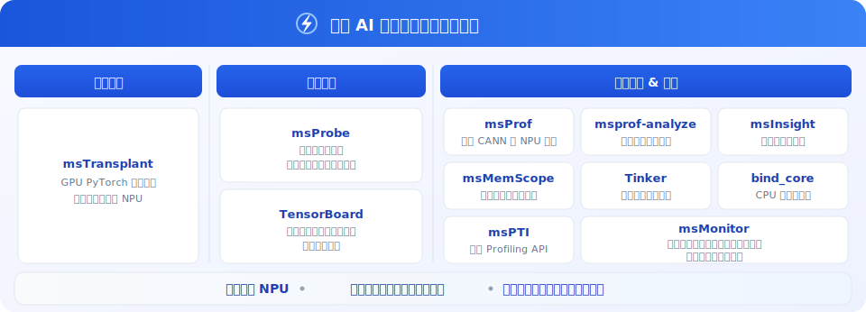

<h1 align="center">MindStudio Training Tools</h1>

<b>昇腾 AI 训练开发工具链</b>

 
  
  
  
  
  

## ✨ 最新消息

  

 🔹 **[2026.03.28]**：精度调试模块（debug 目录）正式日落下线，详情请参见 [公告](https://gitcode.com/Ascend/mstt/discussions/2)                
 🔹 **[2026.02.25]**：Tinker 并行策略自动寻优系统正式开源，详情请参见 [Tinker 项目](https://gitcode.com/Ascend/mstt/tree/master/profiler/tinker)       
 🔹 **[2026.01.12]**：本仓库许可证（License）变更，详情请参见 [公告](https://gitcode.com/Ascend/mstt/discussions/1)      
 🔹 **[2025.12.31]**：MindStudio 训练开发工具链全面开源     

 

## ℹ️ 简介

MindStudio Training Tools（msTT）训练开发工具链，聚焦训练开发中的关键挑战。通过提供分析迁移、精度调试与性能调优三大核心工具，高效应对迁移受阻、Loss 异常、性能不达标等问题，助力实现精度与性能双优的极简开发体验。

## ⚙️ 功能介绍

训练开发工具链提供以下系列化工具：

| 类别 | 工具名称                                                                                      | 功能简介                                               |
|:--:|:------------------------------------------------------------------------------------------|:---------------------------------------------------|
| 迁移 | [**msTransplant**](https://gitcode.com/Ascend/mstt/tree/master/msfmktransplt)                                                      | **【分析迁移】** PyTorch 训练脚本一键迁移至昇腾 NPU，支持少量改码或零改码完成迁移。 |
| 精度 | [**msProbe**](https://gitcode.com/Ascend/msprobe)                                         | **【精度调试】** 昇腾全场景精度工具，用于训练精度调试与问题定位。                |
| 精度 | [**TensorBoard**](https://gitcode.com/Ascend/msprobe/blob/master/docs/zh/user_guide/accuracy_compare/pytorch_visualization_instruct.md) | **【分级可视】** 分级展示模型结构与精度，支持调试与标杆模型对比以定位精度问题。         |
| 性能 | [**msProf**](https://gitcode.com/Ascend/msprof)                                           | **【模型调优】** 全场景性能调优底座，采集 CANN 与 NPU 数据，提升设备调优效率。    |
| 性能 | [**msprof-analyze**](https://gitcode.com/Ascend/msprof-analyze)                           | **【性能分析】** 基于采集数据做性能分析，快速识别性能瓶颈。                   |
| 性能 | [**msMemScope**](https://gitcode.com/Ascend/msmemscope)                                   | **【内存调优】** 内存调优专用工具：整网级多维度内存采集，支持自动诊断与优化分析。        |
| 性能 | [**msInsight**](https://gitcode.com/Ascend/msinsight)                                     | **【可视调优】** 可视化性能分析，覆盖系统、算子、服务化等场景，辅助完成性能诊断。        |
| 性能 | [**Tinker**](https://gitcode.com/Ascend/mstt/tree/master/profiler/tinker)                 | **【并行寻优】** 大模型并行策略自动寻优：按训练脚本做单节点 NPU 测评并推荐高性能并行方案。 |
| 性能 | [**bind_core**](https://gitcode.com/Ascend/mstt/tree/master/profiler/affinity_cpu_bind)   | **【一键绑核】** CPU 绑核工具，无需侵入修改工程即可按 CPU 亲和性策略绑核。       |
| 性能 | [**msPTI**](https://gitcode.com/Ascend/mspti)                                             | **【性能剖析】** 面向昇腾的 Profiling API，可据此开发 NPU 应用性能分析工具。 |
| 监控 | [**msMonitor**](https://gitcode.com/Ascend/msmonitor)                                     | **【在线监控】** 一站式监控，支持落盘与在线采集，面向集群的监测与问题定位。           |

## 🚀 快速入门

如需快速上手各工具，请参见《[训练开发工具链快速入门](docs/zh/quick_start/mstt_quick_start.md)》。

## 📦 安装指南

请通过上方表格链接进入对应源码仓库，参见 README 中的《安装指南》。

## 📘 使用指南

请通过上方表格链接进入对应源码仓库，参见 README 中的《使用指南》；若需按场景选择工具，请参见《[msTT 工具选型指南](./docs/zh/user_guide/mstt_user_guide.md)》。

## 🌌 智能检索

为提升文档查阅效率，我们提供多种高效检索方式：     
🔹 [AI 问答（DeepWiki）](https://deepwiki.com/mindstudio-docs/master)：自然语言问答，快速把握项目架构与模块关系。     
🔹 [AI 问答（ZRead）](https://zread.ai/mindstudio-docs/master)：中文问答体验更优，精准定位功能用法与细节。     
🔹 [精确搜索（ReadTheDocs）](https://mindstudio-docs-master.readthedocs.io/)：关键词全文检索，直达接口、参数与报错等信息。     

## 🛠️ 贡献指南

欢迎参与项目贡献，请参见 《[贡献指南](./docs/zh/contributing/contributing_guide.md)》。

## ⚖️ 相关说明

🔹 《[许可证声明](./docs/zh/legal/license_notice.md)》     
🔹 《[安全声明](./docs/zh/legal/SECURITY.md)》     
🔹 《[免责声明](./docs/zh/legal/disclaimer.md)》    

## 🤝 建议与交流

欢迎大家为社区做贡献。如果有任何疑问或建议，请提交 [Issues](https://gitcode.com/Ascend/mstt/issues)，我们会尽快回复。感谢您的支持。

|                                                                         即时互动（微信群）                                                                          |                                                                               官方资讯（公众号）                                                                                | 深度支持（助手/论坛）                                                                                                                                                                                                                                                                                                                                                                                                                                                                                                 |
|:----------------------------------------------------------------------------------------------------------------------------------------------------------:|:----------------------------------------------------------------------------------------------------------------------------------------------------------------------:|:--------------------------------------------------------------------------------------------------------------------------------------------------------------------------------------------------------------------------------------------------------------------------------------------------------------------------------------------------------------------------------------------------------------------------------------------------------------------------------------------------------------|
|  *扫码加入技术交流群* |  *扫码关注官方公众号* | 扫码入群并关注公众号，直达 MindStudio 用户与开发者最快捷的交流平台：  **快速提问：** 与社区小伙伴即时探讨技术问题 **掌握动态：** 第一时间获取版本发布与功能更新通知  **经验共享：** 与广大开发者交流最佳实践与实战心得      **更多支持渠道**：👉 昇腾助手： 👉 昇腾论坛： |

## 🙏 致谢

msTT 由华为公司的下列部门联合贡献：    
🔹 昇腾计算MindStudio开发部  
🔹 昇腾计算生态使能部  
🔹 华为云昇腾云服务  
🔹 2012分布式并行计算实验室  
🔹 2012网络技术实验室  
感谢来自社区的每一个 PR，欢迎贡献 msTT！
