# Case Study on Locating Foundation Model Training Performance Bottlenecks

## Scenarios with Common Performance Issues

During the process of porting an LLM from other devices to Ascend devices and training it on the Ascend device, performance issues may arise. Performance issues primarily manifest as insufficient out-of-the-box performance and performance degradation over time.

- **Out-of-the-box performance optimization**: This refers to users noticing poor performance when using the model on the Ascend platform and directly optimizing the performance.
- **Performance degradation over time**: It refers to users encountering performance degradation issues during the training process due to unexpected factors (such as improper adjustment of algorithm parameters). These issues require identifying the causes of the performance degradation and resolving them.

**Figure 1** Scenario description

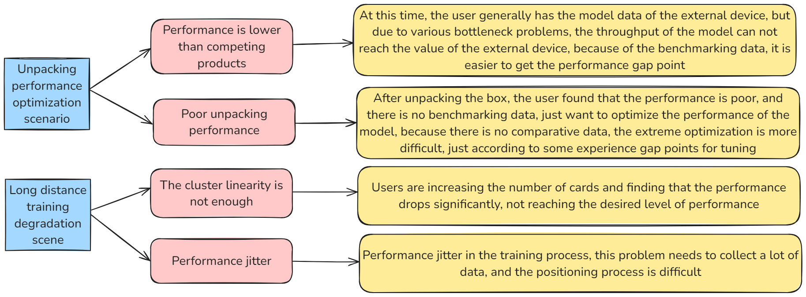

## Troubleshooting

### Performance Troubleshooting Process

The basic performance tuning process for an LLM is as follows:

**Figure 1** Basic performance tuning process

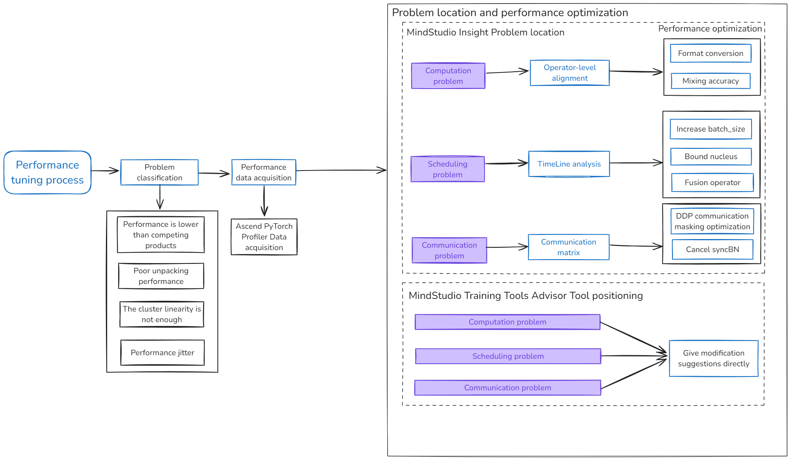

The first step of performance tuning is to identify the problem and then perform targeted optimization.

1. Collect profile data. You can use the Ascend PyTorch Profiler interfaces for data profiling and analysis.
2. Use MindStudio Insight, the visualization tool, to demarcate the performance issues. The results are typically categorized into three areas: computation, scheduling, and communication.
3. Use [Advisor](https://gitcode.com/Ascend/msprof-analyze/blob/master/docs/en/user_guide/advisor_instruct.md) to assist in locating the problem. Advisor automatically analyzes the profile data based on the built-in case library and provides performance tuning suggestions.
4. Apply appropriate tuning methods for different issues. After each tuning, re-run the training, collect profile data, and use MindStudio Insight to check whether the tuning methods are effective. Repeat this process until the performance issues are resolved.

### Collecting Profile Data Using Ascend PyTorch Profiler<a name="case_of_troubleshooting_performance_bottleneck_in_llm_training01"></a>

Ascend PyTorch Profiler is a set of APIs provided during the training process of LLMs in the Ascend PyTorch framework. It can collect raw profile data from the framework, CANN, and the device, and perform analysis on the data.

For details about Ascend PyTorch Profiler, see [Ascend PyTorch Profiler](https://gitcode.com/Ascend/pytorch/blob/master/docs/en/developer_notes/ascend_pytorch_profiler_user_guide.md).

Add the following sample code to the training script (for example, `train_*.py`) to configure profiling parameters, and then start the training.

```python
import torch
import torch_npu

# Pre-configured parameters for Profiler data profiling and analysis
experimental_config = torch_npu.profiler._ExperimentalConfig(
    export_type=torch_npu.profiler.ExportType.Text,
    profiler_level=torch_npu.profiler.ProfilerLevel.Level1,
    msprof_tx=False,
    aic_metrics=torch_npu.profiler.AiCMetrics.PipeUtilization,
    l2_cache=False,
    op_attr=False,
    data_simplification=False,
    record_op_args=False,
    gc_detect_threshold=None
)
# The number of the LLM training iterations
steps = 7
with torch_npu.profiler.profile(
        activities=[
            torch_npu.profiler.ProfilerActivity.CPU,
            torch_npu.profiler.ProfilerActivity.NPU
        ],
        schedule=torch_npu.profiler.schedule(wait=0, warmup=0, active=2, repeat=2, skip_first=1),
        on_trace_ready=torch_npu.profiler.tensorboard_trace_handler("./result"),
        record_shapes=False,
        profile_memory=True,
        with_stack=False,
        with_modules=False,
        with_flops=False,
        experimental_config=experimental_config) as prof:
    for step in range(steps):
        # Model training
        train_one_step(step, steps, train_loader, model, optimizer, criterion)
        # Call the step method to perform profiling and analysis
        prof.step()
```

The file structure generated by the profiling is as follows:

```text
└── localhost.localdomain_139247_20240628101435_ascend_pt
    ├── profiler_info.json
    ├── profiler_metadata.json
    ├── ASCEND_PROFILER_OUTPUT
    │   ├── communication.json
    │   ├── communication_matrix.json
    │   ├── kernel_details.csv
    │   ├── memory_record.csv
    │   ├── npu_module_mem.csv
    │   ├── operator_details.csv
    │   ├── operator_memory.csv
    │   ├── step_trace_time.csv
    │   ├── op_statistic.csv
    │   ├── api_statistic.csv
    │   └── trace_view.json
    ├── FRAMEWORK
    └── PROF_000001_20230628101435646_FKFLNPEPPRRCFCBA
          ├── analyze
          ├── device_*
          ├── host
          ├── mindstudio_profiler_log
          └── mindstudio_profiler_output
```

### Locating Problems Using MindStudio Insight

MindStudio Insight provides a rich set of tuning and analysis tools, visually presenting real hardware and software runtime data. It allows multidimensional analysis of profile data, helps identify performance bottlenecks, and allows performance analysis for clusters with hundreds and thousands of ranks, and even beyond.

You can import the [profile data collected by Ascend PyTorch Profiler](#collecting-profile-data-using-ascend-pytorch-profiler) to MindStudio Insight by referring to "Basic Operations" > "[Importing Data](https://gitcode.com/Ascend/msinsight/blob/master/docs/en/user_guide/basic_operations.md#importing-data)" in [MindStudio Insight User Guide](https://gitcode.com/Ascend/msinsight/blob/master/docs/en/user_guide/overview.md). Then, perform the following steps to analyze the profile data.

#### Viewing the Overall Data on the Overview Page

You can learn about the details of each module on the **Summary** page. For details, see "System Tuning" > "[Summary](https://gitcode.com/Ascend/msinsight/blob/master/docs/en/user_guide/system_tuning.md#%E6%A6%82%E8%A7%88%EF%BC%88summary%EF%BC%89)" in [MindStudio Insight Tool User Guide](https://gitcode.com/Ascend/msinsight/blob/master/docs/en/user_guide/overview.md).

1. In the "Parallel Strategy Analysis" module, different parallel strategy analysis perspectives are provided, such as PP, TP, CP, DP, and EP.

   1. Click the checkbox to select the parallel strategy, and use the box annotations to identify parallel groups.
   2. Selecting different data types will display the corresponding heatmap. Based on the heatmap, you can identify rank groups with performance issues, with darker red indicating worse performance.

   **Figure 1** Parallel strategy analysis

   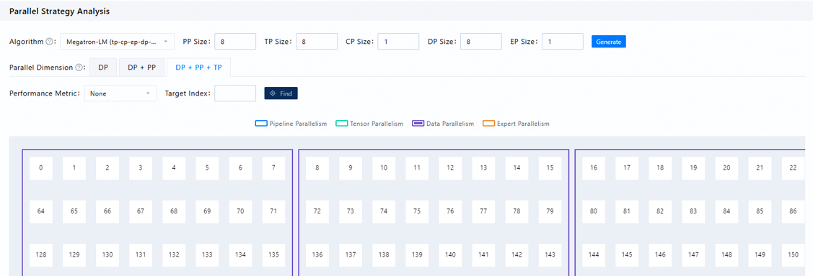

2. The computation/communication overview area displays the computation, communication, and free time proportions for each rank under the selected rank group, and provides expert recommendations.

   **Figure 2** Computing/Communication Overview

   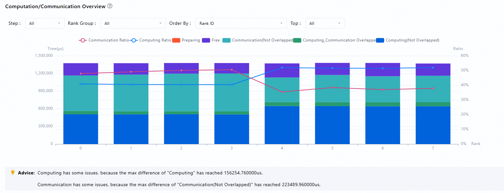

   Meanings of data metrics are as follows:

   **Table 1** Data metrics

   | Data Metric                    | Meaning                                                                                                                      |
   | ------------------------------ | ---------------------------------------------------------------------------------------------------------------------------- |
   | Total Computing                | Total kernel time on the Ascend device.                                                                                      |
   | Pure Computing                 | Pure computing = Total Computing – Communication (Overlapped)                                                                |
   | Communication (Overlapped)     | Overlapped communication time, which refers to the duration during which computation and communication occur simultaneously. |
   | Communication (Not Overlapped) | Not overlapped communication time, which refers to the pure communication duration.                                          |
   | Free                           | The duration during which neither computation nor communication is performed.                                                |

Different metrics can locate different performance issues:

- **Computation issue**: Typically represented as an excessive difference between the maximum and minimum proportions of total computation time in the rank group. If the computation time of certain ranks obviously exceeds the normal range, it is likely that the rank is handling an excessively heavy computation task, such as processing too much data or dealing with a model of high complexity. It could also be that the rank's performance is limited.
- **Scheduling issue**: Typically represented as an excessive difference between the maximum and minimum proportions of free time in the rank group. If the free time of a compute rank is too long, it indicates an abnormal dispatch from the host to the device, which can also negatively impact the performance of the cluster.
- **Communication issue**: If the non-overlapped communication time is too long, it indicates a problem with the collaboration between computation and communication. It could be that the communication mode may need to be optimized, or that network bandwidth instability is preventing communication from coordinating well with computation.

#### Computation Issues

When the data metrics indicate a computation issue, you can directly view the operator data of the abnormal rank and compare it with that of the normal ranks. In this case, you can use the inter-rank performance comparison feature of MindStudio Insight. Follow the instructions in the [MindStudio Insight User Guide](https://gitcode.com/Ascend/msinsight/blob/master/docs/en/user_guide/overview.md) to set the two ranks into comparison mode and view the results in the operator interface. The following figure is an example of a computation issue. It can be seen that, under the condition of equal operator counts, the average execution time of MatMul operators has significantly increased, resulting in a computation time difference between the two ranks.

**Figure 3** Compute operator types

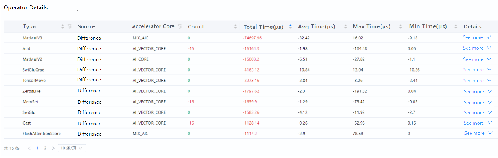

Based on experience, MatMul operators are likely to degrade under specific shapes. You can switch the grouping method to "Computing Operator Name and Input Shape", and sort by total execution time to further identify which shapes cause the most severe degradation in MatMul operators. After locating the operator issue, you can consult the operator developers to further confirm the cause of the issue.

**Figure 4** Computing operator name and input shape

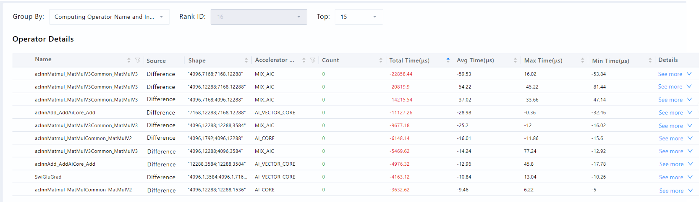

#### Scheduling Issues

When data metrics indicate a scheduling issue, navigate to the timeline view to compare abnormal and normal ranks for further operator-level localization. For interface details, see "System Tuning" > "[Timeline](https://gitcode.com/Ascend/msinsight/blob/master/docs/en/user_guide/system_tuning.md#timeline)" in [MindStudio Insight User Guide](https://gitcode.com/Ascend/msinsight/blob/master/docs/en/user_guide/overview.md). Access the timeline page and select the HostToDevice connection type. The **HostToDevice** page displays the delivery and execution relationships from CANN operators to Ascend Hardware operators and from CANN operators to HCCL communication operators, which are used to locate scheduling issues.

The HostToDevice connections usually have two forms: diagonal and vertical. The following figure is an example of a scheduling issue. If the HostToDevice connection is diagonal, as shown on the left, it indicates that the scheduling of tasks during this period is reasonable, and the Ascend device is operating at full capacity, performing both computation and communication tasks. If the HostToDevice connection is vertical, as shown on the right, it indicates that the Ascend device quickly completed the tasks dispatched by the CPU but did not fully load the computation and communication tasks. This generally indicates a scheduling issue. In this case, tuning can be done by methods such as increasing the batch size, binding cores, and replacing operators with fused ones.

**Figure 5** Scheduling issues

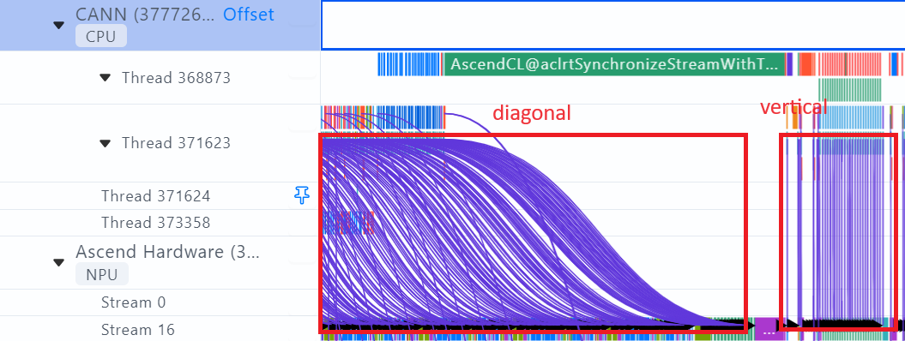

#### Communication Issues

When the data metrics indicate a communication issue, you need to access the communication page for further analysis. The communication page is used to display the network link performance across the cluster and the communication performance of all nodes. By analyzing the overlapped duration between cluster communication and computation, slow hosts or nodes in the cluster training can be identified. Typically, we analyze performance issues based on key metrics such as the communication matrix and communication duration.

**Communication Matrix**

**Figure 6** Communication matrix


The above figure is the visualized communication matrix on MindStudio Insight, where you can obtain information such as bandwidth, transfer size, link type, and transfer duration between ranks for each rank group.

1. You can first check the transfer size to analyze whether there are any differences in the transfer volume of each rank in this collective communication, and whether there is any uneven distribution.
2. Check the transfer duration and bandwidth. If the transfer duration and bandwidth values between different ranks are abnormal or have large discrepancies, it indicates the presence of abnormal links within the rank group.

**Communication Duration**

Communication duration refers to the time spent on communication between compute ranks. There are many factors that can lead to excessive communication time, such as incorrect communication protocol configurations, excessive data transfer volume, and so on. Only by identifying these links with excessive communication time and properly resolving the issues can data be transmitted more smoothly between compute ranks, thereby improving the overall performance of the cluster.

After selecting a specific rank group, the user can view the summary of the time spent by each compute rank in the communicator, along with the HCCL chart and communication duration distribution diagram of communication operators. This allows for a quick understanding of the relative position of the communication operators and detailed communication data.

**Figure 7** HCCL chart

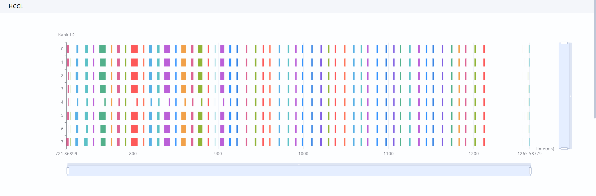

**Figure 8** Communication duration distribution chart

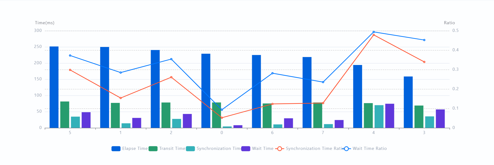

The above figure is an analysis of communication duration within a specific rank group from a profile data set. From the communication duration data, we found that rank 3 has the longest synchronization time, rank 4 has the shortest synchronization time, and there is a noticeable difference in synchronization time. A longer synchronization time generally means that this rank is waiting for other ranks, while a shorter synchronization time generally means that other ranks are waiting for this rank. Based on this, it can be preliminarily determined that rank 3 is a fast rank and rank 4 is a slow rank.

## Performance Tuning Cases

### Case Description

A certain multimodal model experienced a sudden significant performance degradation during training. We will perform performance tuning based on the process described above.

Use Ascend PyTorch Profiler to collect profile data during LLM training. This case involves a cluster with 16 ranks.

> [!NOTE]
>
> This case study is based on previous tool versions and data, and is for reference only. If any discrepancies arise with the latest tool or data outputs, refer to the latest version.

### Locating and Analyzing Issues Using MindStudio Insight

MindStudio Insight loads all data for fault locating.

1. The communication time of each rank in this rank group takes relatively high proportion. The total computation time (pure computation time + overlapped communication time) only accounts for one-third of the total time, so it can be identified as a communication issue.

   **Figure 1** Overview page

   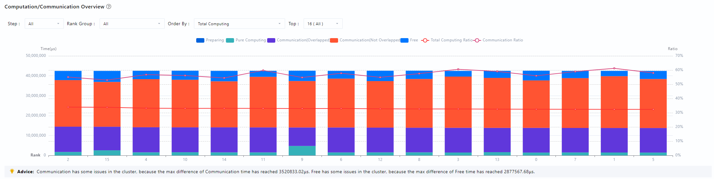

2. Switch to the communication page: A large number of rank asynchronization issues were found (highlighted in red in the box), which indicates that many operators are waiting for extended periods. The most obvious slow rank (rank 12) is selected for analyzing the detailed cause.

   **Figure 2** Communication page

   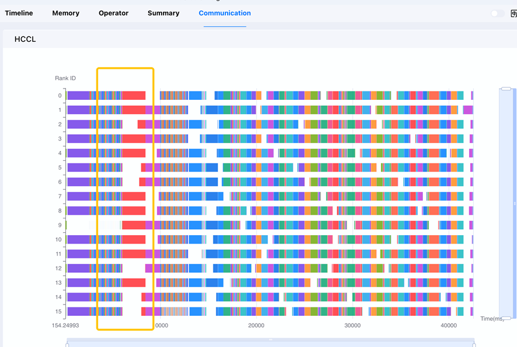

3. Switch to the timeline page: It is clear that rank 12 has a lot of free time. At the same time, there are many events on the AscendCL side that are occupying resources. It can be preliminarily determined that the memory usage of the rank is too high, and memory defragmentation is required when new data is allocated. As a result, there is a long period of free time. You can use `export PYTORCH_NPU_ALLOC_CONF="expandable_segments:True"` to solve the memory fragmentation issue and improve memory utilization. Solve the performance problem after debugging.

   **Figure 3** Timeline page

   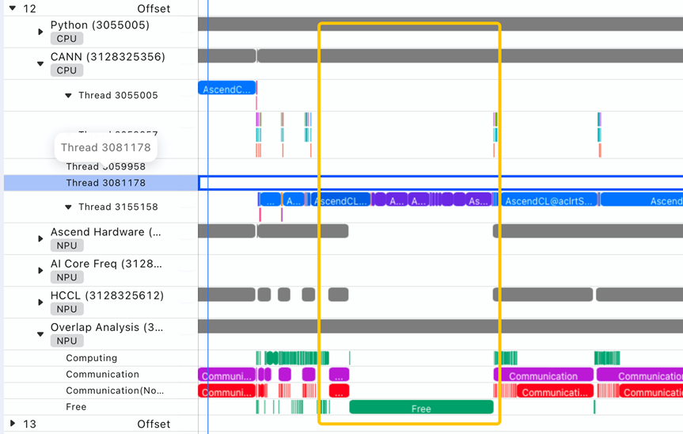

   **Figure 4** Timeline page

   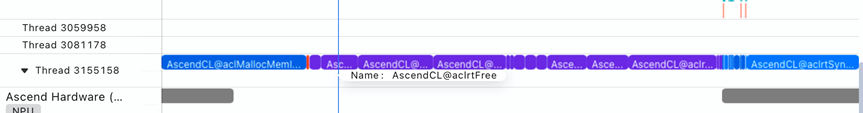

### Advisor-assisted Fault Locating

In this case, you can also use [Advisor](https://gitcode.com/Ascend/msprof-analyze/blob/master/docs/en/user_guide/advisor_instruct.md) to assist in locating the fault.

1. Run the `msprof-analyze advisor all -d $HOME/profiling_data/` command to obtain the path for saving the expert suggestions. `$HOME/profiling_data/` is the path of the profile data.

   **Figure 1** Advisor output

   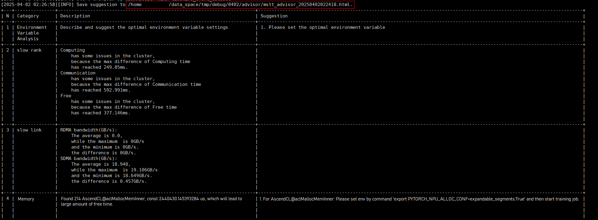

2. Open the HTML file. We can see similar conclusion and suggestion (in the red box) for resolving the performance problem.

   **Figure 2** Advisor suggestions

   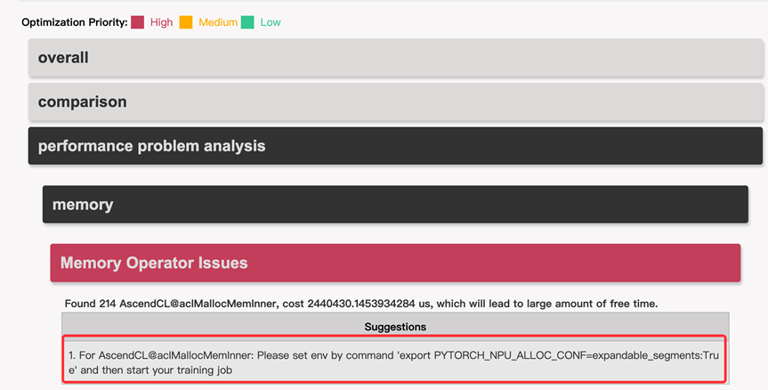
