# Performance Tool Usage

## Overview

This document describes how to efficiently use the tuning toolchain in training and inference tasks to implement a closed-loop process from profile data collection to fault locating. The training scenario focuses on model tuning, and the inference scenario includes model tuning and service tuning. This document focuses on **model tuning** and **service tuning**.

**Model tuning**

| Procedure                  | Tool                                                                                                                                                                                                                                                                                                                                                                                                                     | Description                                                                                                                                                                                                                                                                                                                                                                                                                                                                                                                                                                                                                                                                                                                                                                                                                                                                                                                                                                                                                                                                                                                                                                                                                                                       |
| -------------------------- | ------------------------------------------------------------------------------------------------------------------------------------------------------------------------------------------------------------------------------------------------------------------------------------------------------------------------------------------------------------------------------------------------------------------------ | ----------------------------------------------------------------------------------------------------------------------------------------------------------------------------------------------------------------------------------------------------------------------------------------------------------------------------------------------------------------------------------------------------------------------------------------------------------------------------------------------------------------------------------------------------------------------------------------------------------------------------------------------------------------------------------------------------------------------------------------------------------------------------------------------------------------------------------------------------------------------------------------------------------------------------------------------------------------------------------------------------------------------------------------------------------------------------------------------------------------------------------------------------------------------------------------------------------------------------------------------------------------- |
| Profile data collection    | Two collection modes are available based on the enabling mode: msprof CLI and AI framework Profiler APIs. For details, see [Model Tuning Profiling Tools](#model-tuning-profiling-tools). Collection using AI framework Profiler APIs &#8226; PyTorch: Ascend PyTorch Profiler &#8226; MindSpore: MindSpore Profiler Profiling using the msprof CLI The msprof CLI does not have AI framework layer data. | To record the profile data required for model running, including the AI framework and Ascend software and hardware, you need to select an appropriate profile data collection tool. For details, see [Model Tuning Profiling Tools](#model-tuning-profiling-tools). The msprof CLI is used to collect profile data at the CANN and NPU layers. It serves as the basis for other profile data collection APIs. The Profiler APIs of the AI framework encapsulate the msprof CLI and enable further collection and parsing of profile data at the AI framework layer. This method is the most commonly used approach in training and online inference scenarios. According to their functions and features, the Profiler APIs can be classified into three modes: general (static) collection, dynamic collection, and online monitoring. In addition, some training or inference kits further encapsulate the AI framework Profiler APIs, which can be directly invoked through the APIs in the kits, such as [MindSpeed-MM](https://gitcode.com/Ascend/MindSpeed-MM/blob/master/docs/en/tools.md) and [MindFormers](https://www.mindspore.cn/mindformers/docs/en/r1.3.2/perf_optimize/perf_optimize.html). |
| Profile data analysis      | Quick analysis tool for model tuning: • Cluster analysis (cluster_analyze) &#8226; Advisor • Performance breakdown and comparison (compare) For details, see [Quick Analysis for Model Tuning (msprof-analyze)](#performance_tool_usage01).                                                                                                                                                                  | The msprof-analyze provides the following functions for preliminary analysis: • cluster_analyze: Extracts iteration duration and communication data to quickly identify slow ranks, nodes, and links in large-scale clusters (such as those with 1,000 or 10,000 ranks), where analyzing all data directly is impractical. You are advised to use this tool together with the **Summary** and **Communication** tab pages of MindStudio Insight. For details, see [Cluster Performance Analysis](#performance_tool_usage05) in MindStudio Insight. • advisor: Identifies common problems and provides tuning suggestions, quickly demarcates and locates typical performance problems, and provides guidance for further analysis. • compare: Compares and analyzes training duration and memory usage to identify degraded operators or APIs, helping users improve performance tuning efficiency. It also allows comparison of performance differences between GPUs and NPUs, as well as between NPUs. It is advised to use this feature in scenarios where baseline data is available, such as performance degradation after GPU-to-NPU migration or when experiencing performance jitter.                                                            |
| Profile data visualization | In-depth analysis tool for model tuning. For details, see [In-depth Model Tuning Analysis (MindStudio Insight)](#performance_tool_usage02).                                                                                                                                                                                                                                                                              | MindStudio Insight displays complete profile data in graphics, helping users deeply understand and accurately locate root causes. This tool uses the top-down analysis method, that is, from macro to micro, from the entire cluster to a single node. For details about the usage policies and operations, see [In-depth Model Tuning Analysis (MindStudio Insight)](#performance_tool_usage02).                                                                                                                                                                                                                                                                                                                                                                                                                                                                                                                                                                                                                                                                                                                                                                                                                                                                 |

**Serving Tuning**

Serving tuning is involved only in the inference scenario. For details about how to use this tool, see [Serving Tools](#performance_tool_usage12).

| Procedure             | Tool                                                                                                   | Description                                                                                                                                                                                                                                                                 |
| --------------------- | ------------------------------------------------------------------------------------------------------ | --------------------------------------------------------------------------------------------------------------------------------------------------------------------------------------------------------------------------------------------------------------------------- |
| Environment pre-check | Inference precheck tool (msprechecker)                                                                 | Check whether the overall service performance is affected by system, environment variable, or configuration file issues.                                                                                                                                                    |
| Quick analysis        | • Expert advice tool for serving tuning (msserviceadvisor) • Automatic tuning tool (modelevalstate) | • msserviceadvisor is applicable to scenarios where serving performance needs to be quickly improved, but does not support fine-grained tuning. • modelevalstate is used to improve serving performance and can achieve 95% of the optimal performance of manual tuning. |
| In-depth analysis     | Serving tuning tool (msServiceProfiler)                                                                | This tool is used for in-depth analysis and is suitable for users with extensive experience in serving operations.                                                                                                                                                          |

## Model Tuning Tools

### Procedure

Model tuning can be divided into two steps: performance profiling and performance analysis.

1. **Collecting profile data**: You are advised to analyze the profile data first. For details about how to use the tool, see [Model Tuning Profiling Tools](#model-tuning-profiling-tools).

   > [!NOTE]
   >
   > - When collecting profile data for the first time, you are advised to collect only L1 data and do not enable the stack (that is, `with_stack` is set to `False`). You can set `warmup` to `1` and `active` to `2` to collect data of two steps.
   > - If competing product analysis is involved, you are advised to collect performance metrics of competing products under the same conditions (including but not limited to the number of collected steps, hyperparameter settings, and used data).

2. **Performance bottleneck analysis:** After profile data is collected, use the performance analysis tool to analyze bottlenecks.

   1. The msprof-analyze tool performs preliminary analysis, identifies performance issues at a fine-grained level, and provides clear direction for further in-depth analysis. For details, see [Quick Analysis for Model Tuning (msprof-analyze)](#performance_tool_usage01).
   2. The MindStudio Insight tool identifies bottlenecks and analyzes root causes. For details, see [In-depth Model Tuning Analysis (MindStudio Insight)](#performance_tool_usage02).

### Model Tuning Profiling Tools

MindStudio provides multiple flexible system-level profile data collection methods. You can select a proper solution to accurately locate performance bottlenecks and improve training efficiency.

Two collection modes are available based on the enabling mode: msprof CLI and AI framework Profiler APIs (Ascend PyTorch Profiler and MindSpore Profiler).

The msprof CLI is used to collect profile data at the CANN and NPU layers. It serves as the basis for other profile data collection APIs.

> [!NOTE]
>
> The msprof CLI does not have AI framework layer data.

The Profiler APIs of the AI framework encapsulate the msprof CLI and enable further collection and parsing of profile data at the AI framework layer. This method is **the most commonly used approach**. According to their functions and features, the Profiler APIs can be classified into three modes: general (static) collection, dynamic collection, and online monitoring.

In addition, some training or inference kits further encapsulate the AI framework Profiler APIs, which can be directly invoked through the APIs in the kits, such as [MindSpeed-MM](https://gitcode.com/Ascend/MindSpeed-MM/blob/master/docs/en/tools.md) and [MindFormers](https://www.mindspore.cn/mindformers/docs/en/r1.3.2/perf_optimize/perf_optimize.html).

**Figure 1** Profile data collection framework

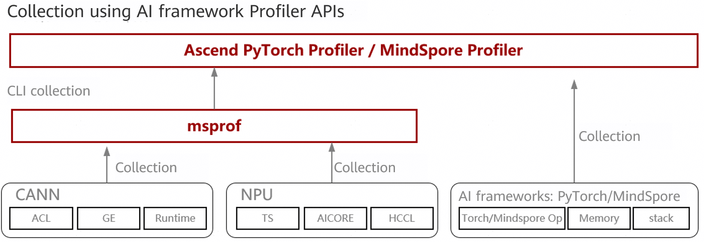

**Table 1** Collection methods 

| **Collection Method**          | **Features**                                                                                                                                                                                      | **Recommended Application Scenario**             | Reference Document Link                                                                                                                                |
| ------------------------------ | ------------------------------------------------------------------------------------------------------------------------------------------------------------------------------------------------- | ------------------------------------------------ | ------------------------------------------------------------------------------------------------------------------------------------------------------ |
| Profiling using the msprof CLI | The msprof command line tool collects and parses profile data such as AI task profile data and data of AI Compute Service AI processors. The msprof CLI does not have AI framework layer data. | Training and inference scenarios.                | [msProf Model Tuning Tool](https://gitcode.com/Ascend/msprof/blob/master/docs/en/quick_start/msprof_quick_start.md)                                                       |
| Ascend PyTorch Profiler APIs   | Fully align with the usage in PyTorch-GPU scenarios and support collection of PyTorch framework and Ascend software and hardware data.                                                            | General performance analysis based on PyTorch.   | [Ascend PyTorch Profiler](https://gitcode.com/Ascend/pytorch/blob/master/docs/en/developer_notes/ascend_pytorch_profiler_user_guide.md) |
| MindSpore Profiler APIs        | Collect MindSpore framework and Ascend software and hardware data.                                                                                                                                | General performance analysis based on MindSpore. | [MindSpore Tuning Tool](https://gitcode.com/Ascend/docs/blob/master/MindStudio/master/en/menu/mindspore_profiler_user_guide.md)                                |

When using the AI framework Profiler for collection, you can set parameters by referring to [Table 2](#ZH-CN_TOPIC_0000002504087082__table3829mcpsimp).

**Table 2** Parameter configuration 

| Application Scenario                                        | Parameter Configuration                                                                                                                                                                                                                  |
| ----------------------------------------------------------- | ---------------------------------------------------------------------------------------------------------------------------------------------------------------------------------------------------------------------------------------- |
| General performance analysis                                | &#8226; `profiler_level=Level1` &#8226; Retain the default value `PipeUtilization` for `aic_metrics`. &#8226; Set `activities` to collect CPU and NPU data. &#8226; Enable other switches as required.                          |
| NPU/GPU comparison                                          | This configuration is used to compare the end-to-end duration of the NPU and GPU. &#8226; profiler_level=Level0 &#8226; Set `activities` to collect only NPU or CPU and NPU data (as required). &#8226; Disable other switches. |
| Code locating                                               | To locate the code of an abnormal operator, you can enable the `with_stack` or `with_modules` switch in common scenarios. (Do not enable the switch unless necessary. Otherwise, the performance will deteriorate.)                      |
| Analyzing the on-chip memory allocation of the operator NPU | profile_memory=True                                                                                                                                                                                                                      |
| Analyzing cluster communication                             | profiler_level=Level1                                                                                                                                                                                                                    |

Based on functions and features, the collection methods in [Table 1](#ZH-CN_TOPIC_0000002504087082__table38291mcpsimp) can be classified into three modes: general collection, dynamic collection, and online monitoring, as described in [Table 3](#ZH-CN_TOPIC_0000002504087082__table1893295514719).

**Table 3** Collection classifications 

| **Collection Mode**                | **Features**                                                                                                                                                                    | **Recommended Application Scenario**                                                |
| ---------------------------------- | ------------------------------------------------------------------------------------------------------------------------------------------------------------------------------- | ----------------------------------------------------------------------------------- |
| General collection                 | Sets the collection period or collects all data, and flushes the detailed profile data to disks.                                                                                | General performance analysis                                                        |
| dynamic_profile dynamic collection | During model training, you can **start the collection process at any time and dynamically modify configuration collection items** without frequently modifying the script code. | Scenarios with high startup and shutdown costs (such as ultra-large-scale training) |

### Quick Analysis for Model Tuning (msprof-analyze)

[msprof-analyze](https://gitcode.com/Ascend/msprof-analyze/blob/master/docs/en/quick_start/msprof-analyze_quick_start.md) provides a command line tool for quick analysis of performance bottlenecks in AI jobs. [Table 1](#ZH-CN_TOPIC_0000002535887119__table2845mcpsimp) lists the three core capabilities.

**Table 1** Core capabilities of the msprof-analyze tool 

| **Tool Name**                                  | **Function Description**                                                                                                                                                                                                                                         |
| ---------------------------------------------- | ---------------------------------------------------------------------------------------------------------------------------------------------------------------------------------------------------------------------------------------------------------------- |
| cluster_analyze (cluster analysis)             | Locates slow nodes, ranks, and links. It can be used together with MindStudio Insight.                                                                                                                                                                           |
| compare (performance breakdown and comparison) | Compares operators between NPUs and GPUs and between two NPUs in terms of time and memory, helping users quickly locate operators.                                                                                                                               |
| Advisor (expert suggestions)                   | Based on the experience of performance optimization experts and the affinity adaptation of Ascend software and hardware to operators, the automatic tuning capability is provided to help users identify performance bottlenecks and provide tuning suggestions. |

- cluster_analyze (cluster analysis)

  The cluster_analyze result is displayed using MindStudio Insight to help analyze the communication matrix and communication duration.

  **Figure 1** Visual cluster analysis result on MindStudio Insight

  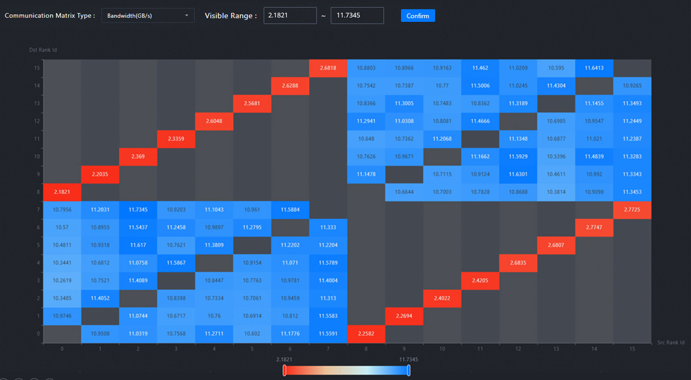

- compare tool for performance comparison

  The compare tool divides the duration into four core dimensions: operator execution, communication (not overlapped with computing), scheduling overhead, and memory usage, enabling precise identification of performance bottlenecks.

  **Figure 2** Analysis result report of the compare tool

  

- Advisor expert suggestion

  Advisor automatically identifies performance bottlenecks and provides tuning suggestions. It covers the delivery, computing, and communication dimensions in cluster and single-rank scenarios, analyzing profile data from end to end.

  **Figure 3** Main functions of the advisor tool

  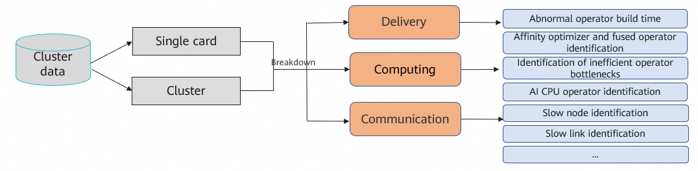

  The Advisor tool classifies tuning suggestions by urgency. The suggestions marked in red have the highest priority and need to be handled first.

  **Figure 4** Analysis result report of the advisor tool

  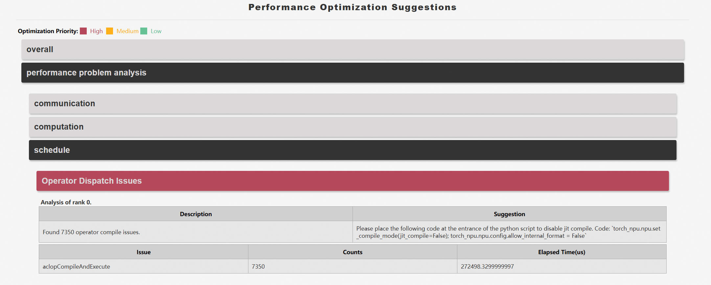

### In-depth Model Tuning Analysis (MindStudio Insight) 

#### Overview 

MindStudio Insight can display full profile data in a visualized manner, helping you further analyze and confirm issues.

[Figure 1](#ZH-CN_TOPIC_0000002535807093__fig71814018265) shows the process of using the MindStudio Insight tool to analyze problems.

**Figure 1** Workflow of using MindStudio Insight for analysis 

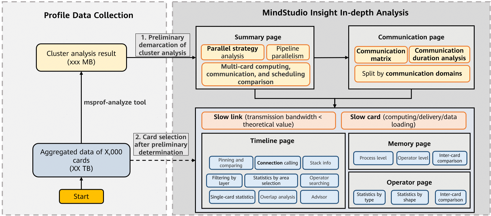

1. Use the cluster analysis function for preliminary demarcation.

   1. Go to the **Summary** page and preliminarily determine the issue category through multi-rank computing, communication, and scheduling comparison. For details, see [Summary](#performance_tool_usage06).

   2. Go to the **Communication** page and further locate the slow rank or slow link issue by communication domain. After confirming the abnormal rank or link, you can directly go to the **Timeline** based on the communication operator to locate the fault. For details, see [Communication](#performance_tool_usage07).

      > [!NOTE]
      >
      > - If the number of ranks is small, you can directly import the raw profile data to automatically generate the cluster analysis result (the visualization tool invokes the msprof-analyze CLI).
      > - If there are too many ranks and the full profile data is too heavy, you are advised to manually invoke the msprof-analyze tool in CLI mode to open the **cluster_analysis_output** deliverables with the visualization tool MindStudio Insight for faster and more convenient analysis.

2. After preliminary demarcation, select the required rank and perform further analysis from the single-rank dimension.

   - **Timeline** page: intuitively displays the running details of both the host and devices during training or inference. It shows the API execution duration on the host side and the task execution duration on the device side. For details, see [Timeline](#performance_tool_usage09).
   - **Memory** page: shows the overall memory usage trend in a line chart. You can also select and zoom in on the peak area in the line chart to precisely identify the processes or operators with high memory consumption. For details, see [Memory](#performance_tool_usage10).
   - **Operator** page: displays the duration statistics of compute operators and communication operators by type and shape. In addition, the comparison between two ranks is supported, allowing you to view operator details more intuitively. For details, see [Operator](#performance_tool_usage11).

#### Obtaining Software Packages 

[Table 1](#ZH-CN_TOPIC_0000002535887061__table4505318193511) describes how to obtain the MindStudio Insight software packages and documents. Download the required version based on your needs.

**Table 1** Methods for obtaining the software packages and documents 

| Category         | Link                                                                                                                                                                                                                                                                                                                                                                                                                    |
| ---------------- | ----------------------------------------------------------------------------------------------------------------------------------------------------------------------------------------------------------------------------------------------------------------------------------------------------------------------------------------------------------------------------------------------------------------------- |
| Software package |&#8226; [Community edition](https://www.hiascend.com/developer/download/community/result?module=pt%2Bsto%2Bcann) &#8226; [Commercial edition](https://www.hiascend.com/developer/download/commercial/result?module=sto) &#8226; [POC edition (Non-commercial, experimental preview of upcoming features; releases may not follow a fixed schedule.)](https://www.hiascend.com/forum/thread-0246172897155253267-1-1.html)|
| Document         | [MindStudio Insight](https://www.hiascend.com/document/detail/en/mindstudio)                                                                                                                                                                                                                                                                                                                                                    |

#### Cluster Performance Analysis 

##### Summary 

The **Summary** page provides the following functions: **parallel strategy analysis, pipeline parallel analysis, comparison of multi-rank computing, communication, and scheduling, and MoE expert load balancing analysis.**

**Preliminary Qualitative Analysis**

You need to compare the multi-rank computing, communication, and scheduling time to determine whether any component accounts for an unusually high proportion, and to check for serious inter-rank asynchronization or large communication time fluctuations between ranks, which may indicate fast and slow ranks, [Figure 1](#ZH-CN_TOPIC_0000002503927234__fig135675411608) shows the page.

**Figure 1** Summary page 

The common operations are as follows:

1. Configure a correct parallel strategy and make sure the parameter settings are consistent with those used in model training and inference. For detailed parallel parameter configurations, consult the model development personnel.
2. If the number of ranks is small, you are advised to select the **DP + PP + TP** dimension.
3. Select the required performance metrics to generate a heat map for quick horizontal comparison. During fast and slow rank analysis, focus on the communication time in specific parallel domains.
4. View the parallel strategy layout diagram. The heat map rendering effect enables efficient horizontal comparison.
5. If the parallel strategy is correctly configured, the slow rank advice is provided.
6. On the **Computation/Communication Overview** page in the lower part of the page, view the comparison of the computing, communication, and scheduling time of each rank to preliminarily determine whether there are issues related to computing, communication, delivery, and slow ranks.

**Typical Case Studies**

- Typical case 1: As shown in [Figure 2](#ZH-CN_TOPIC_0000002503927234__fig1879412319517), the communication time between ranks fluctuates significantly and the ranks are not synchronized. The proportions of computing and free (delivery) time are inversely related to communication time. The rank with a low communication time proportion but high computing and free (delivery) time proportions is identified as a slow rank. This indicates that the cluster has a fast- and slow-rank issue. For details about how to further locate a fast- and slow-rank issue, see [Locating Fast and Slow Ranks Using Timeline](solution_to_top1.md#solution_to_top1-1).

  **Figure 2** Typical case 1

  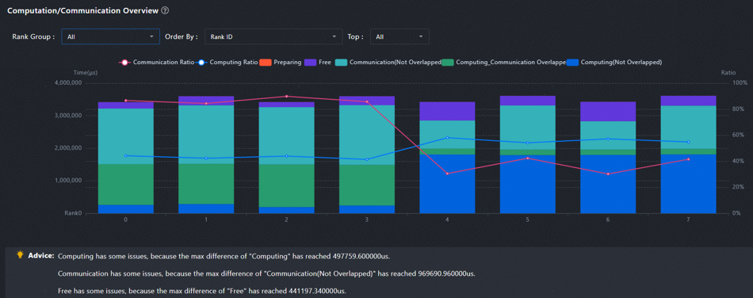

- Typical case 2: As shown in [Figure 3](#ZH-CN_TOPIC_0000002503927234__fig1531948185114), the free time proportion is high, indicating that the cluster has a delivery bottleneck. In this case, locate and optimize the cluster by referring to [Host Bound Troubleshooting](solution_to_top3.md). The communication time proportion is also high, and the communication time of each rank fluctuates. In this case, locate and optimize the cluster by referring to [Communication Tuning Solutions](solution_to_top1.md).

  **Figure 3** Typical case 2

  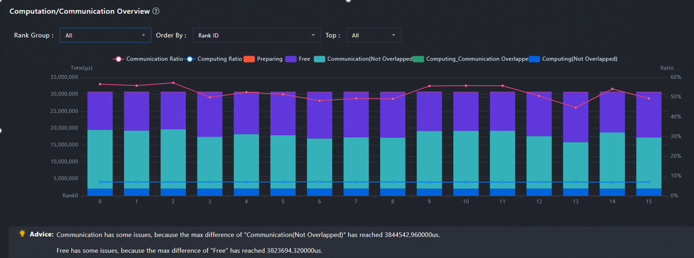

  If there are a large number of ranks, a large amount of full data is displayed, which is inconvenient for viewing and analysis, as shown in [Figure 4](#ZH-CN_TOPIC_0000002503927234__fig18983117211). You need to **split data** properly to make the analysis direction clearer.

  **Figure 4** Computation/Communication Overview page 

  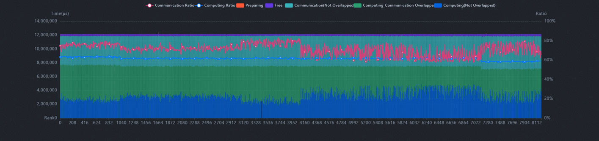

  Simplification method 1: Click a communication domain connection line (illustration① in [Figure 5](#ZH-CN_TOPIC_0000002503927234__fig189831172111)) to view the communication domain independently. The overview after breakdown by communication domain is displayed. Clicking a box has the same effect. Each line represents a communication domain, and each box represents a parallel group.

  **Figure 5** Computation/Communication Overview of a communication domain 

  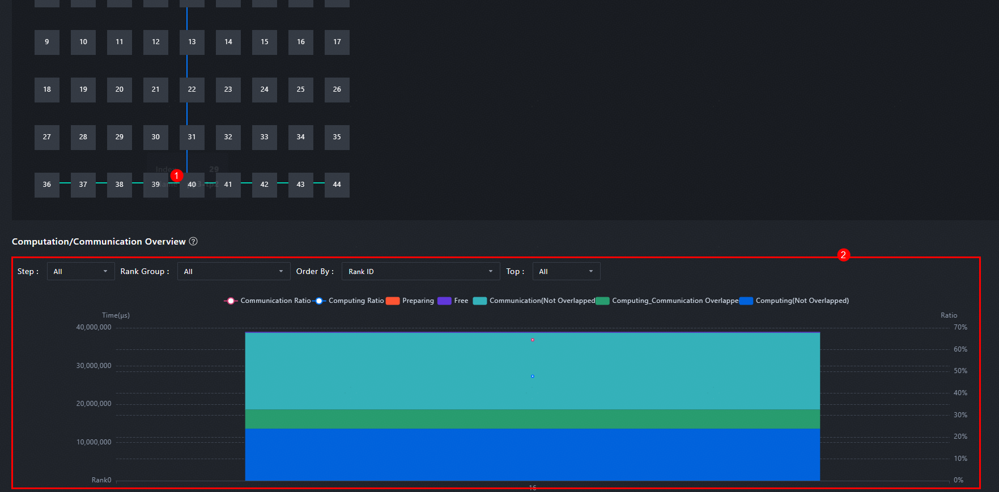

  Simplification method 2: View the folded view and locate the fault from the overall to the partial. The following uses a 512-rank cluster whose parallel strategy is DP8, PP8, and TP8 as an example. There are 512 ranks in the full view (that is, in the DP + PP + TP). After the TP dimension is folded (DP + PP), every eight TP-domain ranks are combined into one node, resulting in 64 folded nodes. You can first select the DP + PP dimension to identify the slow group, and then use the full DP + PP + TP view to pinpoint the slow rank.

  1. In the DP + PP dimension, select **DP-Communication for Performance Metric**. As shown in [Figure 6](#ZH-CN_TOPIC_0000002503927234__fig17985111822), there are slow groups whose DP indexes are **4** and **7**.

     **Figure 6** DP + PP dimension (TP collapsed) 

     .png "dp-+-pp-(tp-folded)")

  2. The following uses the parallel group whose DP index is 4 as an example. Right-click **4** and click **Expand** to go to the DP + PP + TP dimension, as shown in [Figure 7](#ZH-CN_TOPIC_0000002503927234__fig3995119219). In this case, set **Performance Metric** to **TP-Communication**. Rank 38 is identified as the slow rank. This rank impacts the TP domain (32–39) and further affects DP Indexes 0 to 7 in [Figure 6](#ZH-CN_TOPIC_0000002503927234__fig17985111822).

     **Figure 7** DP + PP + TP dimension (full view) 

     .png "dp-+-pp-+-tp-(all-dimensions-expanded)")

  3. After the slow rank is located, right-click the connection line of a communication domain (for example, the green line indicates the TP communication domain in the figure) to view the communication duration analysis. Go to the **Communication** page to further analyze the communication process of the slow rank, as shown in [Figure 8](#ZH-CN_TOPIC_0000002503927234__fig12999111628) and [Figure 9](#ZH-CN_TOPIC_0000002503927234__fig199171113216).

     **Figure 8** Right-clicking a connection line to view the communication duration analysis 

     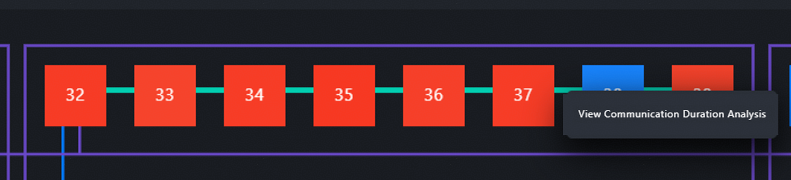

     **Figure 9** Communication Duration Analysis 

     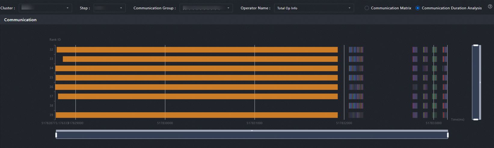

##### Communication 

The **Communication** tab page breaks down communication metrics by communication domains. If the communication duration is too long on the **Summary** tab page, check whether slow ranks or slow links exist on the **Communication** tab page. You can switch between the **Communication Matrix** and **Communication Duration Analysis** views, as shown in the red box in [Figure 1](#ZH-CN_TOPIC_0000002503927296__fig667414820578).

**Figure 1** Switching between the Communication Matrix and Communication Duration Analysis views 

**Procedure**

1. On the **Communication** page, select **Communication Duration Analysis** to view the **Visualized Communication Duration** chart and check whether the **Transmit Time** takes up a large ratio of the communication time, as shown in [Figure 2](#ZH-CN_TOPIC_0000002503927296__fig1125010131226).

   If **Transmit Time** is excessive, the problem is due to a slow link. If **Synchronization Time** is excessive, the problem is caused by a slow rank.

   **Figure 2** Communication duration 

   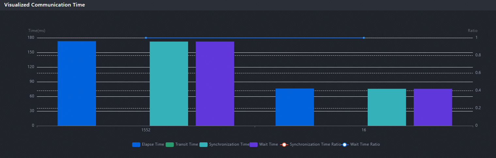

2. If the transmission time proportion is too high, select the **Communication Matrix**, and check whether the transmission bandwidth is far lower than the empirical bandwidth, as shown in [Figure 3](#ZH-CN_TOPIC_0000002503927296__fig136271632185319). If the transmitted data volume is sufficient but the bandwidth is below the expected level, tuning is required. Common causes of slow links include communication retransmission, small communication packets, and unaligned data packet bytes. For relevant cases, see [Communication Tuning Solutions](solution_to_top1.md).

   **Figure 3** Communication matrix 

   

3. If the **Transmit Time** proportion is low but the **Wait Time** or **Synchronization Time** proportion is high, there are fast and slow rank issues. In this case, you need to select the **Communication Duration Analysis**. View the **Communication operator thumbnail** to determine the slow ranks, as shown in [Figure 4](#ZH-CN_TOPIC_0000002503927296__fig2429143613918). For the hcom allGather collective communication operators in green, ranks 4, 5, and 13 with short duration are slow ranks, and ranks (such as ranks 11 and 14) with long duration are relatively fast ranks. Next, you need to analyze what the slow rank is doing during the idle period. Go to the **Timeline** page to view the comparison. For details, see [Locating Fast and Slow Ranks Using Timeline](solution_to_top1.md#solution_to_top1-1).

   **Figure 4** Identifying slow ranks 

   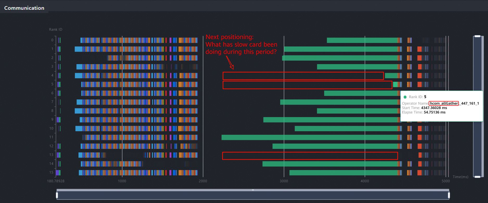

**Switching Between Communication and Timeline Pages**

- You can switch between the **Communication** and **Timeline** pages based on communication operators, as shown in [Figure 5](#ZH-CN_TOPIC_0000002503927296__fig16998195192919) and [Figure 6](#ZH-CN_TOPIC_0000002503927296__fig368718341305).

  If an abnormal rank or communication operator is located on the **Communication** page, you can switch to the **Timeline** page to further locate the root cause. Conversely, if a long-running communication operator is found on the **Timeline**, check the **Communication** page for slow ranks causing delays in the same domain.

  **Figure 5** Switching from the Communication page to the Timeline page by operators 

  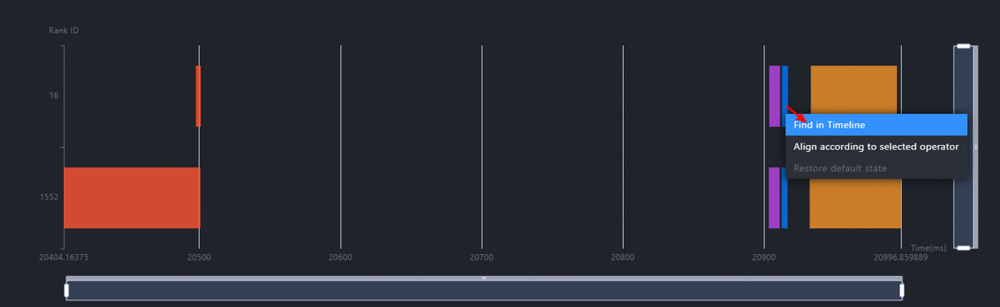

  **Figure 6** Switching from the Timeline to the Communication page by operators 

  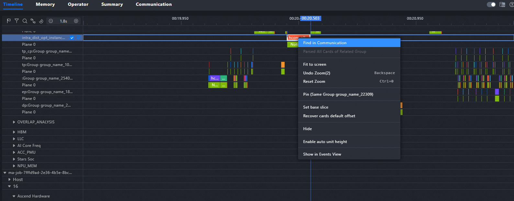

#### Single-device Performance Analysis 

##### Timeline 

The **Timeline** page intuitively displays the running details of both the host and devices during training or inference. It shows the API execution duration on the host side and the task execution duration on the device side. [Figure 1](#ZH-CN_TOPIC_0000002535807019__fig1128122615409) shows the common units and GUI. [Table 1](#ZH-CN_TOPIC_0000002535807019__table9307154914018) describes the information on the GUI.

**Figure 1** Common units and GUI 

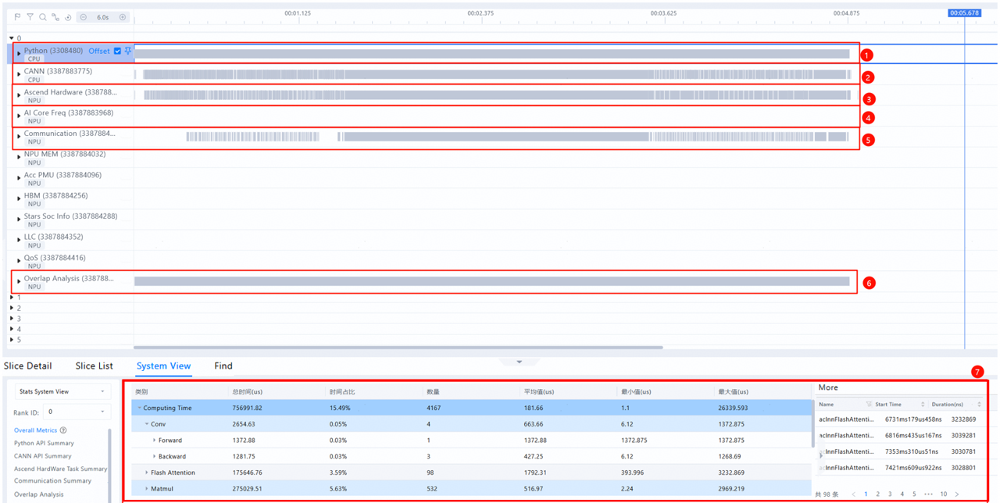

**Table 1** Common Timeline units and GUI description 

| No. | Name                           | Description                                                                                                                                                                                                                                                                          |
| --- | ------------------------------ | ------------------------------------------------------------------------------------------------------------------------------------------------------------------------------------------------------------------------------------------------------------------------------------ |
| 1   | Python unit (level-1 pipeline) | Displays the code at the Python layer. During collection, you can enable the **with stack** function to view the code call stack.                                                                                                                                                    |
| 2   | CANN unit (level-2 pipeline)   | Collects data such as ACL API execution, GE convergence, and Runtime. Python operators are delivered from the level-1 pipeline to the level-2 pipeline. Tasks are dequeued from the level-2 pipeline and then delivered to the NPU layer.                                            |
| 3   | Ascend Hardware (NPU layer)    | Also called the device side, it records the execution time sequence of tasks such as computing and communication on the NPU.                                                                                                                                                         |
| 4   | AI Core Freq                   | The AI Core frequency is used to observe frequency reduction issues.                                                                                                                                                                                                                 |
| 5   | Communication                  | Formerly known as HCCL unit. It records the communication events at the NPU layer, corresponding to the communication sub-lane of Ascend Hardware. The events are reported by components such as HCCL. This unit can be used to locate communication details.                        |
| 6   | Overlap Analysis               | The computing and communication tasks of Ascend Hardware (NPU layer) are vertically projected to this unit to display the computing, communication, and free time. It is used to quickly compare the differences of computing, communication, and free time between different ranks. |
| 7   | Stats System View              | Statistics summary of a single rank. You can select a rank from the **Rank ID** drop-down list box on the left.                                                                                                                                                                      |

Here lists the most commonly used lanes and functions during timeline locating. You can expand each lane to view details, as shown in [Figure 2](#ZH-CN_TOPIC_0000002535807019__fig7728122216162). For details, see [Timeline](https://gitcode.com/Ascend/msinsight/blob/master/docs/en/user_guide/system_tuning.md#%E6%97%B6%E9%97%B4%E7%BA%BF%EF%BC%88timeline%EF%BC%89) in [MindStudio Insight System Tuning](https://gitcode.com/Ascend/msinsight/blob/master/docs/en/user_guide/system_tuning.md).

**Figure 2** Viewing details of a unit 

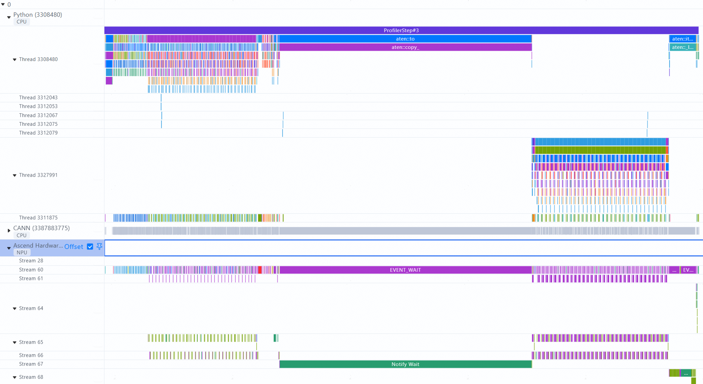

**Common Operations**

To quickly view or learn about all shortcut key operations, click the question mark button in the upper right corner of the page and choose keyboard shortcuts from the drop-down list.

Common timeline operations include **jumping between communication and timeline tab pages, pinning and comparing, overlap analysis, flag marking of key areas, box selection and statistics, and delivery connection relationship viewing.** For details, see [Timeline](https://gitcode.com/Ascend/msinsight/blob/master/docs/en/user_guide/system_tuning.md#%E6%97%B6%E9%97%B4%E7%BA%BF%EF%BC%88timeline%EF%BC%89) in [MindStudio Insight System Tuning](https://gitcode.com/Ascend/msinsight/blob/master/docs/en/user_guide/system_tuning.md).

**Locating the Difference Source of the Fast and Slow Ranks**

The **Timeline** page is used to further locate the difference source of the fast and slow ranks. Ideally, the computing time of each rank is similar. It is abnormal for one rank to finish computing early and wait a long time for another rank. If some ranks have long-duration communication operators that spend most of their time waiting (for example, in a Notify Wait event), check for a fast and slow rank issue.

Fast and slow ranks are a phenomenon with multiple possible causes. You can determine the causes by comparing the differences between fast and slow ranks on the **Timeline** page. Common causes of slow ranks include load imbalance, slow computing, slow delivery, and slow data loading (for example, storage-related issues). The locating process is as follows:

1. In the communication operator thumbnail on the **Communication** page, find the communication operator with big difference and switch to the **Timeline** page.

2. Determine the source of differences at the Ascend hardware layer (NPU layer) through overlap analysis and pinning and comparing.

3. On the **Timeline** page, select **async_npu** to view its delivery connections. Based on the connection relationships, trace upstream along the NPU layer and identify the Python-layer source where the difference occurs. After the Python layer code is confirmed, contact the model development or O&M personnel to further locate the root cause.

   > [!NOTE]
   >
   > The **Timeline** page provides a wide range of functions. For detailed use cases, see [Locating Fast and Slow Ranks Using Timeline](solution_to_top1.md#solution_to_top1-1).

**Observing the Delivery Bottleneck**

The **Timeline** page provides an efficient tool for observing delivery problems. In ideal situations, the computing pipeline on the NPU side runs continuously, and the NPU will not wait for a CPU. However, if the delivery is slow, the pipeline cannot run properly and the computing power utilization of the AI Core decreases.

> [!NOTE]
>
> The ideal **Free Time** proportion is less than 10%.

The typical delivery bottlenecks on the **Timeline** are as follows: For details about the locating methodology and optimization approach, see [Analysis of Delivery Exceptions](solution_to_top3.md#delivery-exception-analysis).

- The ratio of **Free** in **Overlap Analysis** is higher than that of **Computing** and **Communication**, as shown in [Figure 3](#ZH-CN_TOPIC_0000002535807019__fig029044141416) and [Figure 4](#ZH-CN_TOPIC_0000002535807019__fig18956112318318).

  **Figure 3** Typical delivery bottleneck symptom 1

  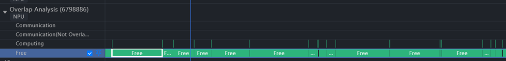

  **Figure 4** Typical delivery bottleneck symptom 2

  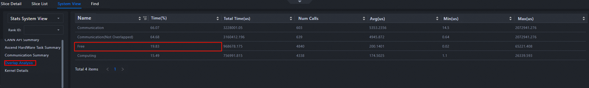

- The HostToDevice line is nearly vertical, as shown in [Figure 5](#ZH-CN_TOPIC_0000002535807019__fig12167922161).

  **Figure 5** Typical delivery bottleneck symptom 3

  

- Frequent HostToDevice copy interrupts the asynchronous pipeline, causing a delivery bottleneck, as shown in [Figure 6](#ZH-CN_TOPIC_0000002535807019__fig113818131710).

  **Figure 6** Typical delivery bottleneck symptom 4

  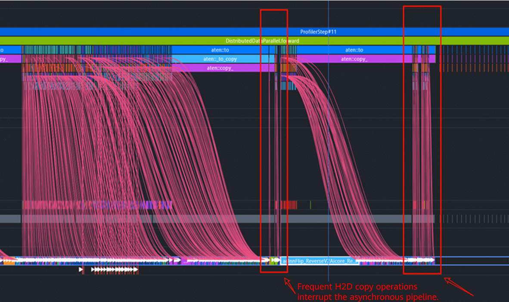

**Single-Card Statistics and Operator Searching**

If you want to view the position of an operator on the **Timeline** page, select the **System View** in the data pane at the bottom, select the **Stats System View** and the corresponding **Rank SN**, and click the **Kernel Details** to view all operators. In addition, you can filter operators by name, type, accelerator core, and input/output shape and sort operators by duration. Choose an operator and click **Click** in the **Click to Timeline** column to go to the corresponding **Timeline** view, as shown in [Figure 7](#ZH-CN_TOPIC_0000002535807019__fig12208010468). This operation is faster than global search.

**Figure 7** Operator details 

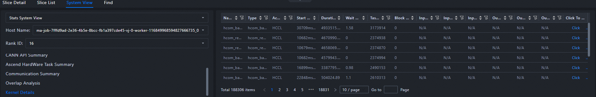

##### Memory 

The overall memory usage trend is displayed in a line chart. You can select and zoom in on the peak area to precisely identify the processes or operators with high memory consumption. For operators with abnormal memory allocation and release, jump to the **Timeline** to locate the code.

> [!NOTE]
>
> Memory optimization roadmap: Increase the batch size to maximize the NPU memory usage. Observe the memory usage trends, mitigate spikes, and balance the peak and off-peak hours.

[Figure 1](#ZH-CN_TOPIC_0000002535807021__fig775318316219) shows that the NPU is underutilized and memory spikes occur.

**Figure 1** Typical case

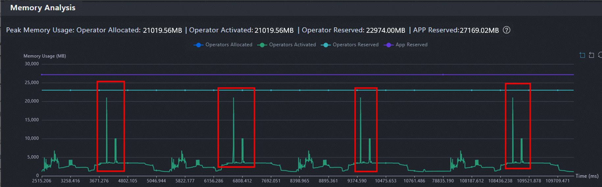

Select operators within the memory spike period. In the memory allocation/release details, sort the operators by requested memory size in descending order. Click the operator ranked first to go to the **Timeline** and locate the specific code, as shown in [Figure 2](#ZH-CN_TOPIC_0000002535807021__fig256619222223). Then, communicate with the model development personnel based on the code location to evaluate potential tuning opportunities.

**Figure 2** Switching to the timeline 

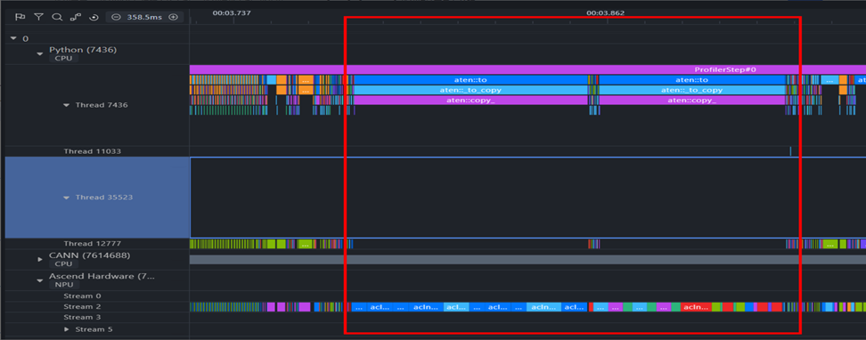

The **Memory** page also supports comparison between two ranks. For details, see "Memory" > "[Instructions](https://gitcode.com/Ascend/msinsight/blob/master/docs/en/user_guide/system_tuning.md#%E4%BD%BF%E7%94%A8%E8%AF%B4%E6%98%8E-1)" in [MindStudio Insight System Tuning](https://gitcode.com/Ascend/msinsight/blob/master/docs/en/user_guide/system_tuning.md).

##### Operator 

The **Operator** page displays the duration statistics of computing and communication operators. The common functions are as follows:

- Collect statistics by type to observe the time consumption ratio of operators, especially whether the ratio of low-efficiency operators such as conversion operators is too high.
- Collect statistics by accelerator core groups to determine whether the time consumption of AI CPU operators or vector operators is abnormally high.
- Collect statistics on computing operators by input shape to determine whether the operators deteriorate in a specific shape.
- You can switch to display the top 15 or all operators, as shown in [Figure 1](#ZH-CN_TOPIC_0000002535807065__fig18956232172415).

For details about the operator locating and tuning methods, see [Operator Performance Tuning Solutions](solution_to_top2.md).

**Figure 1** Operator page 

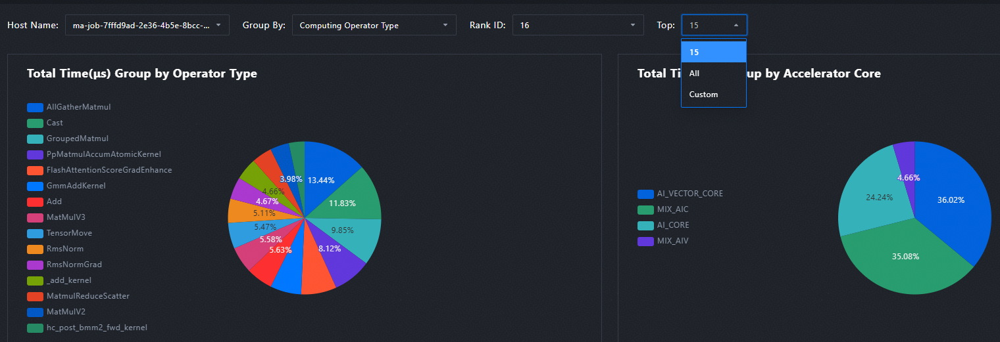

The **Operator** page also supports comparison between two ranks. For details, see "Operator" > "[Instructions](https://gitcode.com/Ascend/msinsight/blob/master/docs/en/user_guide/system_tuning.md#%E4%BD%BF%E7%94%A8%E8%AF%B4%E6%98%8E-2)" in [MindStudio Insight System Tuning](https://gitcode.com/Ascend/msinsight/blob/master/docs/en/user_guide/system_tuning.md).

**Typical Case: Using the Operator Comparison to Quickly Locate the Computing Performance Deterioration**

Background: The same model is deployed on different devices, but the computing performance degrades (about 80 ms per step). The root cause needs to be identified.

1. Move the profile data of the two ranks to the same parent directory and use MindStudio Insight to open the parent directory.

2. Set data comparison between two ranks by referring to "Operator" > "[Instructions](https://gitcode.com/Ascend/msinsight/blob/master/docs/en/user_guide/system_tuning.md#%E4%BD%BF%E7%94%A8%E8%AF%B4%E6%98%8E-3)" in [MindStudio Insight System Tuning](https://gitcode.com/Ascend/msinsight/blob/master/docs/en/user_guide/system_tuning.md).

3. The single-step computing time of a slow rank is about 80 ms longer than that of a fast rank. After the comparison mode is enabled, sort the operators by **Total Time** in **Operator Details**, as shown in [Figure 2](#ZH-CN_TOPIC_0000002535807065__fig459772715412). In the figure, the number of operators is the same (difference = 0), while the total duration differs by approximately 74 ms. This indicates that the MatMul operators are the primary source to the time difference.

   **Figure 2** Inter-rank operator comparison 

   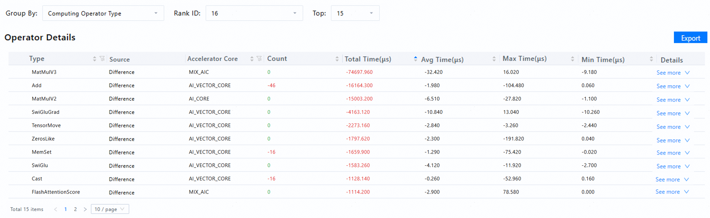

4. Compare operators of the same shape. As shown in [Figure 3](#ZH-CN_TOPIC_0000002535807065__fig43061311115511), operators of the same type (MatMulV3) but different shapes have different degrees of deterioration. In each shape, the MatMul of a slow rank deteriorates more stably than the fast rank.

   **Figure 3** Comparison by shape 

   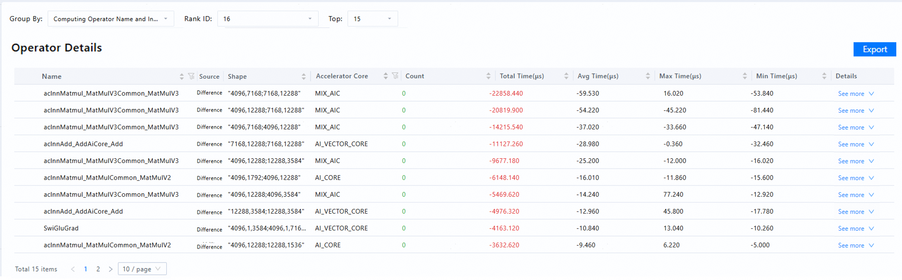

5. The analysis indicates that differences in on-chip memory across devices are the root cause. As the MatMul operator is memory-intensive, varying levels of compute and communication bandwidth preemption result in the performance gap.

### Serving Tools 

This section describes the application scenarios and troubleshooting methods of serving tools. For details about how to locate specific faults, see [Serving Performance Tuning Cases](solution_to_top6.md#cases-for-tuning-the-serving-performance).

1. General tuning: The inference pre-check tool (msprechecker) checks the system, environment variables, and configuration files to identify potential problems that may affect the serving performance.
2. Targeted tuning: Optimize serving scheduling by adjusting the configuration items (such as the input and output length and number of concurrent requests) of the current requirements. The following tools are available:
   1. Expert advice tool for serving tuning (msserviceadvisor): This tool quickly improves serving performance, but cannot be used for refined tuning.
   2. Automatic serving tuning tool (modelevalstate): This tool enhances serving performance and reaches 95% of the optimal performance achieved by manual tuning. However, this method takes a long time, and parameters need to be continuously searched to approach the optimal solution.
3. If the expected result is not achieved, you can use the serving tuning tool (msServiceProfiler) for in-depth analysis. The msServiceProfiler tool is applicable to users who are familiar with the entire serving operation.

**Table 1** Serving performance tools

| Tool                                                                                                                                  | Introduction                                                                                                                                                                                                                                                                                                                                                                                                                                                                                                         |
| ------------------------------------------------------------------------------------------------------------------------------------- | -------------------------------------------------------------------------------------------------------------------------------------------------------------------------------------------------------------------------------------------------------------------------------------------------------------------------------------------------------------------------------------------------------------------------------------------------------------------------------------------------------------------- |
| [Inference Pre-check Tool](https://gitcode.com/Ascend/msit/blob/master/msprechecker/README_EN.md)                                        | Supports full-process detection before, during, and after inference. • Before inference: The one-click pre-check function is provided to check for issues that may cause service deployment failures or performance deterioration, such as environment variables, system kernels, and configuration files. • During inference: All environment-related data can be flushed to disks. • After inference: The flushed files are compared to help identify differences and reproduce the baseline environment. |
| [Serving Advisor](https://gitcode.com/Ascend/msserviceprofiler/blob/master/docs/en/service_profiling_advisor_instruct.md)             | Provides tuning suggestions for key metrics such as Time To First Token (TTFT) and throughput, based on the output result using the Benchmark tool, `config.json` configuration of the MindIE service, and theoretical analysis of the performance upper limit.                                                                                                                                                                                                                                                    |
| [Serviceparam Optimizer](https://gitcode.com/Ascend/msserviceprofiler/blob/master/docs/en/serviceparam_optimizer_instruct.md)         | Provides automatic parameter tuning for MindIE and vLLM services. Uses advanced retrieval algorithms to efficiently find the optimal solution in the parameter space for automatic tuning. This tool is lightweight to support quick and convenient deployment and ensure accurate search results.                                                                                                                                                                                                                   |
| [Serving Tuning Tools](https://gitcode.com/Ascend/msserviceprofiler/blob/master/docs/en/msserviceprofiler_serving_tuning_instruct.md) | Provides the capabilities to parse and break down the profile data collection APIs of the inference service This tool is designed for serving tuning. It collects the start and end time points of key processes, identifies and records information (such as key function calls, key events, and serving scheduling), and collects operator information to quickly locate performance problems.                                                                                                                     |
