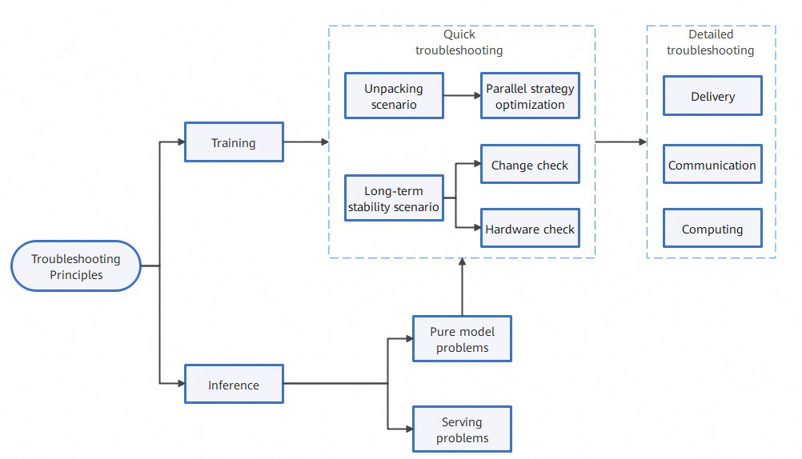
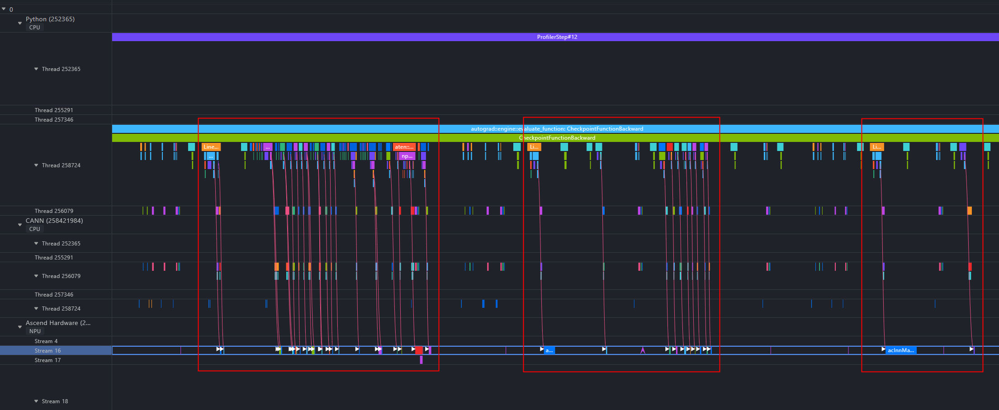
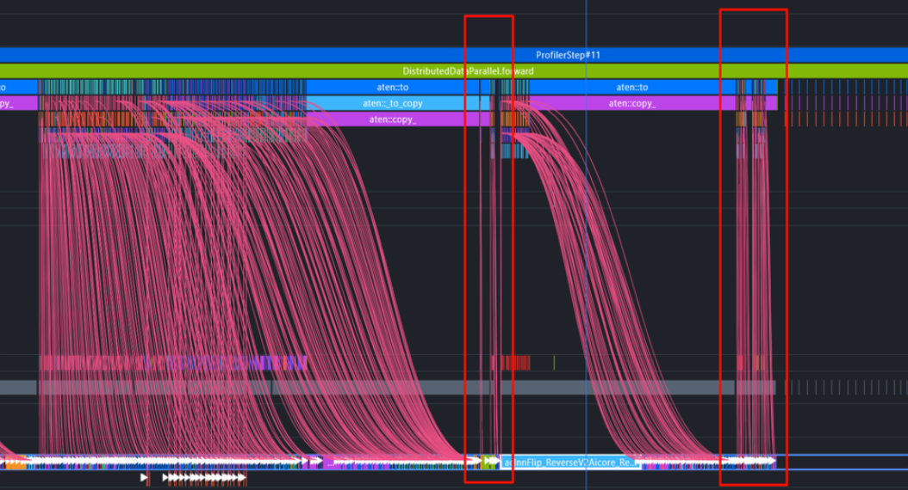
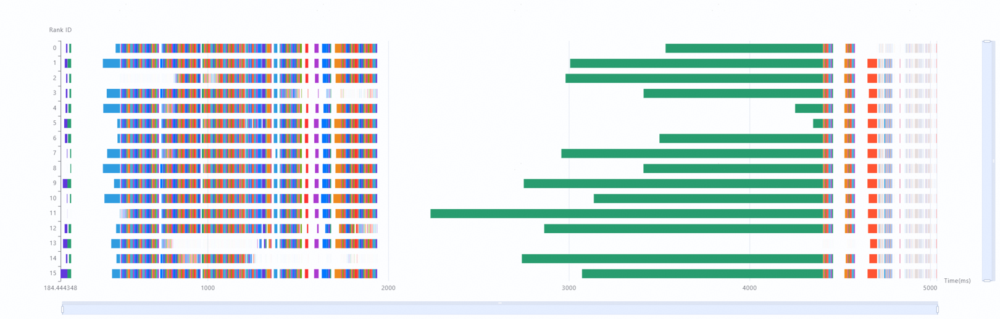
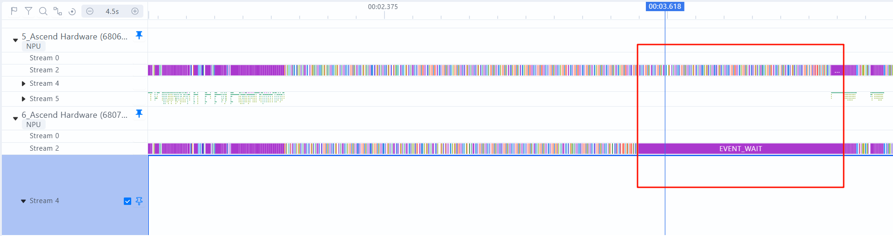

# Performance Troubleshooting Process

## Troubleshooting Overview

The overall performance tuning roadmap is described in [Performance Tuning Options](overview.md#performance-tuning-options). The procedure is as follows:

> [!NOTE]
>
> The prerequisite for performance tuning is that the precision does not deteriorate. In special cases, you need to check whether the precision deterioration is acceptable.

1. Problem identification: Collect necessary information by referring to [Problem Information Collection](#problem-information-collection).
2. Performance troubleshooting: For details about the locating method, see [Troubleshooting Principles](#troubleshooting-principles).
3. Experiment verification: During multiple experiments, strictly control variables to ensure that all parameters and data are consistent, except for the modified strategies.

## Problem Information Collection

Before troubleshooting, gather accurate issue information, including [basic information](#ZH-CN_TOPIC_0000002503927266__table8794114914506), a [Key problem description](#ZH-CN_TOPIC_0000002503927266__table8794114914507), and the [optimization objective](#ZH-CN_TOPIC_0000002503927266__table8794114914508).

**Table 1** Basic information 

| Main Information      | Description                                                                                                                                                                           |
| --------------------- | ------------------------------------------------------------------------------------------------------------------------------------------------------------------------------------- |
| Model type            | Model structure (Llama-like, GPT-like, and MoE-like).                                                                                                                                 |
| Operation scale       | Number of devices and servers                                                                                                                                                         |
| Parallelism strategy  | Specific parallel parameter configuration.                                                                                                                                            |
| Framework and version | &#8226; Specify the version of CANN, MindSpore, or PyTorch. &#8226; Check for recent changes in these versions to determine whether the issue occurred before or after the change. |

**Table 2** Key problem description 

| Main Information            | Description                                                                                                                                                                                                                                                                                                                                                                                                                                                                                                                                                                                                                                                                                                                                                                                                                            |
| --------------------------- | -------------------------------------------------------------------------------------------------------------------------------------------------------------------------------------------------------------------------------------------------------------------------------------------------------------------------------------------------------------------------------------------------------------------------------------------------------------------------------------------------------------------------------------------------------------------------------------------------------------------------------------------------------------------------------------------------------------------------------------------------------------------------------------------------------------------------------------- |
| Background                  | During training or inference, the model performance does not meet the expected standards, is lower than that of competing products, or exhibits abnormal performance. &#8226; The performance is not as expected. Generally, this problem occurs after model migration. The performance is not as expected compared with that of the competing product. &#8226; During long-term stable model training, performance fluctuates randomly or when specific events occur. &#8226; The cluster linearity is insufficient. After the cluster scale is expanded, the model performance does not increase as expected. &#8226; The performance of the pure model is abnormal under the same configuration. For details, see the training problem troubleshooting in this document. &#8226; Serving scheduling requires tuning. |
| Current performance metrics | Clarify the current performance issue. For details about how to prioritize performance metrics, see "Performance Tuning" > "Performance Overview" > "[Performance Metrics](https://gitcode.com/Ascend/ModelZoo-PyTorch/blob/master/PyTorch/docs/en/performance_tuning/performance_overview.md)" in [PyTorch Model Porting and Tuning Guide](https://gitcode.com/Ascend/ModelZoo-PyTorch/blob/master/PyTorch/docs/en/README.md).                                                                                                                                                                                                                                                                                                                                                                                              |

**Table 3** Optimization objective 

| Main Information              | Description                                                                                                                                                                                                                                                                                                                                                                                                                                                                                                                                                                                                                                                          |
| ----------------------------- | -------------------------------------------------------------------------------------------------------------------------------------------------------------------------------------------------------------------------------------------------------------------------------------------------------------------------------------------------------------------------------------------------------------------------------------------------------------------------------------------------------------------------------------------------------------------------------------------------------------------------------------------------------------------- |
| Performance tuning objectives | Specify the tuning objective and its source, for example, competitor benchmarking or linear scalability calculations. If the optimization involves methods such as increasing the batch size, do not use metrics such as single-step time for measurement. For details, see "Performance Tuning" > "Performance Overview" > "[Performance Metrics](https://gitcode.com/Ascend/ModelZoo-PyTorch/blob/master/PyTorch/docs/en/performance_tuning/performance_overview.md) "in [PyTorch Training Model Porting and Tuning Guide](https://gitcode.com/Ascend/ModelZoo-PyTorch/blob/master/PyTorch/docs/en/README.md), select proper metrics for replacement. |

## Troubleshooting Principles

### Quick Troubleshooting

Quick checks can be performed in two scenarios: unpacking and long-term stability scenarios. The details are as follows:

1. Unpacking scenario: The unpacking performance issues typically occur during the first model loading. In this case, the tuning objective should be defined first. If performance benchmarks from competing products are available, tools such as profiling can be used to analyze the differences in detail. You are advised to optimize the parallel strategy and determine the optimal configuration before starting a task. If the issue persists, refer to the long-term stability scenario for further troubleshooting.
2. Long-term stability scenario: Performance issues related to long-term stability usually arise when the system, after running without issues for a period, suddenly experiences performance degradation or problems.
   1. Change check: Check whether changes have been made recently, including but not limited to cluster replanning and version changes. If the performance issue arises after these changes, try rolling back the changes, if possible. If the issue is confirmed to be caused by the change, focus on the impact of the version update or operations (such as restart) on the cluster. For more details, see [Methodology for Locating Performance Deterioration During Version Upgrade](solution_to_top7.md)..
   2. Hardware check: When the performance fluctuates, check whether hardware faults occur at the corresponding time point, for example, hardware alarms such as NPU frequency reduction and network packet loss. Note that this hardware check is the initial step and primarily focuses on hardware alarms. If no hardware alarms or key events such as packet loss are identified, refer to [Detailed Check](#detailed-troubleshooting).

### Detailed Troubleshooting

The detailed troubleshooting focuses on three types of common issues: delivery, communication, and computing. For details about how to use the performance tools, see [Performance Tool Usage](performance_tool_usage.md).

> [!NOTE]
>
> - The msprof-analyze tool performs preliminary analysis, identifies performance issues at a fine-grained level, and provides clear direction for further in-depth analysis. For details, see [Quick Analysis for Model Tuning (msprof-analyze)](performance_tool_usage.md#performance_tool_usage01).
> - The MindStudio Insight tool identifies bottlenecks and analyzes root causes. For details, see [In-depth Model Tuning Analysis (MindStudio Insight)](performance_tool_usage.md#performance_tool_usage02).

**Figure 1** Detailed troubleshooting flowchart

#### Delivery Issues

The delivery issues refer to the abnormal time consumption during operator delivery. The Graph Engine delivers operator execution requests to the Runtime, which determines the task type and delivers the request to the appropriate device for execution. For details, see "[Operator Compilation and Execution Workflow](https://www.hiascend.com/document/detail/en/CANNCommunityEdition/910/others/tbeaicpudevg/atlasopdev_10_0012.html)" in [TBE & AI CPU Operator Development Guide](https://www.hiascend.com/document/detail/en/CANNCommunityEdition/910/others/tbeaicpudevg/atlasopdev_10_0001.html).

Under normal conditions, the computing pipeline on the NPU runs continuously without waiting for the CPU. However, if the delivery is delayed, the pipeline is blocked, resulting in low computing power utilization of AI Cores. In such cases, a delivery issue is identified. The delivery problem can be observed in the **[Timeline](performance_tool_usage.md#performance_tool_usage09)** of MindStudio Insight. If any of the following symptoms occurs, analyze the problem by referring to [Delivery Exception Analysis](solution_to_top3.md#delivery-exception-analysis).

- Excessive **Free** time: The **Free** proportion in **Overlap Analysis** is far greater than that of **Computing** and **Communication**. The ideal **Free Time** proportion is less than 10%.

  **Figure 2** Viewing Free

  

- The HostToDevice connection lines in the red box are almost vertical, and the Device lines in the blue box are relatively idle.

  **Figure 3** Viewing the connection line

  

- Frequent HostToDevice copying interrupts the asynchronous pipeline, causing a delivery bottleneck.

  **Figure 4** Finding the delivery bottleneck

  

#### Communication Issues

Communication issues generally refer to abnormal communication between NPUs. Typical symptoms are slow and fast ranks or the communication bandwidth is far lower than expected. For details, see [Cluster Performance Analysis](./performance_tool_usage.md#performance_tool_usage05). For details about the solution, see [Communication Tuning Solutions](solution_to_top1.md).

> [!NOTE]
>
> In large cluster scenarios, the data volume of full cluster profiling may be excessive, making analysis cumbersome. You are advised to use the cluster_analyze tool on full cluster profiling and import the `cluster_analysis_output` directory to MindStudio Insight. For details about the tool, see [Quick Analysis for Model Tuning (msprof-analyze)](performance_tool_usage.md#performance_tool_usage01). Then examine the output to identify any ranks that are noticeably faster or slower, as well as potential communication or transmission issues, and select the profiling of some ranks for single-rank analysis.

- Figure 5 demonstrates the **Communication Duration Analysis** function on the **Communication** page of the MindStudio Insight. Each color block represents a collective communication operator, and its length represents the execution time of the communication operator. For a collective communication operator, when execution times between different ranks vary significantly, the rank with the shortest execution time functions as a slow rank because other ranks must wait for it to complete.

  **Figure 5** Using the Communication Duration Analysis of MindStudio Insight to locate slow ranks

  

- In the timeline, you can see obvious inter-rank wait. As highlighted in the red box in Figure 6, fast rank rank 6 has completed its computation and is waiting for slow rank rank 5 to finish.

  **Figure 6** Timeline comparison of Profiling results between fast and slow ranks (at Ascend hardware layer)

  

- As shown in Figure 7, the duration of the hcom_allGather communication operator of the fast rank rank 6 is longer than that of the slow rank rank 5, and the duration is mainly caused by synchronization wait.

  **Figure 7** Timeline comparison of profiling results between fast and slow ranks (communication unit)

  .png "timeline-comparison-of-profiling-results-between-fast-and-slow-cards-(communication-unit)")

#### Computing Issues

The computing issues refer to operator performance issues, a key challenge in the deep learning model. Specifically, the execution efficiency of some basic compute units is low, affecting the running speed of the entire model and causing resource waste. Such issues need to be solved by using dedicated analysis tools and code tuning technologies. For example, when evaluating the performance of a fused operator, you can compare metrics such as the computing time and memory usage under different configurations. For details, see [Operator Performance Tuning Solutions](solution_to_top2.md) to locate and resolve the issues.

**Figure 8** Operator performance issue locating

