# Communication Tuning Solution

## Overview

Communication issues are typically characterized by excessively long cluster communication time, significantly exceeding the computing time, as shown in [Figure 1](#ZH-CN_TOPIC_0000002504087092__fig97371217617). Alternatively, specific communication operators may exhibit abnormally long durations. For example, in [Figure 2](#ZH-CN_TOPIC_0000002504087092__fig315152711916), the time of reduceScatter operators is much longer than the computing stream, as marked by ① and ②.

**Figure 1** Communication issue 1: longer communication time than computing 

**Figure 2** Typical communication issue 2: long-duration communication operators 

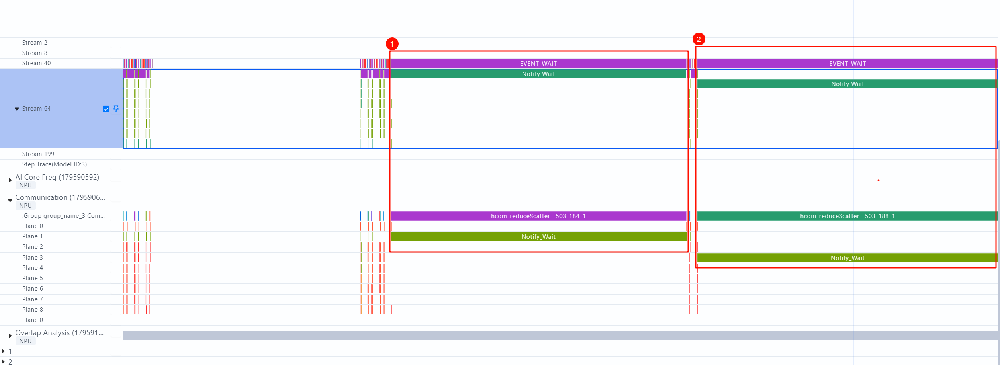

Note that communication issues can be caused either by slow data transmission or by other slow ranks (that is, the fast and slow ranks).

To check whether the issue is caused by the transmission or the fast and slow ranks, perform the following operations:

- Go to the **Communication Duration Analysis** tab page on MindStudio Insight. If the **Transmit Time** proportion of the rank is high, the communication transmission is faulty. If the **Synchronization Time** proportion is high, there are slow and fast ranks. For details, see [Communication](performance_tool_usage.md#performance_tool_usage07).

  **Figure 3** Communication duration analysis

  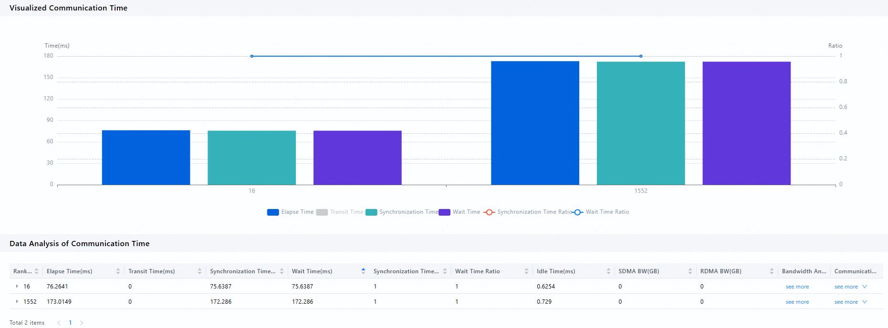

- You can compare the multi-rank computing, communication, and free time on the **Summary** tab page to check whether the problem is caused by fast and slow ranks. For details, see [Summary](performance_tool_usage.md#performance_tool_usage06). [Figure 4](#ZH-CN_TOPIC_0000002504087092__fig1472719122113) shows a typical example. If the free time of each rank is negatively correlated with the communication time (that is, a longer free time indicates a shorter communication time, and a shorter free time indicates a longer communication time), there is a high probability that the cluster contains fast and slow ranks caused by delivery performance fluctuation. Similarly, there is a problem that the computing time is negatively correlated with the communication time.

  **Figure 4** Fast and slow rank problem 

  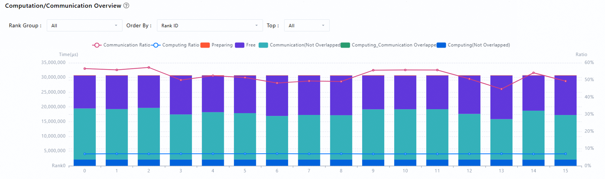

If there are slow and fast ranks, locate the cause by referring to [Fast and Slow Rank Troubleshooting](#fast-and-slow-rank-troubleshooting).

If the issue is not related to slow and fast ranks, focus on the communication layer. Potential causes include [communication retransmission](#communication-retransmission), [small-packet overhead], byte misalignment between source and destination addresses, compute-communication bandwidth contention, and performance overhead from profiling collection.

## Fast and Slow Rank Troubleshooting

### Overview

Fast and slow ranks are relative concepts. A fast rank is one that completes a computing task earlier in a cluster, while a slow rank finishes the same task later. In a cluster, collective communication requires coordination between ranks. If different ranks complete their tasks at different times, fast ranks need to wait for slow ranks before communication can proceed, which leads to overall cluster performance degradation.

Fast and slow ranks can be caused by various reasons. The general troubleshooting approach is to use precise divergence point analysis to compare the differences of fast and slow ranks on the **Timeline** tab of MindStudio Insight, to determine the specific root cause.

The common causes include load imbalance and performance fluctuation of computing, host delivery, and data loading.

The main contents are as follows:

- [Precise Divergence Point Analysis for Fast and Slow Ranks](#precise-divergence-point-analysis-for-fast-and-slow-ranks): describes the general method for analyzing fast and slow ranks.
- [Locating Fast and Slow Ranks Using the Timeline](#locating-fast-and-slow-ranks-using-the-timeline): demonstrates how to use the **Timeline** tab page of MindStudio Insight to locate the fast and slow rank problem.
- [Locating Fast and Slow Ranks Through Operator Comparison](#locating-fast-and-slow-ranks-through-operator-comparison): demonstrates how to use the operator comparison function to locate the fast and slow rank problem.
- [Fast and Slow Rank Cases](#fast-and-slow-rank-cases): provides more typical cases of fast and slow ranks.

### Precise Divergence Point Analysis for Fast and Slow Ranks

You can quickly locate the root cause of the difference between fast and slow ranks on the **Timeline** tab page of MindStudio Insight.

**Figure 1** Precise divergence point analysis

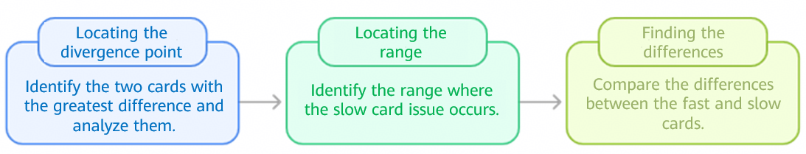

#### Locating the Divergence Point

On the **Communication** tab, open the communication operator thumbnail and select the last iteration ID. Identify the collective communication operator with the largest duration difference. Starting from the divergence point where the impact is most significant, right-click to navigate to the corresponding communication position for further analysis. The green operator is used as an example, as shown in [Figure 2](#ZH-CN_TOPIC_0000002535807027__fig16785105671316).

**Figure 2** Locating the divergence point 

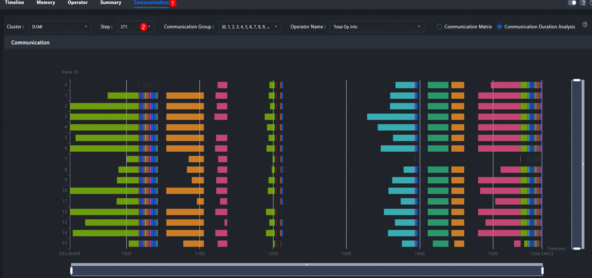

#### Locating the Range

1. Zoom in the communication operator. Locate the ranks to be compared (cards with the largest duration gap, for example, ranks 0 and 3), as shown in [Figure 3](#ZH-CN_TOPIC_0000002535807027__fig1399855918136).

   **Figure 3** Locating the range 1

   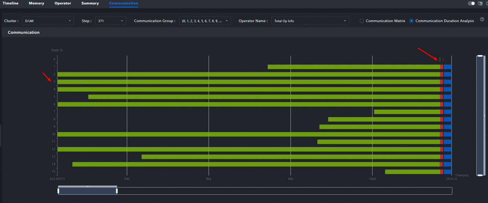

2. Right-click the communication operator and choose **Find in Timeline** from the shortcut menu. It is recommended that you add a flag at the beginning of the Python API delivered by the HCCL communication operator on the two ranks.

   **Figure 4** Locating the range 2

   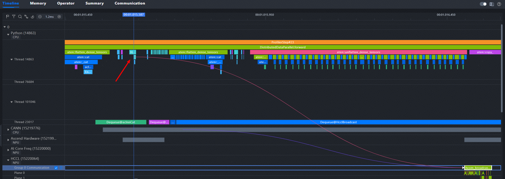

3. Identify the place (white line in the figure) where the fast and slow ranks begin to diverge—this marks the start of the comparison region. Use the respective flags of the two ranks as the end points of their comparison intervals to determine the fast-rank region and the slow-rank region, as shown in [Figure 5](#ZH-CN_TOPIC_0000002535807027__fig11471433161010).

   **Figure 5** Locating the place where slow and fast ranks are generated 

   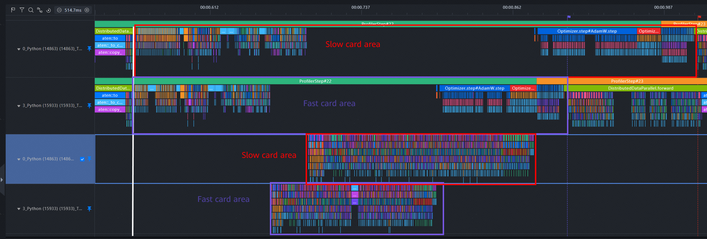

#### Finding the Differences

Compare the fast-rank region and the slow-rank region to find the specific causes of the difference.

As shown in [Figure 6](#ZH-CN_TOPIC_0000002535807027__fig15176410142), there are three areas that cause slow and fast ranks: areas 1 and 4, 2 and 5, and 3 and 6.

**Figure 6** Example 

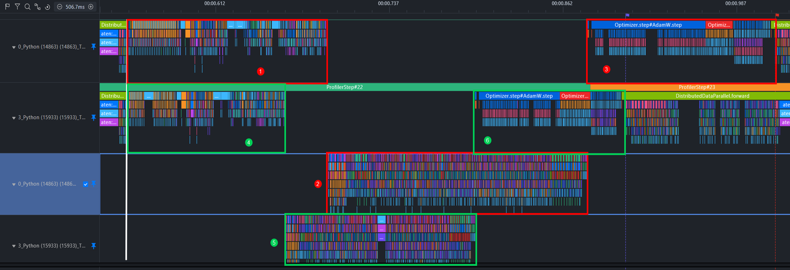

The problem points of the fast and slow ranks have been located. Next, locate the root cause of the fast and slow ranks based on the operator and code.

### Locating Fast and Slow Ranks Using the Timeline

This section describes how to locate fast and slow rank faults using MindStudio Insight.

If the fast and slow rank issue has been preliminarily located in the cluster (for details, see [Summary](performance_tool_usage.md#performance_tool_usage06)), and the transmit time is low while wait or synchronization time is high (for details, see [Communication](performance_tool_usage.md#performance_tool_usage07)), the cluster has the issue. In this case, view **Communication Time Analysis**. The communication operators are tiled horizontally to determine where the slow rank is.

As shown in [Figure 1](#ZH-CN_TOPIC_0000002504087044__fig145361328205714), for the hcom allGather collective communication operators in green, ranks 4, 5, and 13 with short duration are slow ranks, and ranks (such as ranks 11 and 14) with long duration are relatively fast ranks.

The next step is to analyze what the slow rank is doing during the idle period. You need to go to the **Timeline** module to view the specific differences.

**Figure 1** Communication operator tiling 

1. Right-click a communication operator and choose **Find in Timeline** from the shortcut menu. On the **Timeline** view displayed, mark the approximate range with a flag to facilitate subsequent locating.

   **Figure 2** Switching from the communication operator to the Timeline view

   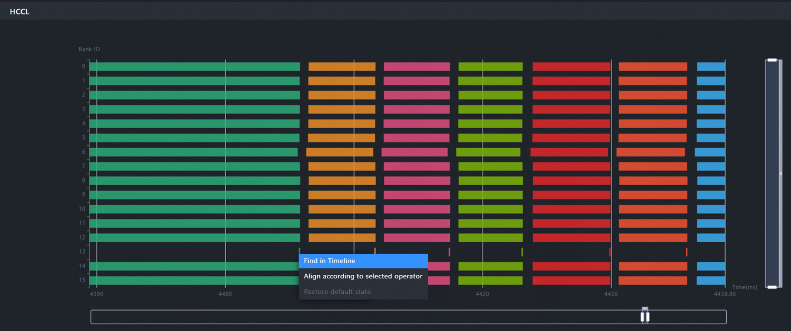

   **Figure 3** Marking the approximate range with a flag

   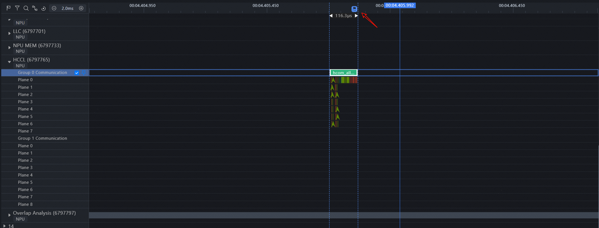

2. Select a step, click **Fit to screen**, and pin it to the top to compare the **Overlap Analysis** lanes of the slow rank (rank 13) and fast rank (rank 14) to determine the source of the difference. (The **Overlap Analysis** lanes shows the computing and communication tasks at the Ascend Hardware layer in a unified manner, making the comparison clearer.)

   **Figure 4** Limiting the troubleshooting area to a step (full-screen display by step)

   .png)

   **Figure 5** Pinning the slow rank (rank 13) and fast rank (rank 14) to the top to compare the Overlap Analysis lanes and determine the source of the difference

   -and-fast-card-(card-14)-to-the-top-to-compare-the-overlap-analysis-l.png)

3. Based on statistics from the selected area, the number of slow rank lane computing tasks is much greater than that of fast rank lane computing tasks.

   **Figure 6** Statistics

   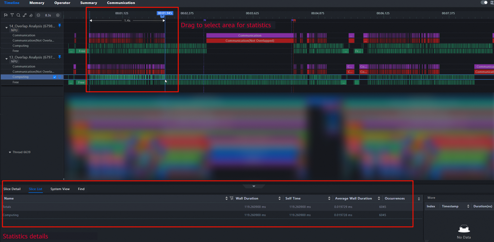

   The difference mainly comes from the second half, indicating that the problem is caused by load imbalance.

   **Figure 7** Operator quantity comparison

   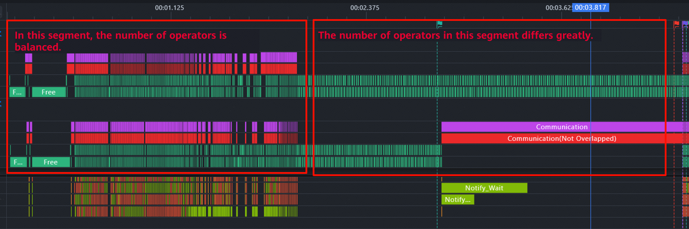

4. Determine the Python API that delivers the extra operators based on **async_npu**. (You can select specific area to display connection lines instead of full display.)

   **Figure 8** async_npu delivery connections

   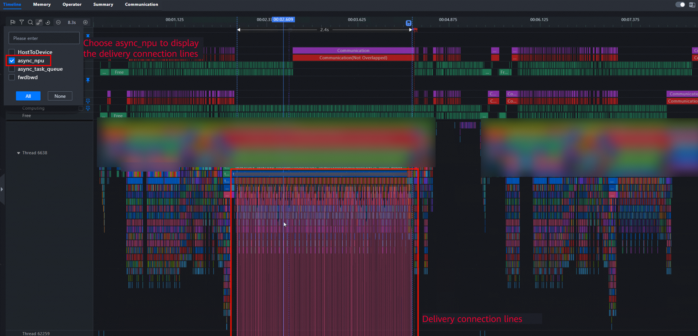

   According to the statistics from the selected area at the Ascend hardware layer, for an API on the Python side, the fast rank delivers 1,218 computing operators and the slow rank delivers 3,303 computing operators. Therefore, the slow rank is caused by the unbalanced load of the API on the Python side.

5. Confirm with the model development personnel whether the load imbalance can be avoided.

### Locating Fast and Slow Ranks Through Operator Comparison

If the slow and fast ranks in the cluster are caused by the fluctuation of the computing time on the **Summary** page of MindStudio Insight, in addition to the method mentioned in [Precise Divergence Point Analysis for Fast and Slow Ranks](#precise-divergence-point-analysis-for-fast-and-slow-ranks), you can compare the time consumption of the slow and fast rank operators to quickly locate the difference source.

#### Locating the Fast and Slow Ranks on the Summary Page

Go to the **Computation/Communication Overview** area on the **Summary** page of MindStudio Insight. In this example, ranks 0 to 7 are slow computing ranks (long computing time and short communication time), and ranks 8 to 15 are fast computing ranks (short computing time and long communication time). The long communication time of the latter is caused by waiting for the former.

**Figure 1** Computation/Communication Overview page

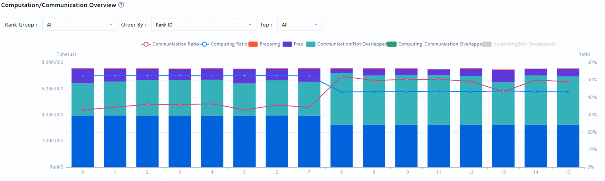

#### Comparing operator differences

As described in [Operator](performance_tool_usage.md#performance_tool_usage11), you can quickly locate the operators that cause the time consumption difference. As shown in [Figure 2](#ZH-CN_TOPIC_0000002503927274__fig146751313103511), set ranks 7 and 8 to the inter-rank comparison mode and sort them by total time consumption in ascending order. If the number of operators on the fast and slow ranks differs greatly, the computing load is unbalanced. In this case, confirm with the model development personnel whether the load imbalance can be avoided. If the number of operators of a certain type is the same but the average time consumption differs, contact the operator development owner or use the method in [Precise Divergence Point Analysis for Fast and Slow Ranks](#precise-divergence-point-analysis-for-fast-and-slow-ranks) to further locate the root cause on the **Timeline**.

**Figure 2** Inter-rank operator comparison 

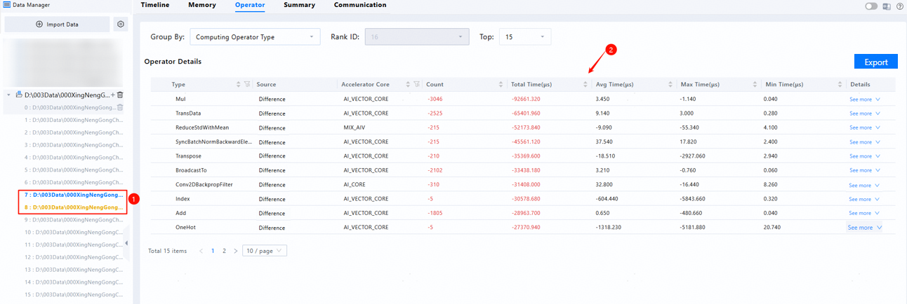

Similarly, you can use the compare tool to go to the **KernelCompare** comparison page and analyze operator differences. For details, see [Quick Analysis for Model Tuning (msprof-analyze)](performance_tool_usage.md#performance_tool_usage01).

**Figure 3** KernelCompare page of the compare tool

### Fast and Slow Rank Cases

#### Case 1: Continuous Performance Deterioration After Checkpoints Are Saved in a Cluster

**Issue**

In a 4-node 64-rank cluster, the performance deteriorates continuously after checkpoints are saved.

**Problem Analysis**

The msprof-analyze tool described in [Quick Analysis for Model Tuning (msprof-analyze)](performance_tool_usage.md#performance_tool_usage01) is used to analyze the cluster. The results ([Figure 1](#ZH-CN_TOPIC_0000002503927272__fig175962111612)) show that the fluctuation trends of communication time and free time are negatively correlated. In other words, for the same rank, a rank with longer communication time has shorter free time, while a rank with shorter communication time has longer free time. Based on this observation, rank 0, which has the shortest free time, finishes its computation first and waits for the other ranks, indicating that it is the fast rank. In contrast, rank 1, which has the longest free time, finishes last and is identified as the slow rank. In this case, the fast and slow rank issue is caused by performance fluctuation on the host side.

**Figure 1** cluster_step_trace_time.csv 

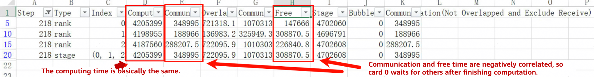

Go to the **Timeline** page. As shown in [Figure 2](#ZH-CN_TOPIC_0000002503927272__fig16619142217167) and [Figure 3](#ZH-CN_TOPIC_0000002503927272__fig969067145819), the communication waiting of rank 0 occurs in the gradient summary phase after backpropagation. Compare the fast and slow ranks on the **Timeline**. An abnormal gap is observed at the end of the step for rank 1 of the slow rank. During this phase, frame freezing occurs, causing rank 0 of the fast rank to wait.

**Figure 2** Timeline view (Rank0) 

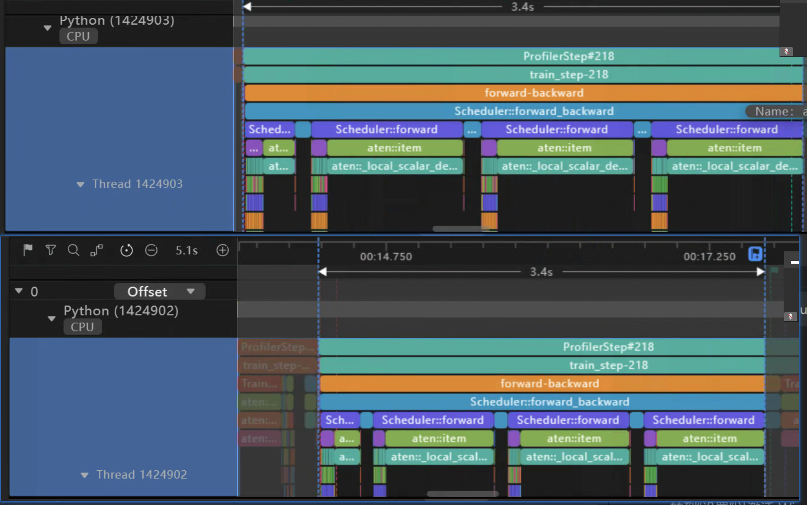

**Figure 3** Timeline view (Rank1) 

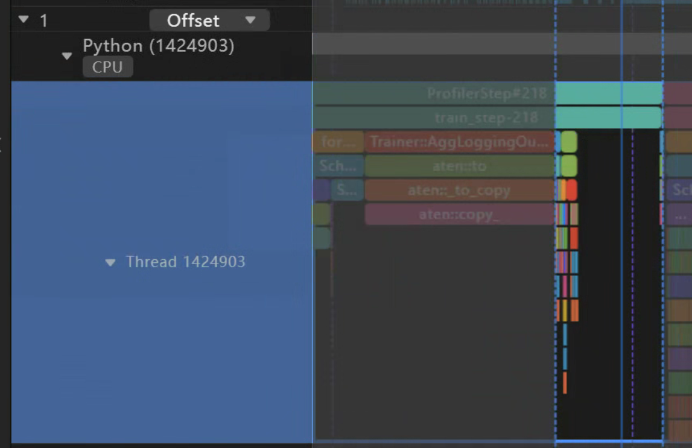

**Fault Locating Completed**

The cause of this problem is that the code has unreleased memory at the end of the slow rank step. After the memory is manually cleared, the problem is resolved.

#### Case 2: Long Waiting Time of the AllReduce Communication Operator in a Cluster

**Issue**

The waiting time of the AllReduce communication operator in the 256P cluster is long, and the linearity does not meet the requirement.

**Problem Analysis**

The Notify Wait message in the DP communication domain takes a long time, as shown in [Figure 1](#ZH-CN_TOPIC_0000002535807039__fig9295127131610).

**Figure 1** Timeline analysis of the DP communication domain 

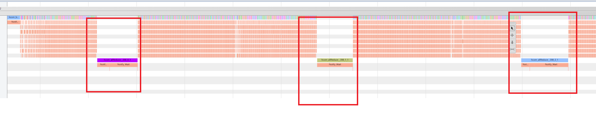

On the **Communication** page, locate the communication domain. There is a long Notify Wait message, and the **Elapse Time** (total communication time) varies significantly. The difference between the fastest and slowest ranks exceeds 200ms.

**Figure 2** Communication duration analysis

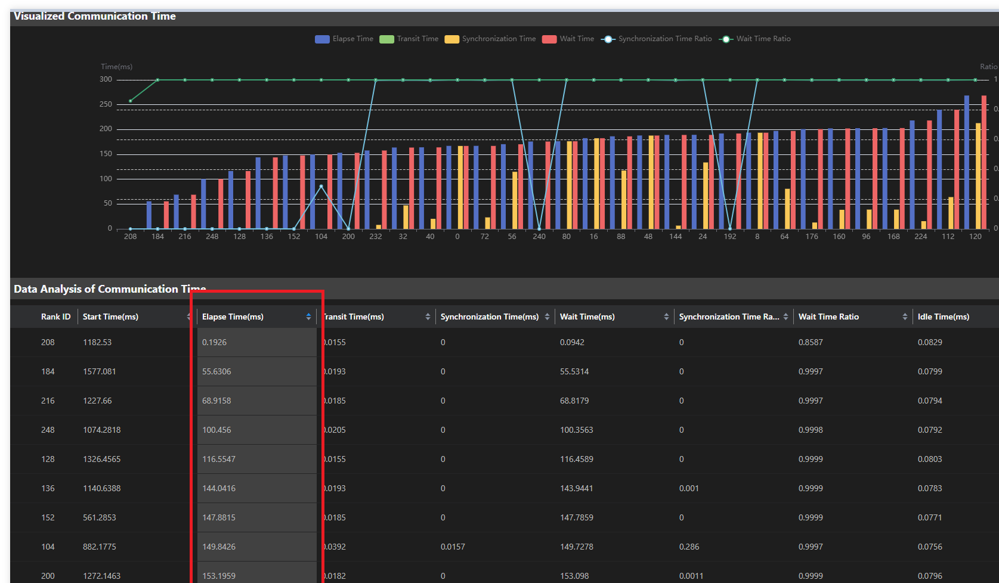

Compare the fast rank 0 and slow rank 208 on the **Timeline** page. The slow rank 208 is slow in TP domain communication, as shown in [Figure 3](#ZH-CN_TOPIC_0000002535807039__fig1010153111614). In a micro computation task, TP domain communication takes 494ms on slow rank 208, compared to 340 ms on fast rank 0. Communication transmission speeds in the TP domain are similar for both fast and slow ranks. The performance difference is mainly caused by the wait time.

**Figure 3** Timeline page of fast rank 0 and slow rank 208 

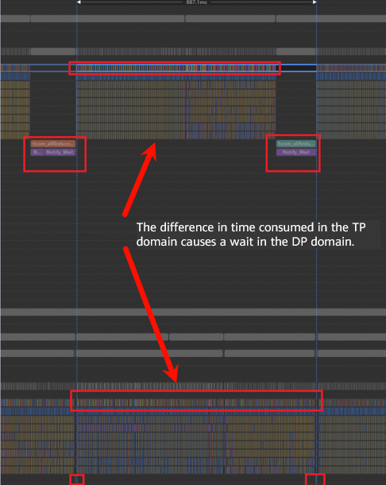

Within the same TP domain as rank 208, rank 214 is the slow rank affecting the entire TP domain. Specifically, rank 214 delays rank 208 in the TP domain, and rank 208 subsequently impacts rank 0 in the DP domain. Therefore, rank 214 is identified as the root cause. Comparing the timelines of ranks 208 and 214 shows that rank 214 experiences slow host delivery, as shown in [Figure 4](#ZH-CN_TOPIC_0000002535807039__fig43241642201912).

**Figure 4** Timelines for Ranks 208 and 214 

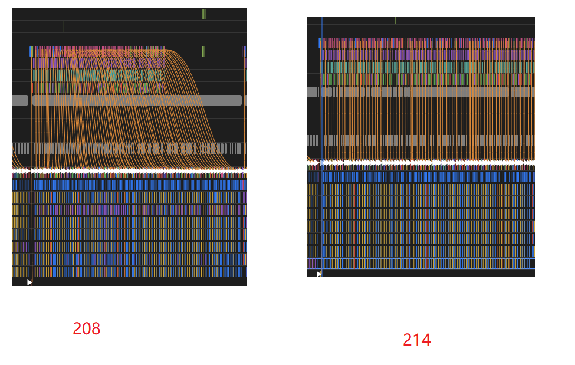

The timeline selection statistics function is used to compare the CANN-side APIs responsible for delivering ranks 208 and 214. The results show that the CANN-side API for rank 214 takes significantly longer time than that for rank 208, as shown in [Figure 5](#ZH-CN_TOPIC_0000002535807039__fig1646164615811).

**Figure 5** Selected area statistics of CANN APIs on ranks 208 and 214 

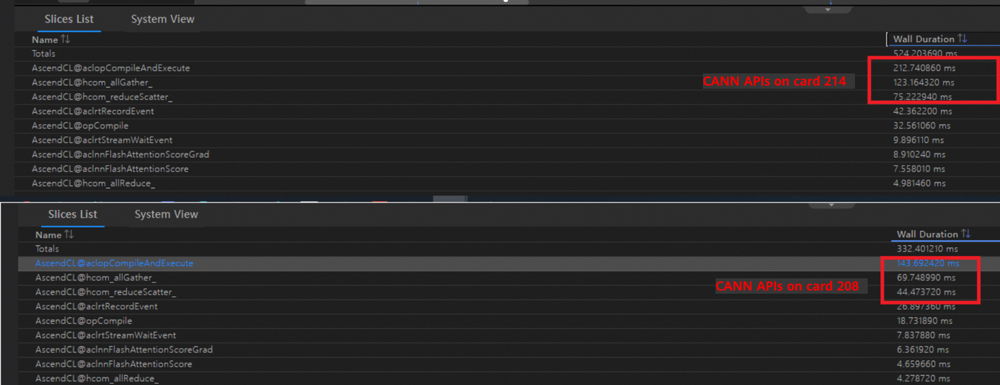

**Fault Locating Completed**

Comparison of the fast and slow rank timelines indicates that the difference is caused by the delivery bottleneck on the host side of the slow rank (rank 214). For details about how to solve the delivery bottleneck on the host side, see [Host Bound Troubleshooting](solution_to_top3.md).

## Communication Retransmission

### Analyzing Cluster Data to Determine Whether Communication Retransmission Occurs

In distributed training, if a communication operator takes more than 4s (the typical threshold for communication retransmission), packet retransmission may occur after the possibility of fast and slow rank issues is excluded. It is difficult to distinguish the two cases based on the profile data of a single rank. You can further locate the fault using MindStudio Insight.

Typically, communication retransmission occurs in performance jitter between clusters. You can use MindStudio Insight to compare the profile data of normal and abnormal steps to confirm the problem.

1. On the MindStudio Insight cluster summary page, you can view the time consumption distribution of different steps, as shown in [Figure 1](#ZH-CN_TOPIC_0000002504087090__fig13354164218130).

   **Figure 1** MindStudio Insight cluster overview page 

   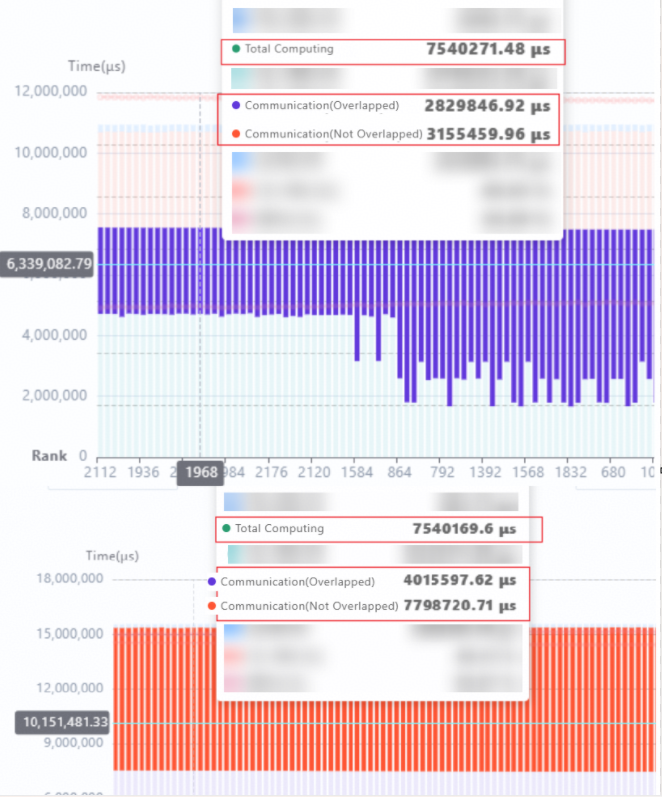

2. Compare the overview results of two steps. The computing time and free time of each rank are close, indicating that there is no obvious fast and slow rank problem. The main difference lies in the communication time (overlapped communication time + non-overlapped communication time).

3. Compare all ranks at the same time. The communication time difference of each rank in steps 11 and 12 is about 4.7s.

4. As shown in [Figure 2](#ZH-CN_TOPIC_0000002504087090__fig1049254151413), the operator LinearWithGradAccumulationAndAsyncCommunication is used for synchronization. The subsequent task (AscendCL@aclnnTopK) is blocked during delivery.

   **Figure 2** Timeline of Rank 320 

   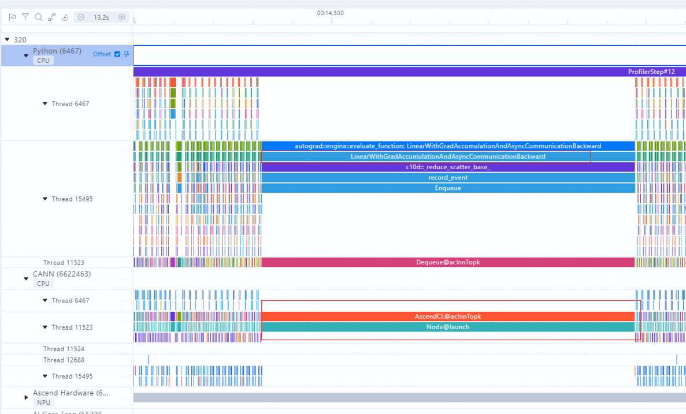

   According to the data analysis results, the NPU (computing) and CPU (scheduling) operate normally. The main difference in communication time between ranks is caused by point-to-point communication timeouts, which are likely due to packet retransmissions triggered by network exceptions.

5. After communication retransmissions are detected, check whether the switch network is correctly configured. For example, verify whether the PFC mechanism is configured. If PFC is not enabled, network congestion may occur, leading to communication retransmissions.

### A Typical Case of Communication Retransmission

**Issue**

When the Llama3-70B model is migrated from a four-node cluster to a 32-node cluster, the linearity deteriorates.

**Problem Analysis**

Use the tool described in [Quick Analysis for Model Tuning (msprof-analyze)](performance_tool_usage.md#performance_tool_usage01) to analyze the normal 4-node cluster and abnormal 32-node cluster. The comparison shows that the time difference is due to communication, with the 32-node cluster experiencing longer overall communication, as shown in [Figure 1](#ZH-CN_TOPIC_0000002535807041__fig1423422518177).

**Figure 1** cluster_step_trace_time.csv deliverable (comparison between a normal 4-node cluster and an abnormal 32-node cluster)

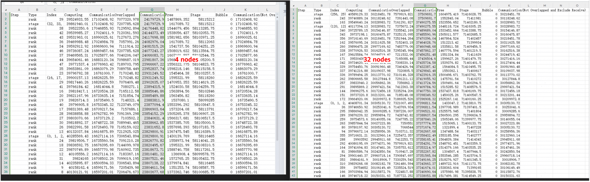

The following uses rank 0 as an example. Compare rank 0 in the normal cluster with that in the abnormal cluster. The problem occurs on the allReduce and broadcast operators at the end of the iteration, as shown in [Figure 2](#ZH-CN_TOPIC_0000002535807041__fig636142716175).

**Figure 2** Timeline of Rank 0 in the abnormal cluster 

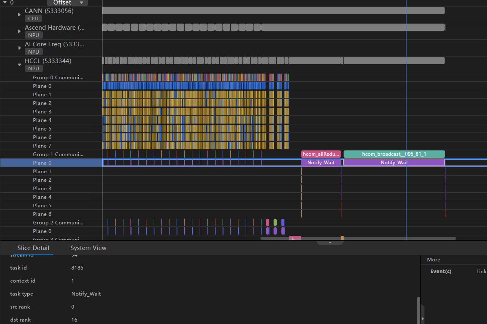

According to the **dst rank** (target rank, which generally indicates the slow rank in the Notify Wait communication event) in the communication operator selection details, continuously redirect to locate the cause. It is found that the rank 440 affects other ranks in the same TP communication domain, as shown in [Figure 3](#ZH-CN_TOPIC_0000002535807041__fig2023542961715).

**Figure 3** Timeline of Rank 440 in the abnormal cluster 

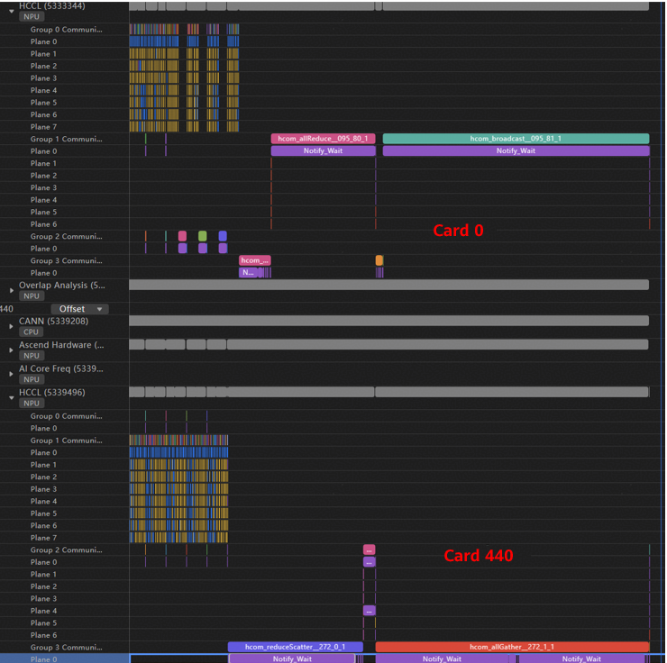

On the **Communication** tab page, select **Communication Duration Analysis** and find the corresponding communication domain. Sort the ranks by **Wait Time** in ascending order and find the ranks with short wait time and long transmission time in the communication domain. See [Figure 4](#ZH-CN_TOPIC_0000002535807041__fig1634973181714).

**Figure 4** Communication Duration Analysis 

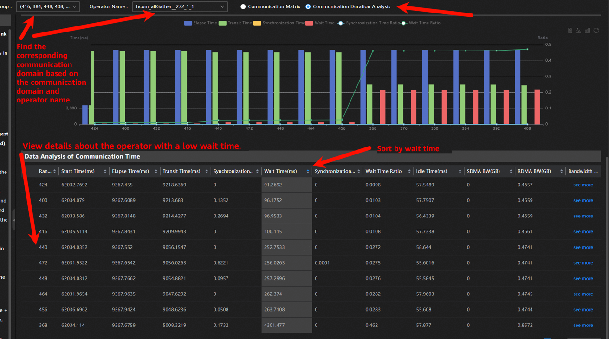

Check the **Bandwidth Analysis** of the ranks with long transmission time. In [Figure 5](#ZH-CN_TOPIC_0000002535807041__fig12279203317179), a large number of RDMA communication packets exist with extremely low bandwidth. In this case, the network transmission may be faulty. Check the network configuration.

**Figure 5** Bandwidth analysis 

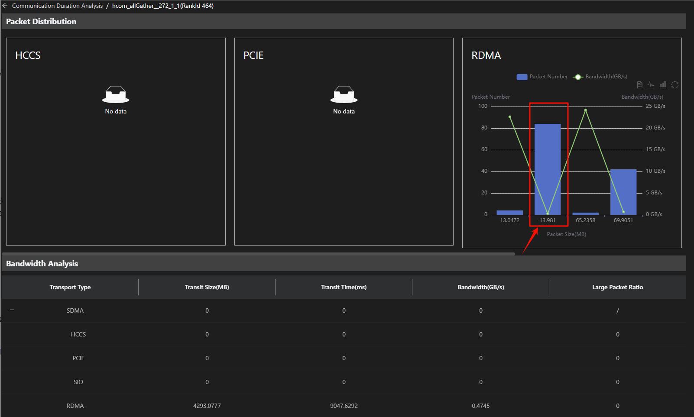

**Solution**

Network configuration analysis reveals that traffic between the switch and the compute node server passes through a PFC-free congestion control queue, resulting in substantial packet loss and subsequent RDMA packet retransmissions. Correctly setting the related environment variables can eliminate the problem.

## Small Communication Packets

### Case: Small Communication Packets Caused by the ZeRO3 Mode

**Issue**

When a model is migrated from an NPU to a GPU, the performance does not meet the requirements.

**Problem Analysis**

The compare performance comparison tool in [Quick Analysis for Model Tuning (msprof-analyze)](performance_tool_usage.md#performance_tool_usage01) is used to compare the data of the baseline GPU with that of the migrated NPU. A large gap exists between the uncovered communication time, as shown in [Figure 1](#ZH-CN_TOPIC_0000002535887091__fig18477143015137).

**Figure 1** Comparison between the GPU and NPU

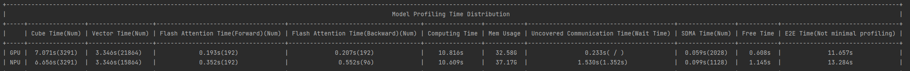

According to the comparison between the timeline of the baseline GPU and that of the NPU after the migration, the difference lies in the allGather communication part at the end of the step. The NPU takes about 100 ms, and the GPU takes only about 4 ms, as shown in [Figure 2](#ZH-CN_TOPIC_0000002535887091__fig311914449169).

**Figure 2** Timeline comparison between the GPU and NPU 

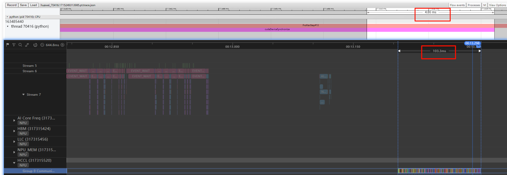

The bandwidth of the NPU communication operators is only about 0.2 GB/s. There are a large number of allGather communication operators, and the amount of data transmitted is only 256 bytes. The communication link setup takes most of the time, as shown in [Figure 3](#ZH-CN_TOPIC_0000002535887091__fig38716463229). These operators are mainly used for ZeRO3 operations.

**Figure 3** AllGather small-packet communication operator 

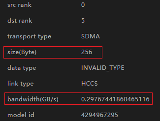

The Zero Redundancy Optimizer (ZeRO) mode is used to save memory by changing the communication policy. The main principle of ZeRO is to split data such as the optimizer status, gradient, and weight, and synchronize the data through collective communication when necessary to reduce the peak usage of the GPU memory. ZeRO is a typical method of trading time for space.

**Solution**

Change the ZeRO3 algorithm to the ZeRO2 algorithm. That is, model weights are no longer split. Although the GPU memory usage increases, the communication overhead between devices is reduced, improving the overall performance by 2.7%.

## Byte Misalignment Between the Source and Destination Addresses

Byte misalignment occurs when the source and destination addresses are not aligned by a specific number of bytes (for example, 512Bytes) during cluster communication, significantly reducing transmission bandwidth and affecting communication performance. This issue commonly arises in SDMA transmissions (intra-node communication) and often appears in the ZeRO algorithm. Proper data padding for address alignment can resolve the issue and improve communication performance.

**Issue**

The performance of a single node with eight ranks is lower than expected. According to the communication matrix analysis on MindStudio Insight, the average bandwidth is only 1~2GB/s, which is far lower than the empirical value, as shown in [Figure 1](#ZH-CN_TOPIC_0000002504087072__fig5563919151714).

**Figure 1** Cluster communication matrix analysis 

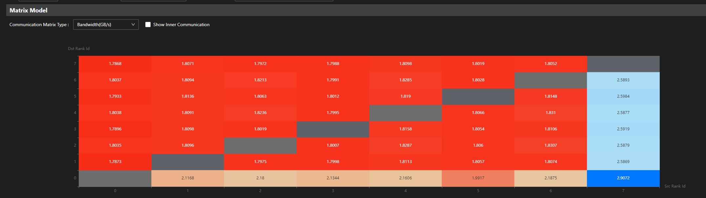

**Problem Analysis**

An allGather operator takes more than 300ms, and the bandwidth is only 0.1GB/s, as shown in [Figure 2](#ZH-CN_TOPIC_0000002504087072__fig18242421111714).

**Figure 2** Timeline details of the allGather operator 

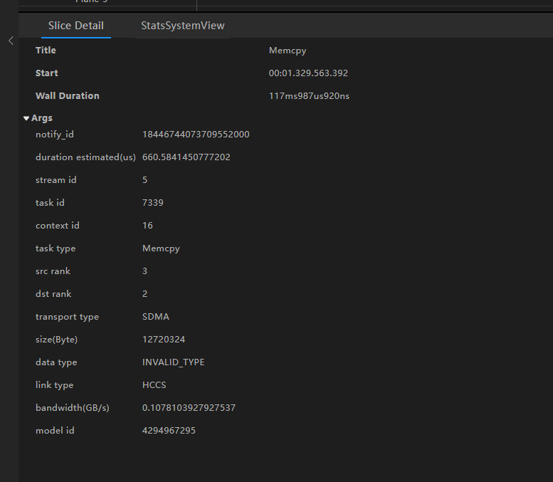

According to the analysis of HCCL experts, the source address and destination address of the allGather communication operator in the DP communicator cannot be aligned. As a result, the communication performance deteriorates seriously.

**Solution**

Perform byte-aligned padding for the allGather bucket in the DP communication domain. Currently, AscendSpeed has adapted to byte-aligned padding for the allGather bucket in the DP communication domain. DeepSpeed and Megatron have not been modified. You need to modify **nccl_start_alignment_factor** in the DeepSpeed source code, as shown in [Figure 3](#ZH-CN_TOPIC_0000002504087072__fig1128582301711). After the modification, the allGather duration is changed from 350ms to 50ms.

**Figure 3** Modifying nccl_start_alignment_factor to enable byte alignment 

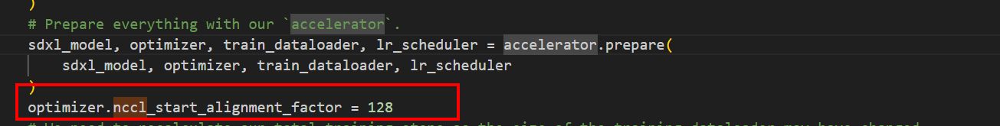

## Computing and Communication Bandwidth Contention

Operators such as MatMul and FA are memory-intensive operators and are prone to MTE bound. When such operators are executed in parallel with communication operators, the memory bandwidth is preempted by the computing and communication operators, as shown in [Figure 1](#ZH-CN_TOPIC_0000002504087110__fig10255174541713). As a result, the communication transmission bandwidth is lower than the empirical value (about 1 to 2 times lower, but not too low), as shown in [Figure 2](#ZH-CN_TOPIC_0000002504087110__fig13417943141714).

**Solution**: If bandwidth contention is severe due to parallel computing and communication, compare the profile data of parallel and non-parallel operations, evaluate whether the impact of bandwidth contention outweighs the benefits of parallel computing, and select the mode with better performance.

**Figure 1** Parallelism of the MatMul operator and AllGather communication operator 

**Figure 2** Bandwidth contention caused by the allGather communication operator 

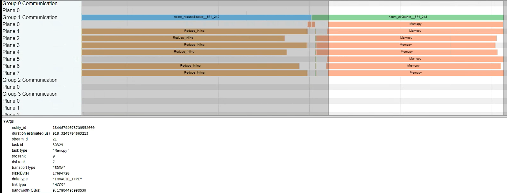

## Performance Bloat During Profile Data Collection

If a high collection level is enabled or a large number of collection items are configured, the host may be under great pressure during profile data collection, resulting in inaccurate profile data collection. For details, see [Model Tuning Profiling Tools](performance_tool_usage.md#model-tuning-profiling-tools). When the profiling collection level is set to level 2, communication scheduling overhead increases. This may cause the host-side delivery of communication operators to be blocked, resulting in long periods of free time.

**Solution**: Degrade the collection level. Do not enable level 2 unless necessary. If level 2 must be enabled, compare and analyze the data at level 1 to eliminate the interference of performance bloat in the data.
