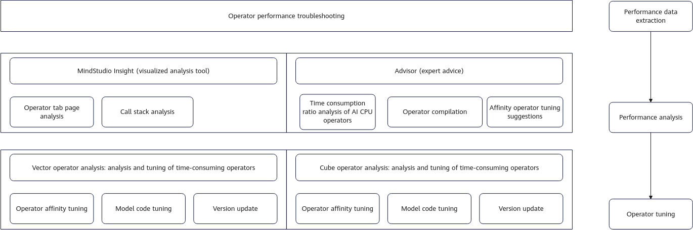
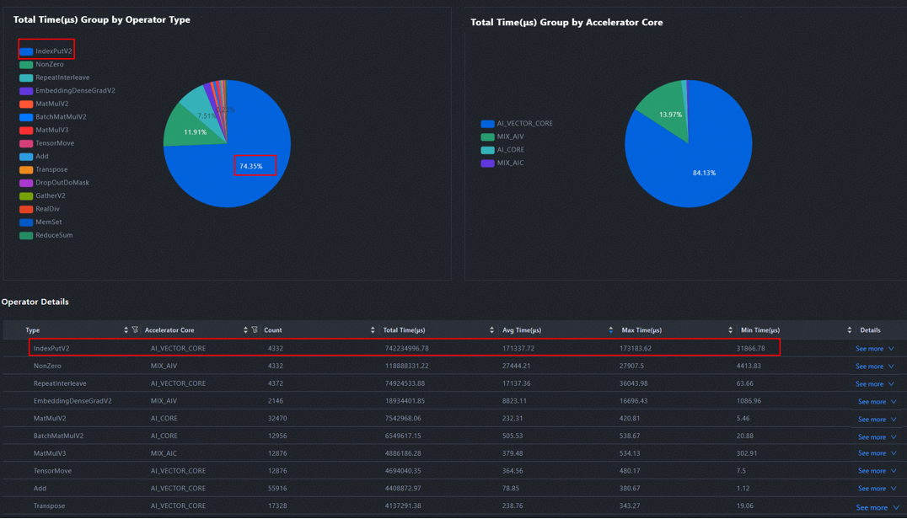
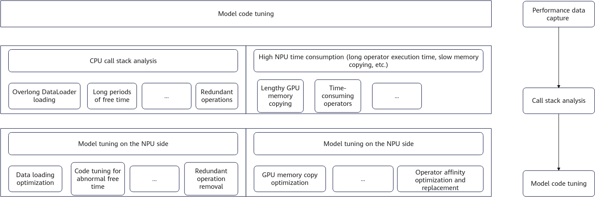
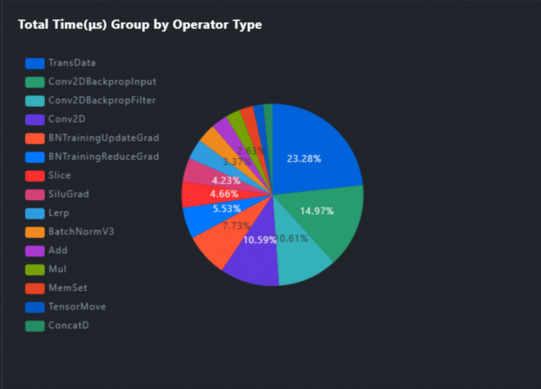

# Operator Performance Tuning Solution

## Locating Methods of Operator Performance Problems

Operator performance is a key challenge in deep learning models. Specifically, the execution efficiency of some basic compute units is low, which affects the overall model runtime and leads to resource waste. Such issues need to be solved by using dedicated analysis tools and code tuning technologies. For example, when evaluating the performance of a fused operator, you can compare metrics such as the computing time and memory usage under different configurations.

**Figure 1** Operator performance issue locating

**Table 1** Methods for locating operator performance problems

| Analysis method                          | Analysis Purpose                                                                                                                                     | Troubleshooting Process                                                                                                                                                                                                                                                                                                                                                                                                                                                                                                                                                                                                                                                                                                                                                                                                                                                                                                                                                                                                                                                                                                                                                                                                                                                               |
| ---------------------------------------- | ---------------------------------------------------------------------------------------------------------------------------------------------------- | ------------------------------------------------------------------------------------------------------------------------------------------------------------------------------------------------------------------------------------------------------------------------------------------------------------------------------------------------------------------------------------------------------------------------------------------------------------------------------------------------------------------------------------------------------------------------------------------------------------------------------------------------------------------------------------------------------------------------------------------------------------------------------------------------------------------------------------------------------------------------------------------------------------------------------------------------------------------------------------------------------------------------------------------------------------------------------------------------------------------------------------------------------------------------------------------------------------------------------------------------------------------------------------- |
| Advisor analysis                         | Long execution time of the AI CPU operator Reducing the time consumed by the AI CPU operator                                                      | Locate the AI CPU operator on the **Timeline** page based on the operator name, find the operator in the code based on the call stack, and try to replace it with the same-logic operator. If the replacement fails, record the operator shape and type and contact the operator owner to check whether the case is supported.                                                                                                                                                                                                                                                                                                                                                                                                                                                                                                                                                                                                                                                                                                                                                                                                                                                                                                                                                        |
| Advisor analysis                         | Operator build error                                                                                                                                 | You can add the code before Python training to specify the binary mode. If the error persists, record the operator shape and type and contact the operator owner to check whether the case is supported. `torch_npu.npu.set_compile_mode(jit_compile=False)`  `torch_npu.npu.config.allow_internal_format = False`                                                                                                                                                                                                                                                                                                                                                                                                                                                                                                                                                                                                                                                                                                                                                                                                                                                                                                                                                                   |
| Single-operator analysis                 | Vector operator analysis                                                                                                                             | The vector operator is optimized by modifying the code logic. The tuning logic is as follows: &#8226; Operator affinity tuning: For details, see [Affinity Operator Tuning Strategy](#affinity-operator-tuning-strategy). &#8226; Model code tuning: Based on operator analysis, call operators at the model code layer and use methods such as redundancy elimination, shape tuning, and equivalent replacement. For details, see [Model Code Tuning Strategy](#model-code-tuning-strategy). &#8226; Version update: Contact the Ascend community to check whether the new version has tuning or subsequent tuning plans. Check whether fusion operators are necessary based on the advisor fusion operator analysis. If necessary, you can develop a fusion operator for replacement.                                                                                                                                                                                                                                                                                                                                                                                                                                                                                      |
| Single-operator analysis                 | Cube operator analysis                                                                                                                               | View the operator proportion on the **Operator** tab page (for details, see [In-depth Model Tuning Analysis (MindStudio Advisor)](./performance_tool_usage.md#performance_tool_usage02)), select the top N operators with the highest time consumption, analyze the average AI Core performance under the input shape, record the abnormal operators and shapes, and contact the operator owner to confirm the tuning plan. &#8226; MAC ratio: indicates whether the cube computing unit is fully used. The ideal value is **80%**. &#8226; MTE ratio: If the MTE ratio is too high, a memory transfer bottleneck exists. If the operator performance cannot meet the expectation, perform the following steps: &#8226; Operator affinity tuning: For details, see [Affinity Operator Tuning Strategy](#affinity-operator-tuning-strategy). &#8226; Model code tuning: Based on operator analysis, call operators at the model code layer and use methods such as redundancy elimination, shape tuning, and equivalent replacement. For details, see [Model Code Tuning Strategy](#model-code-tuning-strategy). &#8226; Version update: Contact the Ascend community to check whether the new version has tuning or subsequent tuning plans. |
| Fusion operator/Affinity API replacement | Use fusion operators or affinity APIs to reduce the delivery of unnecessary small operators and improve the AI Core utilization.                     | The Affinity API issues analyzer in Advisor can automatically identify fused operators. You can locate code based on the call stack and use fused operators or affinity APIs.                                                                                                                                                                                                                                                                                                                                                                                                                                                                                                                                                                                                                                                                                                                                                                                                                                                                                                                                                                                                                                                                                                         |
| Fused operator development               | To further improve the model performance, you can develop fused operators to reduce the delivery of small operators and the proportion of free time. | The host bottleneck and MTE bottleneck are displayed and marked in the operator sequence analysis results of the advisor CSV deliverable. You are advised to analyze the code logic and determine whether the bottleneck can be alleviated by means of operator combination.                                                                                                                                                                                                                                                                                                                                                                                                                                                                                                                                                                                                                                                                                                                                                                                                                                                                                                                                                                                                          |

## Affinity Operator Tuning Strategy

**Issue**

When the BERT model is trained on B4, the performance of B4 is obviously lower than that of A100. For the same step, A100 takes 45 seconds, B4 takes 1,000 seconds, and the NPU performance is about 0.045 GPU.

**Case Analysis**

1. In the overlap analysis table, computing accounts for most of the time in the step, while the proportion of free time is very low. Therefore, tuning starts with computing.

   **Figure 1** Overlap analysis table

   

   **Figure 2** Viewing the compute operators

   

2. Check the time consumption of the operator. The computing time of the IndexPutV2 operator accounts for 75% of the total time consumption. Therefore, the operator needs to be optimized. For details, see [Table 2](#ZH-CN_TOPIC_0000002503927292__table20724033121415).

   > [!NOTE]
   >
   > The IndexPutV2 operator is used as an example. The operations of other operators are similar. For details, see [Table 1](#ZH-CN_TOPIC_0000002503927292__table990385911288) and [Table 2](#ZH-CN_TOPIC_0000002503927292__table20724033121415).

   **Table 1** Code optimization for the Linear, Reduce_Sum, BatchMatMulV2, RepeatInterleave, and Gatherelement operators 

   | Operator         | Before Code Optimization                                                                                                                        | After Code Optimization                                                                                                                                                          | Description                                                                                                                                                                                                                                                                              |
   | ---------------- | ----------------------------------------------------------------------------------------------------------------------------------------------- | -------------------------------------------------------------------------------------------------------------------------------------------------------------------------------- | ---------------------------------------------------------------------------------------------------------------------------------------------------------------------------------------------------------------------------------------------------------------------------------------- |
   | Linear           | `### Before modification ###` `model=nn.Linear(K,N) input=torch.randn(M,K) res=model(input)`                                                 | `###After modification###` `Res=torch.addmm(bias,input,weight.t())#: The input is in (M,K) format, and the weight is in (N,K) format---weight.t() is (K,N).`                  | This tuning solution is provided regardless of scenarios.                                                                                                                                                                                                                                |
   | Reduce_Sum       | `mask = torch.nn.functional.one_hot(indices, num_classes=self.num_experts).sum(dim=1)`                                                          | `temp_mask = torch.zeros(indices.shape[0], self.num_experts, device="npu", dtype=torch.bfloat16) mask=temp_mask.scatter_(-1,indices,1.0)`                                        | The **mask** creation mode is changed from **onehot+reducesum** to **zeros+scatter**. The local computing time is reduced from 2.2ms to 0.08ms, and the total time is reduced by 306ms.                                                                                               |
   | BatchMatMulV2    | `output = tf.matmul(a, b, transpose_a=True) #  a: [bs, n, 1], b: [n, 1]`                                                                        | `a_ = tf.transpose(a, perm=[0, 2, 1]) a_=tf.reshape(a_,[-1,a_.shape[2]]) output=tf.matmul(a_,b,transpose_a=True)#a_:[bs,n],b:[n,1]`                                              | When tf.matmul processes inputs with shapes [b, n, 1] and [n, 1] to produce a [b, 1, 1] output, it often triggers an inefficient BatchMatMul path. To improve performance in both forward and backward passes, reshape or transpose these inputs into a 2D MatMul or dot product format. |
   | RepeatInterleave | `valid_lens = torch.repeat_interleave(valid_lens, shape[1])`                                                                                    | `valid_lens = valid_lens.unsqueeze(-1).expand(-1, shape[1]).reshape(-1)`                                                                                                         | Optimize the operator by changing the shape to switch the high-performance branch. For the second dimension input, replace **shape[1]** with a 1D tensor of length 2048, taking the form of **torch.tensor([shape[1],shape[1],shape[1], ...,shape[1]])**.                                |
   | Gatherelement    | `pt = logit.gather(1, target).view(-1) + eps`   `logpt=torch.log(pt)`   `alpha=self.alpha.to(logpt.device)`   `alpha_class=alpha.gather(0,target.view(-1))` | `pt = logit[torch.arange(logit.size(0)), target.squeeze(1)] + eps logpt=torch.log(pt) alpha=self.alpha.to(logpt.device) alpha_class=torch.index_select(alpha,0,target.view(-1))` | The performance deteriorates when the Gatherelement operator is called on the NPU. Use the **torch.index_select** function to replace the **torch.gather** function and call the GatherV2 operator to avoid the issue. Note that the index needs to be modified.                         |

   **Table 2** Optimization of other operators ()

   | Operator                                            | Website                                                                                                              |
   | --------------------------------------------------- | -------------------------------------------------------------------------------------------------------------------- |
   | IndexPutV2                                          | <https://gitcode.com/Ascend/docs/blob/master/FrameworkPTAdapter/26.0.0/en/pytorch_model_migration_fine_tuning/indexput_operator_replacement.md> |
   | MatMul/hcom_allReduce                               | <https://gitcode.com/Ascend/docs/blob/master/FrameworkPTAdapter/26.0.0/en/pytorch_model_migration_fine_tuning/MatmulAllReduce.md> |
   | Nonzero                                             | <https://gitcode.com/Ascend/docs/blob/master/FrameworkPTAdapter/26.0.0/en/pytorch_model_migration_fine_tuning/nonzero_op_replacement.md> |
   | where                                               | <https://gitcode.com/Ascend/docs/blob/master/FrameworkPTAdapter/26.0.0/en/pytorch_model_migration_fine_tuning/where_op_replace.md> |
   | RotaryMul & RotaryMulGrad (fused operator)          | <https://gitcode.com/Ascend/docs/blob/master/FrameworkPTAdapter/26.0.0/en/pytorch_model_migration_fine_tuning/RotaryMul-RotaryMulGrad.md>   |
   | RmsNorm & RmsNormGrad                               | <https://gitcode.com/Ascend/docs/blob/master/FrameworkPTAdapter/26.0.0/en/pytorch_model_migration_fine_tuning/RmsNorm-RmsNormGrad.md>   |
   | ScaledMaskedSoftmax & ScaledMaskedSoftmaxGrad       | <https://gitcode.com/Ascend/docs/blob/master/FrameworkPTAdapter/26.0.0/en/pytorch_model_migration_fine_tuning/ScaledMaskedSoftmax-ScaledMaskedSoftmaxGrad.md>   |
   | MatmulAllReduce                                     | <https://gitcode.com/Ascend/docs/blob/master/FrameworkPTAdapter/26.0.0/en/pytorch_model_migration_fine_tuning/MatmulAllReduce.md>   |
   | FlashAttentionScore                                 | <https://gitcode.com/Ascend/docs/blob/master/FrameworkPTAdapter/26.0.0/en/pytorch_model_migration_fine_tuning/FlashAttentionScore.md>   |
   | SwiGlu                                              | <https://gitcode.com/Ascend/docs/blob/master/FrameworkPTAdapter/26.0.0/en/pytorch_model_migration_fine_tuning/SwiGlu.md>   |
   | Fusion optimizer                                    | <https://gitcode.com/Ascend/docs/blob/master/FrameworkPTAdapter/26.0.0/en/pytorch_model_migration_fine_tuning/fusion_opt.md>   |
   | Official document for fused operator replacement    | <https://www.hiascend.com/document/detail/en/Pytorch/latest/ptmoddevg/trainingmigrguide/FrameworkPTAdapter/26.0.0/en/pytorch_model_migration_fine_tuning/RotaryMul-RotaryMulGrad.md> |
   | Official document for affinity operator replacement | <https://www.hiascend.com/document/detail/en/Pytorch/latest/ptmoddevg/trainingmigrguide/FrameworkPTAdapter/26.0.0/en/pytorch_model_migration_fine_tuning/indexput_operator_replacement.md> |
   | Official document for affinity API replacement      | <https://www.hiascend.com/document/detail/en/Pytorch/latest/ptmoddevg/trainingmigrguide/FrameworkPTAdapter/26.0.0/en/pytorch_model_migration_fine_tuning/affinity_api_repl.md> |

## Model Code Tuning Strategy

The model performance can be further improved based on the profile data and NPU features. For details about the tuning process, see [Figure 1](#ZH-CN_TOPIC_0000002535807025__fig74933811561). For more common cases, see [Table 1](#ZH-CN_TOPIC_0000002535807025__table487515564316).

**Figure 1** Model code optimization process 

1. Obtains the profile data of a model.
2. Locate the model performance problems such as the single-point CPU operation or long operator execution duration.
3. Locate the faulty code segment based on the call stack relationship in the profile data.
4. Perform in-depth analysis on the faulty code segment to find out the specific cause.
5. Take appropriate tuning measures, such as eliminating redundant code or replacing the original code with a more affinity implementation, to improve performance.

**Table 1** Common fine-tuning cases 

| Issue Type        | Model Issue                                                                                                                                                                                                                                                                                                                                            | Code Tuning Suggestions                                                                                                                                                                                                                            |
| ----------------- | ------------------------------------------------------------------------------------------------------------------------------------------------------------------------------------------------------------------------------------------------------------------------------------------------------------------------------------------------------ | -------------------------------------------------------------------------------------------------------------------------------------------------------------------------------------------------------------------------------------------------- |
| Format conversion | Based on the operator data, if the time consumption of the TransData operator is high, see [Figure 2](#ZH-CN_TOPIC_0000002535807025__fig1623417201456).                                                                                                                                                                                                | Try to disable automatic format conversion. `torch_npu.npu.config.allow_internal_format = False`                                                                                                                                                    |
| Format conversion | The variable **x1** is the result after discontinuous conversion. **transpose** is introduced in each subsequent call. `def forward(self, x):` `x=self.fc1(x)` `x1=F.relu(x).transpose(1,2)#.contiguous()` `x2_1=self.fc2_1(x1)` `x2_2=self.fc2_2(x1)` `x3=torch.add(x2_1,x2_2)` `x4=self.fc3(x3)[:,0,]` `return x4`           | Eliminate the redundant **transpose** generated during the call. After the conversion, invoke the continuous conversion function. `x1 = F.relu(x).transpose(1, 2).contiguous()`                                                                 |
| Redundant code    | If the variable definition is not used, extra memory operation overheads are caused. `tasks = torch.tensor(tasks).to(self.device)    The defined variable is not used.`                                                                                                                                                                             | Delete redundant code.                                                                                                                                                                                                                             |
| Redundant code    | Multiple small-batch memory movements cause a large number of memory operators. You can merge the tasks to improve performance. `tasks = torch.cat([self.task_tokenizer(x["task"]).to(self.device).unsqueeze(0) for x in batched_inputs], dim=0)`                                                                                                   | After the operations are complete on the CPU, the operations are transferred to the NPU in a unified manner. `tasks = torch.cat([self.task_tokenizer(x["task"]).unsqueeze(0) for x in batched_inputs], dim=0)` `tasks=tasks.to(self.device)` |
| Code non-affinity | The performance of an operator deteriorates greatly in extreme shapes. The following uses the SelectV2 operator as an example. For details, see [Figure 3](#ZH-CN_TOPIC_0000002535807025__fig2078518402537). `fg_scores_mask = fg_mask[:, :, None].repeat(1, 1, self.num_classes)` `target_scores=torch.where(fg_scores_mask>0,target_scores,0)` | Avoid calling this operator and use the matrix operation to replace it. `fg_scores_mask = fg_mask.unsqueeze(-1)` `target_scores*=(fg_scores_mask>0).float()`                                                                                 |

**Figure 2** High time consumption percentage of the TransData operator 

**Figure 3** Performance deterioration of the SelectV2 operator with extreme shapes 

