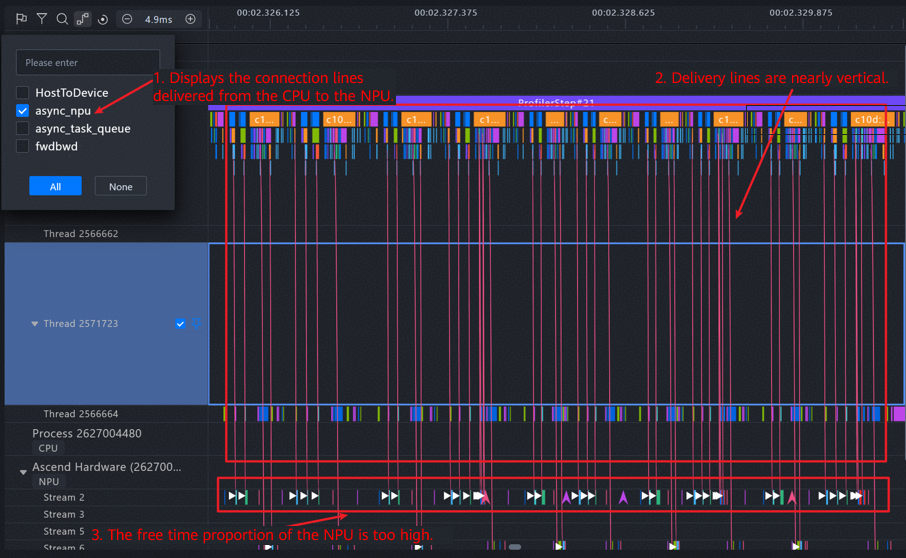
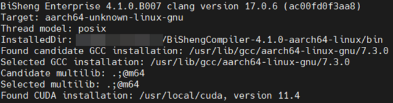
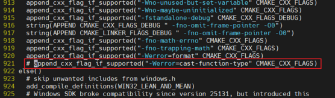
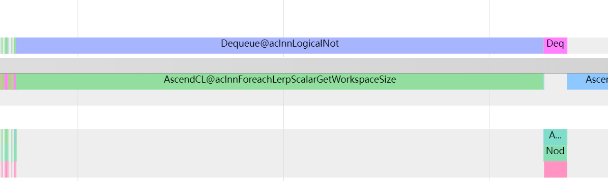
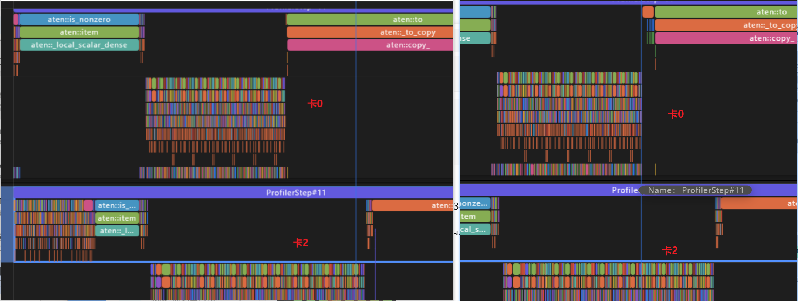
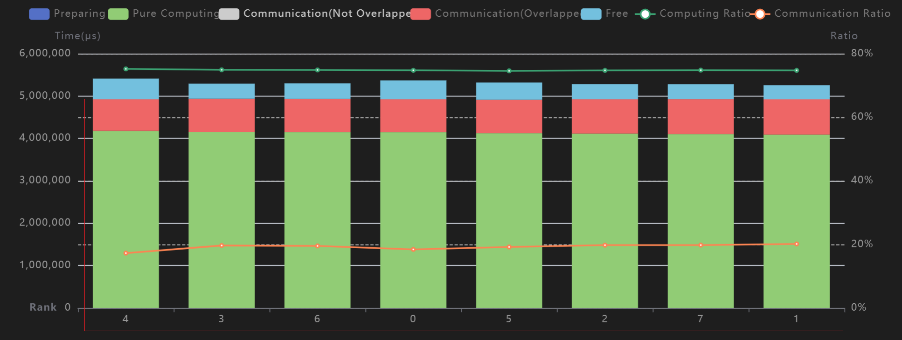
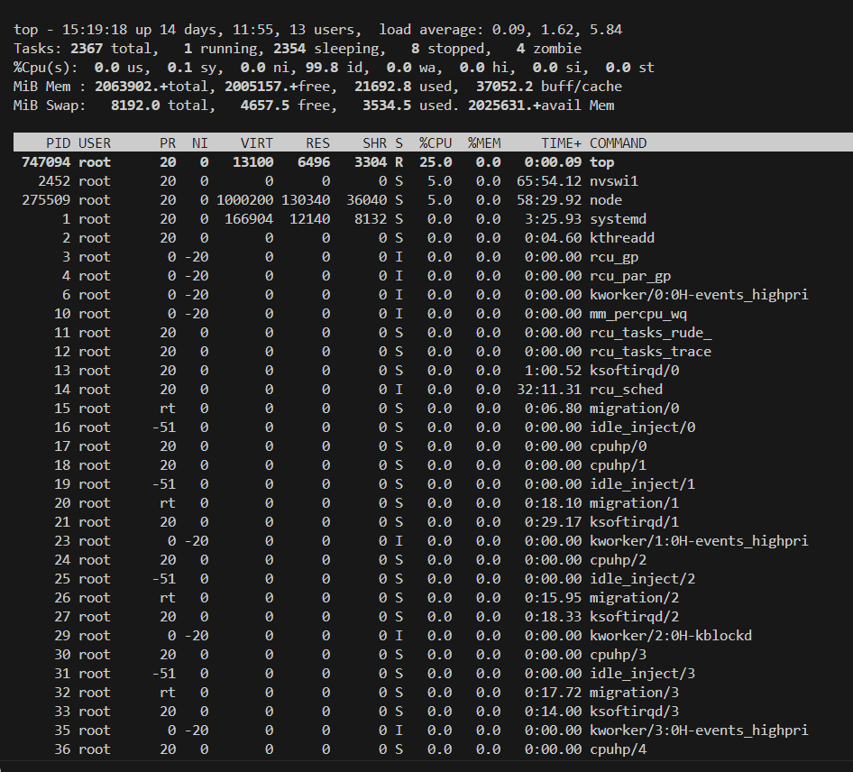
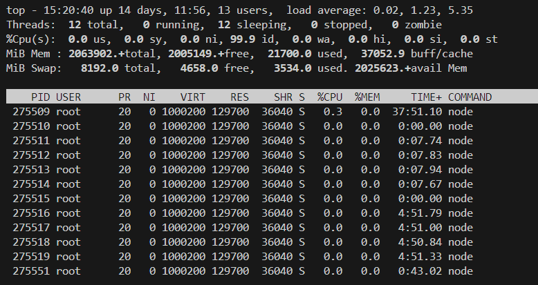
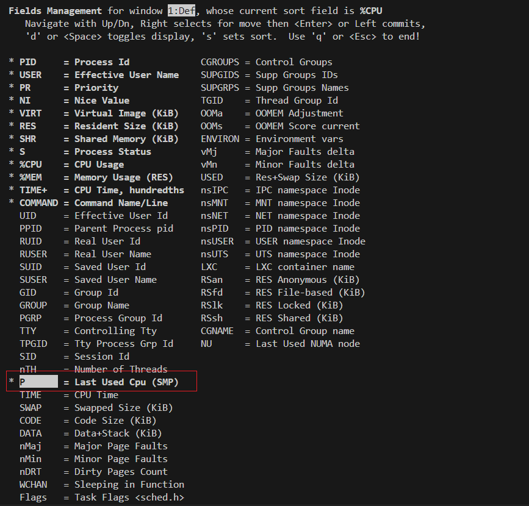
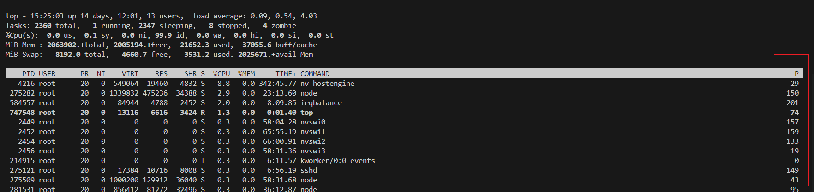

# Host Bound Troubleshooting

## Host Bound Issue Classification

### Introduction to Host Bound

In the TorchNPU training and inference scenarios, host-side task delivery (CPU) such as operator scheduling and memory allocation and device-side task execution (NPU) are asynchronous. When the task delivery time on the host side exceeds the task execution time on the device side, the device is idle and waits for new tasks, causing a performance bottleneck, that is, a host bound issue.

### Host Bound Symptom

1. The operator delivery lines are vertically dense, indicating that the NPU is waiting for the CPU to deliver tasks.

2. The free time proportion of the NPU is too high due to waiting.

   **Figure 1** Profile data in a typical host bound scenario

   

### Host Bound Optimization Methods

Host bound issues are mainly caused by operator delivery delay and CPU overload. [Table 1](#ZH-CN_TOPIC_0000002503927258__table12690162612911) describes the common optimization methods.

**Table 1** Common methods for optimizing the host bound problem <a name="ZH-CN_TOPIC_0000002503927258__table12690162612911"></a>

| Optimization Method            | Advantages                                           | Description                                                                                                                                                                                                                                                                                                                                                                                                                                                                                                                                                                                                                                                                                                                                                                                                                                                                                                    |
| ------------------------------ | ---------------------------------------------------- | -------------------------------------------------------------------------------------------------------------------------------------------------------------------------------------------------------------------------------------------------------------------------------------------------------------------------------------------------------------------------------------------------------------------------------------------------------------------------------------------------------------------------------------------------------------------------------------------------------------------------------------------------------------------------------------------------------------------------------------------------------------------------------------------------------------------------------------------------------------------------------------------------------------- |
| Operator delivery optimization | Reducing the number of operator delivery times       | After identifying bottlenecks (for details, see [Fast and Slow Rank Troubleshooting](solution_to_top1.md#fast-and-slow-rank-troubleshooting)), perform optimization by using methods such as logic optimization, equivalent computing replacement, and operator fusion. For details, see [Affinity Operator Tuning Strategy](solution_to_top2.md#affinity-operator-tuning-strategy).                                                                                                                                                                                                                                                                                                                                                                                                                                                                                                                           |
|                                | Improving the operator delivery speed                | &#8226; [Pipeline Optimization](#pipeline-optimization): Migrate some operator adaptation tasks to the level-2 pipeline to balance the load of the two levels and reduce the time required for task dequeue and wakeup. It is a common and efficient optimization method.<br>&#8226; [Core Binding Optimization](#core-binding-optimization) Optimize the task execution efficiency by configuring the processor affinity (that is, core binding) of operator tasks on the CPU side, avoiding cross-NUMA memory access and reducing task scheduling overhead.<br>&#8226; [Compilation Optimization](#compilation-optimization): The link-time optimization (LTO) and profile-guided optimization (PGO) technologies of the BiSheng Compiler are used to compile and build the source code of Python, torch (PyTorch), and TorchNPU, effectively improving program performance. |
| CPU Computing Optimization     | Leveraging the advantages of heterogeneous computing | Minimize the use of AI CPU operators and preferentially select operators with better affinity. For details, see [Affinity Operator Tuning Strategy](solution_to_top2.md#affinity-operator-tuning-strategy).                                                                                                                                                                                                                                                                                                                                                                                                                                                                                                                                                                                                                                                                                                    |
|                                | Leveraging the advantages of parallel computing      | Promote asynchronous parallel processing between the CPU and NPU, for example, place the data processing logic in the DataLoader,. Reduce stream synchronization operations, for example, exercise caution when using operations such as `item()`, `cpu()`, and `npu()`, and combine or avoid using them as much as possible.                                                                                                                                                                                                                                                                                                                                                                                                                                                                                                                                                                                  |

In addition, there is a type of delivery exception. That is, the time required for operator delivery increases significantly due to factors such as resource preemption and OS scheduling policy conflicts. For details, see [Delivery Exception Analysis](solution_to_top3.md#delivery-exception-analysis).

## Pipeline Optimization

**Enabling Description**

You can set the following environment variables to enable this feature, which is applicable to network scenarios with severe host bound problems.

```cfg
export TASK_QUEUE_ENABLE=2
```

**Working Principles**

The task_queue operator delivery queue supports three configuration levels (using the add operator as an example). Users may configure these as needed. For details, see "[TASK_QUEUE_ENABLE](https://gitcode.com/Ascend/pytorch/blob/master/docs/en/api/environment_variable/TASK_QUEUE_ENABLE.md)" in [TorchNPU Environment Variable Reference](https://gitcode.com/Ascend/pytorch/blob/master/docs/en/api/environment_variable/env_variable_list.md).

**Precautions**

- When `ASCEND_LAUNCH_BLOCKING` is set to `1`, the task queue of the task_queue operator is forcibly disabled, overriding the `TASK_QUEUE_ENABLE` setting. For details, refer to "[ASCEND_LAUNCH_BLOCKING](https://gitcode.com/Ascend/pytorch/blob/master/docs/en/api/environment_variable/ASCEND_LAUNCH_BLOCKING.md)" in [TorchNPU Environment Variable Reference](https://gitcode.com/Ascend/pytorch/blob/master/docs/en/api/environment_variable/env_variable_list.md).

- When `TASK_QUEUE_ENABLE` is set to `2`, the peak NPU memory usage may increase due to the increase of concurrent memory access.

## Core Binding Optimization

**Enabling Description**

You can set the following environment variables to enable this feature, which is applicable to network scenarios where the task scheduling capability is insufficient or the slow response problem is prominent.

```cfg
export CPU_AFFINITY_CONF=<mode>,npu<value1>:<value2>-<value3>
```

- `mode`: core binding mode. If this parameter is `0` or not set, core binding is disabled. If it is `1`, coarse-grained core binding is enabled. If it is `2`, fine-grained core binding is enabled.
- `npu<value1>:<value2>-<value3>`: user-defined core binding range. This parameter is valid only when `mode` is not set to `0`. `value1` indicates the NPU ID, and `value2-value3` specifies the CPU core binding range of the NPU process.

**Working Principles**

- **Coarse-grained core binding**: All threads associated with a single NPU are bound to a specified CPU core area.
- **Fine-grained core binding**: The main threads associated with a single NPU are bound to a specified CPU core area. Each thread exclusively occupies a core to implement isolation.

**Configuration Example**

1. Enable coarse-grained core binding.

   ```shell
   export CPU_AFFINITY_CONF=1
   ```

2. Enable fine-grained core binding.

   ```shell
   export CPU_AFFINITY_CONF=2
   ```

3. Enable custom core binding.

   ```shell
   export CPU_AFFINITY_CONF=1,npu0:0-1,npu1:2-5,npu3:6-6
   ```

4. After the preceding configuration is complete, the NPU binding details are as follows:

   - The NPU 0 process is bound to CPU cores 0 and 1.
   - The NPU 1 process is bound to CPU cores 2 to 5.
   - The NPU 3 process is bound to CPU core 6.
   - Other NPU processes use the default core zone.

## Compilation Optimization

### Obtaining the Compilation Optimization Package

The compilation optimization environment is complex to configure, and the entire process takes a long time. To improve deployment efficiency and achieve out-of-the-box availability, you can directly obtain the pre-built generalization compilation optimization package, including the compressed package after Python compilation optimization and the .whl installation packages of torch and TorchNPU. The Python compressed package can be directly configured with a [soft link](https://repo.oepkgs.net/ascend/pytorch/vllm/python/). The .whl installation packages of torch and TorchNPU are optimized based on model data from typical scenarios and provide performance benefits with good generalization. For details about how to obtain the software packages, see [Table 1](#ZH-CN_TOPIC_0000002503927236__table18319122153814).

**Table 1** Obtaining software packages in the vLLM scenario <a name="ZH-CN_TOPIC_0000002503927236__table18319122153814"></a>

| Name                                                | Link                                                  |
| --------------------------------------------------- | ----------------------------------------------------- |
| Python package                                      | <https://repo.oepkgs.net/ascend/pytorch/vllm/python/> |
| `.whl` installation packages of torch and TorchNPU | <https://repo.oepkgs.net/ascend/pytorch/vllm/torch/>  |
| Runtime dependency SO                               | <https://repo.oepkgs.net/ascend/pytorch/vllm/lib/>    |

### Installing the BiSheng Compiler

The BiSheng compiler must be installed in advance for Python, torch, and TorchNPU compilation optimization.

1. Obtain the compiler installation package from the official website of the Kunpeng community. For version 4.1.0, click [this link](https://kunpeng-repo.obs.cn-north-4.myhuaweicloud.com/BiSheng%20Enterprise/BiSheng%20Enterprise%20203.0.0/BiShengCompiler-4.1.0-aarch64-linux.tar.gz) to download.

2. After the download, run the following installation and configuration commands:

   ```shell
   # Extract the BiSheng Compiler installation package.
   tar -xvf BiShengCompiler-4.1.0-aarch64-linux.tar.gz

   # Configure environment variables
   export PATH=$(pwd)/BiShengCompiler-4.1.0-aarch64-linux/bin:$PATH
   export LD_LIBRARY_PATH=$(pwd)/BiShengCompiler-4.1.0-aarch64-linux/lib:$LD_LIBRARY_PATH
   ```

3. After the configuration is complete, run the following command to verify the installation.

   ```shell
   clang -v
   ```

4. If the following version information is displayed, the configuration is successful:

   **Figure 1** Successful BiSheng Compiler configuration

   

### Python Compilation Optimization

**Installing Dependencies**

During Python source code compilation, the system libraries are invoked. If related system header files are missing during compilation, the compilation may still succeed, but errors may occur when the corresponding components are invoked during running.

- Fedora/RHEL/CentOS (dnf-based system)

  ```shell
  sudo dnf install gcc gcc-c++ gdb lzma glibc-devel libstdc++-devel openssl-devel \
  readline-devel zlib-devel libffi-devel bzip2-devel xz-devel \
  sqlite sqlite-devel sqlite-libs libuuid-devel gdbm-libs perf \
  expat expat-devel mpdecimal python3-pip
  ```

- Debian/Ubuntu (apt-based system)

  ```shell
  sudo apt-get install build-essential gdb lcov pkg-config \
  libbz2-dev libffi-dev libgdbm-dev libgdbm-compat-dev liblzma-dev \
  libncurses5-dev libreadline6-dev libsqlite3-dev libssl-dev \
  lzma lzma-dev tk-dev uuid-dev zlib1g-dev libmpdec-dev
  ```

**Compiling Python**

Download the desired Python source version from [here](https://www.python.org/downloads/source/) and extract it.

To compile and install Python 3.8.17, use the following commands:

```shell
# Decompress the source code file and go to the directory
tar -xvf Python-3.8.17.tgz
cd Python-3.8.17

# Configure the compilation environment (the BiSheng compiler needs to be pre-installed)
export CC=clang
export CXX=clang++

# Compile and install Python (<install_path> indicates the absolute path of the Python installation directory.
mkdir -p <install_path>
./configure --prefix=<install_path> --with-lto --enable-optimizations
make -j
make install
```

After the compilation is complete, the `python3` and `pip3` executable files for compilation optimization are generated in the `install_path/bin` directory.

**Configuring a Soft Link**

To enable the optimized Python in the environment, run the following commands to configure the system soft link:

```cfg
# <default_path> is the default Python directory. You can run 'which python' to query the path
cd <default_path>

# Back up the original Python binary file
mv python python_bak

# Create a Python soft link
ln -s <install_path>/bin/python3 python
```

Configure the `pip` file in the same way. After the configuration is complete, check whether the Python path in the first line of the `pip` file is correct.

```shell
vi pip
```

After the preceding operations are complete, you can run the Python command to invoke the compiled and optimized Python and run the `pip` command to manage packages.

**Precautions**

- If a message is displayed indicating that the `.so` file or module is missing during model running, check whether the dependency is completely installed.
- The compiled Python environment can be migrated across servers. However, the migration can be performed only from an earlier glibc environment to a later one.

### Compilation Optimization of torch and TorchNPU

**Preparations**

```shell
# Download the torch source code. The 2.1.0 version is used as an example
git clone -b v2.1.0 https://github.com/pytorch/pytorch.git pytorch-2.1.0
cd pytorch-2.1.0
git submodule sync
git submodule update --init --recursive

# Install the torch dependency
pip install -r requirements.txt

#Download the TorchNPU source code. The version must match that of torch
git clone -b v2.1.0 https://gitee.com/ascend/pytorch.git torch_npu
```

Modify the `CMakeLists.txt` file in the source code directory of torch and comment out the following line to mask alarms (this line is not needed for later-version torch):

```text
append_cxx_flag_if_supported("-Werror=cast-function-type" CMAKE_CXX_FLAGS)
```

**Figure 1** Code comment example



**First Compilation (Instrumentation Compilation)**

```shell
# Set the environment variable (/path/to/profile is the default path for storing profile data. You can change it by setting LLVM_PROFILE_FILE)
export CMAKE_C_FLAGS="-flto=thin -fuse-ld=lld -fprofile-generate=/path/to/profile"
export CMAKE_CXX_FLAGS="-flto=thin -fuse-ld=lld -fprofile-generate=/path/to/profile"
export CC=clang
export CXX=clang++
export USE_XNNPACK=0

# Compile torch
cd pytorch-2.1.0
git clean -dfx
python3 setup.py bdist_wheel

# Compile TorchNPU (you need to install the newly compiled torch first)
cd torch_npu
git clean -dfx
bash ci/build.sh --python=3.8 --enable_lto --enable_pgo=1
```

**Collecting Profile Data**

```shell
# Install instrumentation packages.
pip install pytorch-2.1.0/dist/torch-*.whl --force-reinstall --no-deps
pip install torch_npu/dist/torch_npu-*.whl --force-reinstall --no-deps

# Set key environment variables.
export OMP_PROC_BIND=false
export LLVM_PROFILE_FILE=/tmp/profile/default_%m.profraw  # Ensure that the /tmp/profile directory is empty

# Execute an actual training task to collect profile data. Example: bash run_model.sh
...
```

**Secondary Compilation (Optimized Compilation)**

```cfg
# Convert the profile data format
llvm-profdata merge /tmp/profile -o default.profdata

# Configure the environment for compilation optimization
export CMAKE_C_FLAGS="-flto=thin -fuse-ld=lld -fprofile-use=/path/to/profile/default.profdata"
export CMAKE_CXX_FLAGS="-flto=thin -fuse-ld=lld -fprofile-use=/path/to/profile/default.profdata"
export CC=clang
export CXX=clang++
export USE_XNNPACK=0

# Compile the optimized torch
cd pytorch-2.1.0
git clean -dfx
python3 setup.py bdist_wheel

# Compile the optimized TorchNPU (copy default.profdata to the torch_npu directory)
cd torch_npu
git clean -dfx
cp /path/to/profile/default.profdata .
bash ci/build.sh --python=3.8 --enable_lto --enable_pgo=2
```

The torch and TorchNPU files generated after the compilation are the high-performance optimization packages.

## Delivery Exception Analysis

### Background

Delivery exceptions are a common cause of slow or fast rank issues, with typical symptoms as follows:

- Single-rank operator execution latency increases significantly (observable via the MindStudio Insight [Timeline](performance_tool_usage.md#performance_tool_usage09)).

  **Figure 1** Unexpected increase in the duration of a single function

  

- The overall delivery duration is prolonged. As shown in [Figure 2](#ZH-CN_TOPIC_0000002503927256__fig1918315395150), the delivery duration of rank 0 is significantly longer than that of the other rank when the same number of operators are executed.

  **Figure 2** Slow operator delivery (<a name="ZH-CN_TOPIC_0000002503927256__fig1918315395150"></a>)

  

These kinds of problems are difficult to locate due to complex scenarios and can be classified as delivery exceptions.

### Pre-check

Before performing in-depth analysis, you need to complete the following basic checks:

- **Extra process check:** Check whether the operating environment has any background process or plugin that affects the CPU performance (this check is usually performed by the service scenario owner and is rarely the main cause).

- **Task load balancing check:** Analyze the computing duration of each rank using the profiling tool. If the time consumed by each rank is similar and no obvious difference exists between the ranks, the task load is balanced (the service scenario owner can further confirm the result). See [Figure 1](#ZH-CN_TOPIC_0000002503927280__fig0119124117159).

  **Figure 1** Balanced computing tasks on multiple ranks (<a name="ZH-CN_TOPIC_0000002503927280__fig0119124117159"></a>)

  

- **CPU affinity configuration for isolation (in the A+K scenario):** In the A+K scenario where the server scheduling capability is limited (CPU core switching or preemption may occur), you are advised to try CPU affinity configuration for task isolation.

  Method: Run the `taskset` command or set the environment variable as `export CPU_AFFINITY_CONF=1` or `export CPU_AFFINITY_CONF=2`.

  > [!NOTE]
  >
  > For details about the environment variable `CPU_AFFINITY_CONF`, refer to the "Performance Tuning" > "Performance Tuning Methods" > "Scheduling Optimization" > "[Core Binding Optimization](https://gitcode.com/Ascend/ModelZoo-PyTorch/blob/master/PyTorch/docs/en/performance_tuning/performance_tuning_methods/scheduling_opt.md#%E7%BB%91%E6%A0%B8%E4%BC%98%E5%8C%96)" in [PyTorch Training Model Porting and Tuning Guide](https://gitcode.com/Ascend/ModelZoo-PyTorch/blob/master/PyTorch/docs/en/README.md).

### Performing the Analysis

#### CPU Running Status

After the [pre-check](#pre-check) is complete, perform the following steps to check the CPU status:

- **Command input**: Run the `top` command to query the running status of the system CPU in real time.

  **Figure 1** `top` command output

  

- **Process thread viewing:** To view all threads of a specific process (PID), run the `top -H -p <pid>` command.

  **Figure 2** Viewing a specified process using `top`

  

- **Interface operation description:**

  - **F**: Enter field selection mode.
  - Up and down arrow keys: Browse fields.
  - **D**: Select or cancel a displayed item.
  - Right arrow key: Select a field and exchange its sorting position with that of another field.
  - Left arrow key: Exit the sorting operation.

  **Figure 3** Selecting display parameters on the top interface

  

- **Result analysis and handling:**

  - Press **F** and add the `P` (`Last used CPU`) field to view the last running CPU core ID of each process.
  - If the CPU cores of a process are switched unexpectedly, the possible causes are as follows: The CPU topology structure of the VM or container is different, or the scope of CPU affinity configuration is too large.
  - For the latter, you can set `export CPU_AFFINITY_CONF=2` for fine-grained optimization of CPU affinity configuration.

  **Figure 4** Display of the last used CPUs of each process

  

#### Capturing Exception Stacks

When a performance exception is detected, you need to capture and analyze the related stack information in a timely manner.

- Viewing with `gdb`

  ```shell
  gdb -p <pid>
  #Access the GDB CLI and print the call stack of the process or main thread
  bt
  #View the call stack of a thread
  info threads
  thread<n>
  bt
  ```

- Viewing with `pstack`

  ```shell
  pstack <pid>
  ```

- Viewing with `cat`

  ```shell
  cat /proc/<pid>/stack
  ```
