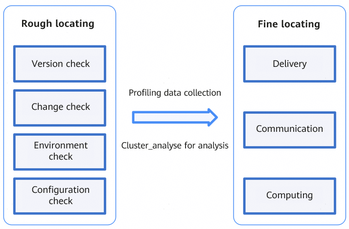

# Methodology for Locating Performance Fluctuation Problems in a Cluster

## Cluster Performance Deterioration Analysis

For details about the overall analysis approach to cluster performance issues, see [Troubleshooting Principles](./positioning_process_for_performance_issues.md#troubleshooting-principles).

Performance problems in long-term, stable training are usually performance fluctuations that occur during a normal training process. To solve these problems, you need to consider recent changes and preliminarily check for any hardware issue, then use the profiling tool to identify problem details.

To improve the locating efficiency, you are advised to take a two-step methodology of rough and fine locating, as shown in [Figure 1](#ZH-CN_TOPIC_0000002535807059__fig1169003471618).

**Figure 1** Locating process 

The two-step methodology of rough and fine locating is designed to streamline profile data collection and analysis in large-scale cluster training scenarios. Rough locating focuses on recent cluster changes (such as configuration changes and component upgrades) and hardware metrics (such as CPU/memory usage and network throughput) to quickly determine suspicious time periods and modules. If no exceptions are detected, take the step of fine locating. Use the profiling tool for in-depth analysis on computing, communication, and delivery to determine root causes from the perspectives of thread stack, I/O latency, and lock contention. This methodology emphasizes the correlation analysis of change information and metrics, and uses visualization methods such as profiling, flame graphs, and traces to implement exception locating and root cause analysis, providing a precise, accurate, and layered diagnosis approach for cluster performance optimization.

In addition, to make verification easier, you are advised to use the test methods of N-partitioning and single-node service modeling test to reproduce the problem on a smaller scale.

1. **Rough locating**

   Rough locating is usually performed in the scenario where no profiling is available. This approach is mainly based on the analysis and experience gained from past issues. Significant problems mainly fall into the following four categories:

   - Resource accumulation: Allocated resources are not released in a timely manner or requested abnormally, causing resource accumulation and affecting performance.
   - Resource preemption: Other processes run on the host, or other machines perform high-intensity read/write operations on shared storage without proper resource isolation.
   - Communication retransmission: Packet loss and other issues trigger communication retransmissions, which degrade performance.
   - Environment change: Recent changes include but are not limited to upgrade, new cluster usage, and startup or stop of some services.

   You can use the following rough locating methods before performing profiling analysis.

   - Version check: Collect the current versions including at least HDK, OS, CANN, and framework. Check the compatibility list to identify compatibility issues and verify whether known performance-related problems exist in these versions.
   - Change check: Confirm whether any changes have been made recently, including but not limited to version upgrades and cluster re-partitioning.
   - Environment check: Check for hardware alarms and verify that key KPIs such as storage (I/O) and network (packet loss) are normal.
   - Configuration check: Check whether the typical check items are correctly configured by referring to [Pre-check Tool Guide](https://gitcode.com/Ascend/msit/blob/master/msprechecker/README_EN.md).

   > [!NOTE]
   >
   > The check items for rough locating are derived from historical problem locating experience and are applicable to most common performance fluctuation problems. For the problems that cannot be identified through rough locating, perform fine locating.
   >
   > In addition, you can use the test methods of cluster N-partitioning and single-node service modeling to reproduce the problem at the smallest possible scale. If the problem is reproduced on a single node, check whether a process preemption occurs, CPU usage changes, or whether any alarm or error exists in the messages or dmesg log.

2. **Fine locating**

   For the process of fine locating, see [Detailed Troubleshooting](positioning_process_for_performance_issues.md#detailed-troubleshooting) and use model fine-tuning tools to further locate and analyze exceptions.

Compare and verify the conclusions of the rough and fine locating processes to obtain the root cause and solution.

## Hands-on Skills for Problem Locating

1. In large-scale scenarios, if the training task needs to be completed within a specified period, you can first specify an optimization objective and calculate the benefits of problem locating (compare the time loss due to experiments and collection in the production cluster for problem locating with the benefits brought by optimization).
2. To locate problems in a large-scale cluster, you can reproduce the problems in a smaller-scale cluster or even a single-node system to facilitate experiments and reduce the impact on production tasks. The methods include but are not limited to N-partitioning, single-node test, and pre-check.
3. In practice, L1 without stack is used for the initial collection. In large-scale cluster scenarios, if data is directly written to the shared storage, the total size of collected data may be too large. In addition, if resources are not properly isolated, other jobs in the cluster may be affected. Therefore, you are advised to write the profile data to the local system, collect the data using scripts, and transfer the collected data to the shared storage in batches.
4. If possible, you can enable dynamic profile data collection during model training.
