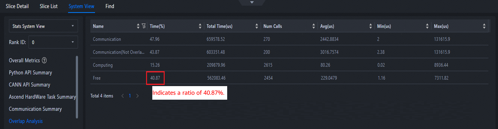
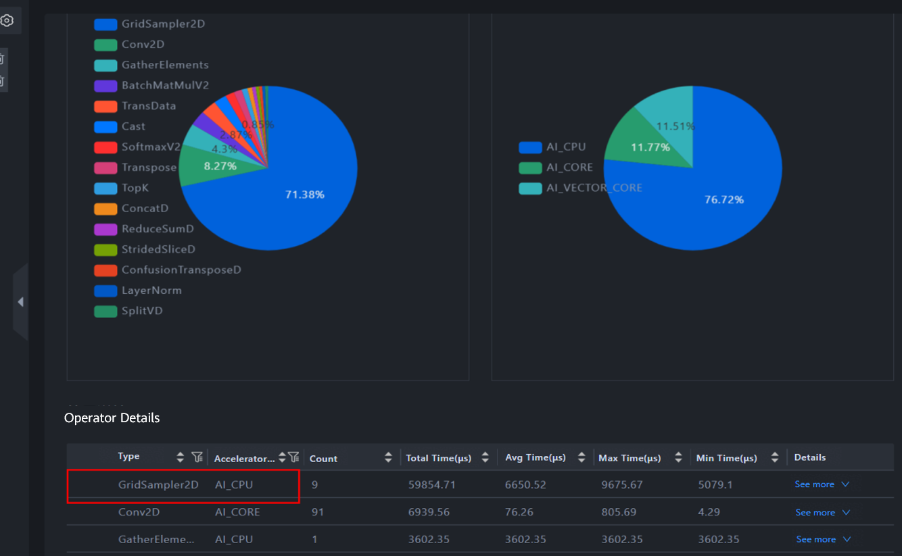
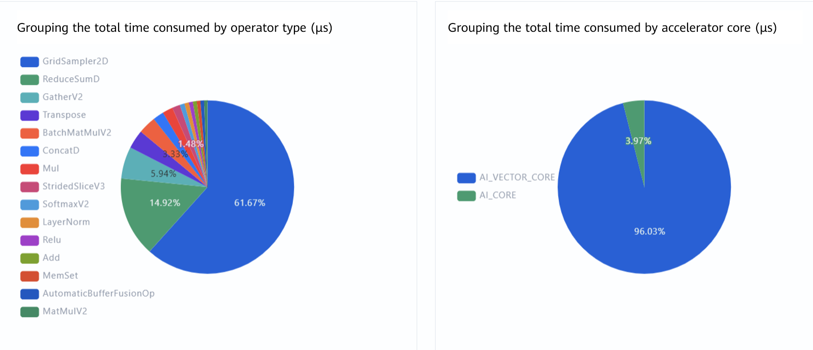
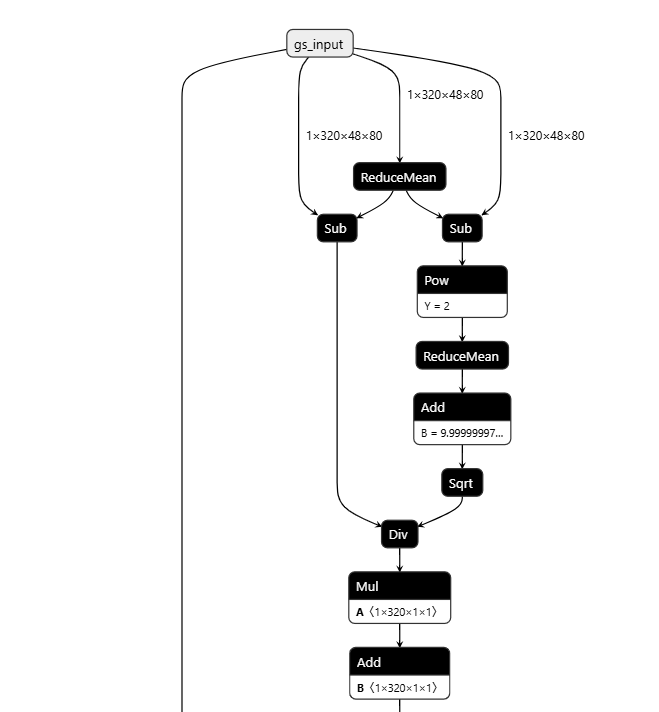
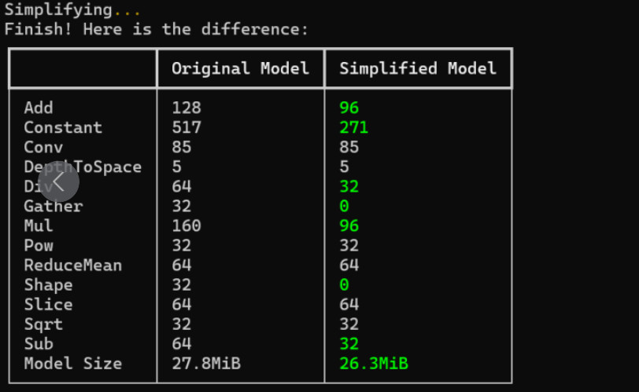
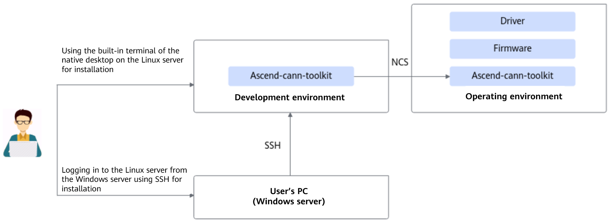
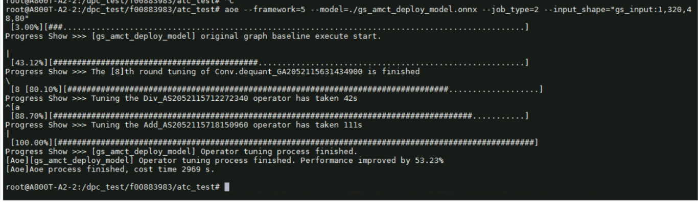
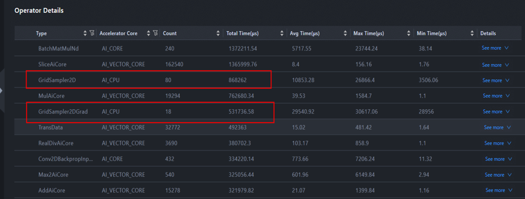
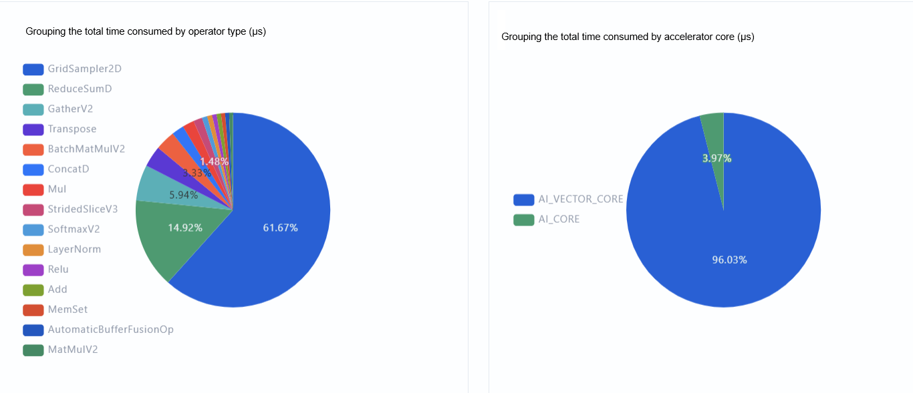
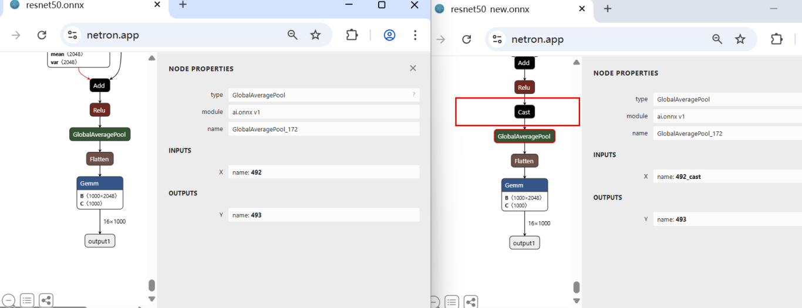

# Solution for ONNX Offline Inference

## Information Collection

This section uses the Atlas 200I A2 accelerator module as an example to describe how to collect the following information required for inference using in Atlas 200I A2.

**Collecting Profiling Information**

For details about how to collect profile data, see the [msprof Model Tuning Tool](https://gitcode.com/Ascend/msprof/blob/master/docs/en/quick_start/msprof_quick_start.md).

1. Log in to the operating environment and go to the `/var` directory where the msprof tool is stored.

2. Run the following command to collect profile data. In the command, *application* indicates the user program.

   ```shell
   msprof --output={path} {application}
   ```

   Example command:

   ```shell
   msprof --output=${HOME}/profiling_output ${HOME}/HIAI_PROJECTS/MyAppname/out/main
   ```

3. After the command is executed, check that the `PROF_XXX` directory is generated in the directory specified by `--output`. The directory structure is as follows:

   ```text
   ├── device_{id}
   │├──data
   │└──...
   └──host
   │├──data
   │└──...
   ```

4. Upload the `PROF_XXX` directory to the development environment where the toolkit package is installed, and run the following command to parse data:

   ```shell
   msprof --export=on --output=<dir>
   ```

   Data files will be added to the `PROF_XXX` directory with the following structure:

   ```text
   ├── device_{id}
   │├──data
   ├──host
   │├──data
   │└──...
   └──mindstudio_profiler_output
   │├──xx_*.csv
   │├──xx_*.json
   │└──...
   ...
   ```

**Collecting Logs for Converting ONNX Files to OM Files Using ATC**

Set the log level for converting ONNX files and direct the log output to a file for analysis. The procedure is as follows:

1. Configure the environment variable for running the ATC.

   ```cfg
   export ASCEND_SLOG_PRINT_TO_STDOUT=1
   export ASCEND_GLOBAL_LOG_LEVEL=0
   ```

2. Add `--log=debug` to the ATC command to collect conversion logs.

   Example command:

   ```shell
   atc --model=$modelPath/$onnxfile \
   --log=debug \
   --framework=5  \
   --input_shape="x:$batchsize,3,$height,$width" \
   --input_fp16_nodes="x" \
   --output_type=FP16 \
   --op_select_implmode=high_precision \
   --output=$outputPath/$outname  \
   --soc_version=Ascendxxxyy \  # xxxyy indicates the type of the chip used by the user.
   ```

3. Run ATC again to redirect the output information to a log file in text format and obtain the **fusion_result.jsonl** file generated during ATC execution for subsequent performance analysis.

**Collecting Inference Logs**

Run OM files for inference and collect the inference output logs. The collection procedure is as follows:

1. Configure the environment variables for running the OM model.

   ```cfg
   export ASCEND_SLOG_PRINT_TO_STDOUT=1
   export ASCEND_GLOBAL_LOG_LEVEL=1
   ```

2. Run OM files and redirect the output information to a log file in text format.

**Returning ONNX and OM Files Before and After Conversion Using ATC**

ONNX is a mainstream model format in the industry and is widely used for model communication and deployment. Offline inference requires that ONNX files be converted into OM files for inference.

You need to collect the ONNX files exported from the model running in the training environment and the OM files generated after conversion for subsequent analysis.

## Analysis

### Analyzing Profile Data Files

1. Import the collected profile data files to MindStudio Insight for analysis.

2. Analyze the ratio of **Free**. Generally, the ratio of **Free** of the Atlas 200I A2 accelerator module is less than 10%. As shown in [Figure 1](#ZH-CN_TOPIC_0000002535807001__fig82447235328), the ratio of **Free** exceeds 30%, which is beyond the specified value. You need to further analyze whether the OS of the Atlas 200I A2 accelerator module runs other services, which occupies resources and causes waiting.

   **Figure 1** Analyzing the Free ratio <a name="ZH-CN_TOPIC_0000002535807001__fig82447235328"></a>

   

3. Analyze the operators running on the AI CPU. As shown in [Figure 2](#ZH-CN_TOPIC_0000002535807001__fig722253853315), GridSampler2D runs on the AI CPU. Locate the faulty operator and contact the owner to determine whether the operator can be optimized to run on the AI Core or perform further analysis.

   **Figure 2** Analyzing operators running on the AI CPU <a name="ZH-CN_TOPIC_0000002535807001__fig722253853315"></a>

   

4. Analyze the time-consuming operators running on the AI Core. As shown in [Figure 3](#ZH-CN_TOPIC_0000002535807001__fig1947769133520), the Conv2D operator takes most of the time. Locate the faulty operator and contact the owner to check whether the operator can be optimized.

   **Figure 3** Analyzing the time-consuming operators running on the AI Core <a name="ZH-CN_TOPIC_0000002535807001__fig1947769133520"></a>

   

5. Analyze the `op_summary` file.

   You are advised to sort the operators by task duration in descending order and pay attention to the operators that take a long time. These operators are the bottlenecks for high performance. If the values of `vec_ratio` and `mac_ratio` do not exceed `0.8`, the operators can be further optimized. If the value of `mtex_ratio` is high, data movement takes a long time. In this case, you can combine the operators before and after the movement to reduce the movement. [Table 1](#ZH-CN_TOPIC_0000002535807001__table386705312365). describes the parameters.

   **Table 1** Parameter description <a name="ZH-CN_TOPIC_0000002535807001__table386705312365"></a>

   | Parameter         | Description                                                                                              |
   | ----------------- | -------------------------------------------------------------------------------------------------------- |
   | aic_mte1_time(us) | Time taken to execute MTE1 instructions (L1-to-L0A/L0B data transfer), excluding the transfer wait time. |
   | aic_mte1_ratio    | Ratio of cycles taken to execute MTE1 instructions (L1-to-L0A/L0B data transfer) to the total cycles.    |
   | aic_mte2_time(us) | Time taken to execute MTE2 instructions (GM-to-AI Core data transfer).                                   |
   | aic_mte2_ratio    | Ratio of cycles taken to execute MTE2 instructions (GM-to-AI Core data transfer) to the total cycles.    |
   | aic_mte3_time(us) | Time taken to execute MTE3 instructions (AI Core-to-GM data transfer).                                   |
   | aic_mte3_ratio    | Ratio of cycles taken to execute MTE3 instructions (AI Core-to-GM data transfer) to the total cycles.    |

### Analyzing ATC Conversion Logs

Check whether the operators that take a long time have records of not hitting the high-performance knowledge base in the logs.

- Search keyword 1: does not hit the high-priority operator information library.

  Log example:

  ```text
  INFO:root: 2025-02-10-12:52:23.694.284 Op[/backbone/stages.2/blocks.14/attn/Div_4] does not hit the high-priority operator information library, which might result in compromised performance.
  INFO:root: 2025-02-10-12:52:23.709.410 Op[/backbone/stages.2/blocks.15/attn/Div_1] does not hit the high-priority operator information library, which might result in compromised performance.
  ```

- Search keyword 2: from cost_model

  Log example:

  ```text
  [DEBUG] TBE(41403,python3):2025-03-20-15:08:44.009.430 [get_tiling_cube.py:147][get_auto_tiling_v2] [auto tiling] tiling is from cost model tiling, kernel name is :"te_fused_op_conv2d_fix_pipe_d637645277a21bcd6e83a554eeadce4e230fd724a51d46ed7c1ff600f7cddfc8_0"
  ```

### OM and ONNX Files

You can use the [netron](https://netron.app/) tool to load the OM and ONNX files to view the model structure. You can also clearly view the topology structure, input, and output of the operators in the ONNX model, facilitating subsequent image modification. [Figure 1](#ZH-CN_TOPIC_0000002535887041__fig9649164411478) shows an example of loading ONNX or OM files.

**Figure 1** Operator topology <a name="ZH-CN_TOPIC_0000002535887041__fig9649164411478"></a>



## Optimization Methods

### Model Compression and Quantization

Quantization can compress a model and reduce the computation workload.

> [!NOTE]
>
> - Ascend supports quantization only for Cube operators (MatMul and Conv).
> - During quantization, some data conversion operators are inserted, which may cause performance deterioration. If quantization is required, you are advised to use methods such as AOE for optimization after quantization and compare the performance before and after quantization. For details about the AOE method, see [ONNX Model Tuning](#onnx-model-tuning).

The quantization methods are as follows:

- ATC: Use the `--compression_optimize_conf` parameter during ATC conversion to directly generate a quantized OM file. For usage details, refer to "[Parameter Description](https://www.hiascend.com/document/detail/en/CANNCommunityEdition/910/devaids/atctool/atlasatc_16_0039.html)" in [ATC Offline Model Compilation Tool User Guide](https://www.hiascend.com/document/detail/en/CANNCommunityEdition/910/devaids/atctool/atlasatc_16_0001.html).
- AMCT_ONNX: quantizes ONNX models. You need to download and install AMCT (ONNX), which is equivalent to the ONNX version of ATC parameter quantization. The AMCT tool can be obtained from the CANN software download link. AMCT supports joint quantization, which may improve the performance of the ResNet structure.
- msModelSlim: quantizes ONNX models. It is a tool provided by the CANN package and does not need to be installed. It supports the quantization of ONNX models larger than 2GB. For details, see [msModelSlim](https://gitcode.com/Ascend/msmodelslim/blob/master/docs/en/quick_start/quantization_quick_start.md).

### ONNX Model Tuning

#### Simplifying ONNX Files

ONNX Simplifier is an open-source tool that simplifies ONNX models. By inferring the entire computational graph, redundant operators (also known as constant folding) are replaced with constant outputs.

Run the following commands to use the ONNX Simplifier tool:

```shell
pip install onnx-simplifier
onnxsim -h # View the parameter description
onnxsim  --overwrite-input-shape="1,3,224,24" efficient.onnx efficient_sim.onnx
```

As shown in [Figure 1](#ZH-CN_TOPIC_0000002535807047__fig1360715412575), some ONNX operations are reduced after the onnxsim operation is performed on the exported ONNX files.

**Figure 1** Using the ONNX Simplifier tool <a name="ZH-CN_TOPIC_0000002535807047__fig1360715412575"></a>



#### ATC Tuning

The following is an example of the command for running the ATC tool:

```shell
atc --framework=5 \
--model=models/vit-b-16.img.fp32.bs${bs}.opt.onnx \
--output=models/vit-b-16.img.bs${bs} \
--input_format=NCHW \
--input_shape="image:${bs},3,224,224" \
--soc_version=Ascend${chip_name} \
--log=error \
--optypelist_for_implmode="Sigmoid" \
--op_select_implmode=high_performance \
--enable_small_channel \
--insert_op_conf=./insert_op.cfg
```

[Table 1](#ZH-CN_TOPIC_0000002535807083__table698594314591) describes the parameters in the command. For details about the parameters, see [ATC Offline Model Compiler User Guide](https://www.hiascend.com/document/detail/en/CANNCommunityEdition/910/devaids/atctool/atlasatc_16_0001.html).

**Table 1** Parameter description <a name="ZH-CN_TOPIC_0000002535807083__table698594314591"></a>

| Parameter                 | Description                                                                                                            |
| ------------------------- | ---------------------------------------------------------------------------------------------------------------------- |
| --model                   | Specifies the ONNX model file.                                                                                         |
| --framework               | The value **5** indicates the ONNX model.                                                                              |
| --output                  | Specifies the output OM model.                                                                                         |
| --input_format            | Specifies the format of the input data.                                                                                |
| --input_shape             | Specifies the shape of the input data.                                                                                 |
| --log                     | Log level.                                                                                                             |
| --soc_version             | Specifies the processor model.                                                                                         |
| --optypelist_for_implmode | Specifies an operator.                                                                                                 |
| --op_select_implmode      | Selects the high-performance or high-precision mode. This parameter is used together with `--optypelist_for_implmode`. |
| --enable_small_channel    | This parameter is used together with `--insert_op_conf`.                                                               |
| --fusion_switch_file      | Disables or enables some fusion patterns.                                                                              |

#### AOE tuning

For products in EP mode, you can perform AOE-based tuning in the environment where the OM model runs. The following command is for your reference.

```shell
aoe --framework 5 --model ./model.onnx --output model --job_type 2 --ip xx.xx.xx.xx --aicore_num=1
```

For details about the parameters and their usage, see [AOE Tuning Tool User Guide](https://www.hiascend.com/document/detail/en/CANNCommunityEdition/910/devaids/aoe/auxiliarydevtool_aoe_0001.html).

#### NCS Tuning

Some products running in Ascend RC mode have small memory. As a result, the model cannot be tuned using the local AOE. In this case, another tuning method, NCS tuning, is required.

##### Installing the CANN Package

- Setting up the environment

  A common Linux server (referred to as the host) and a server equipped with an Ascend NPU (referred to as the device) are available. The Toolkit package needs to be installed on the server. For details about how to install the Toolkit package, see [CANN Installation](https://www.hiascend.com/en/cann/download?versionId=731&ids=d806%2Ch0502%2Ch0601%2Ch0702) of the corresponding version.

  **Figure 1** Environment setup

  

- Configuring environment variables

  - Host

    Load the environment variable script set_env.sh in the CANN installation path. The following uses `${install_path}` as an example.

    ```cfg
    source ${install_path}/ascend-toolkit/set_env.sh
    ```

  - Device

    ```cfg
    export LD_LIBRARY_PATH=${install_path}/latest/tools/ncs/lib64/:${install_path}/latest/runtime/lib64/:$LD_LIBRARY_PATH
    export PATH=${install_path}/latest/tools/ncs/bin/:$PATH
    ```

    Replace `install_path` with the actual installation path of the CANN software.

##### Configuring Key Certificates

Ensure that the host and device are in the same primary network segment and can ping each other.

1. Upload the following shell script to the host:

   ```shell
   DEVICE_IP=10.x.x.196   # your device ip
   HOST_IP=10.x.x.66 # your host IP
   PASS_PHRASE=Ncx12345 # your pass phrase
   KEY_LEN=3072 # [3072,4096]
   VALID_DAYS=365 # the cert will expire after the valid days
   COUNTRY=CN # your country name abbr.(2 letter code)
   STATE=Zhejiang # your province name
   LOCATION=Hangzhou # your city name
   ORGANIZATION=ABC # your company name
   ORGANIZATION_UNIT=DEF # your section name
   COMMON_NAME_ROOT=www.aoe.com # your domain name
   ENCRYPT_MODE=aes256 # [aes256,aes128]

   ##########Modify the preceding content as required. You are advised not to modify the following content.##########

   # generate conf
   rm -rf host-ext.cnf device-ext.cnf
   echo "[ext]" >> host-ext.cnf
   echo "subjectAltName=IP:${HOST_IP}" >> host-ext.cnf
   echo "[ext]" >> device-ext.cnf
   echo "subjectAltName=IP:${DEVICE_IP}" >> device-ext.cnf

   # generate root cert
    openssl req -x509 -newkey rsa:${KEY_LEN} -days ${VALID_DAYS} \
   -nodes -keyout ca-key.pem -out ca-cert.pem \
   -subj "/C=${COUNTRY}/ST=${STATE}/L=${LOCATION}/O=${ORGANIZATION}/OU=${ORGANIZATION_UNIT}/CN=${COMMON_NAME_ROOT}" \
   -addext keyUsage=keyCertSign

   # generate device cert request
   openssl req -newkey rsa:${KEY_LEN} -nodes -keyout device-key.pem -out device-cert.csr -subj "/C=${COUNTRY}/ST=${STATE}/L=${LOCATION}/O=${ORGANIZATION}/OU=${ORGANIZATION_UNIT}/CN=NCS"

   # generate device cert
   openssl x509 -req -in device-cert.csr -days ${VALID_DAYS} -CA ca-cert.pem -CAkeyca-key.pem -CAcreateserial -out device-cert.pem -extensions ext -extfile device-ext.cnf

   # generate host cert request
   opensslreq-newkeyrsa:${KEY_LEN}-nodes-keyouthost-key.pem-outhost-cert.csr-subj"/C=${COUNTRY}/ST=${STATE}/L=${LOCATION}/O=${ORGANIZATION}/OU=${ORGANIZATION_UNIT}/CN=NCA"

   # generate host cert
   openssl x509 -req -in host-cert.csr -days ${VALID_DAYS} -CA ca-cert.pem -CAkey ca-key.pem -CAcreateserial -out host-cert.pem -extension ext -extfile host-ext.cnf

   # encrytprivatekey
   openssl rsa -in host-key.pem -passout pass:${PASS_PHRASE} -${ENCRYPT_MODE} -out host-key.pem
   openssl rsa -in device-key.pem -passout pass:${PASS_PHRASE} -${ENCRYPT_MODE} -out device-key.pem
   ```

2. Change the values of `Device Ip` and `Host Ip` to the corresponding IP addresses, and run the shell script on the host to generate a key certificate file.

   **Table 1** Related files

   | File Name       | Function                                                                                             |
   | --------------- | ---------------------------------------------------------------------------------------------------- |
   | ca-cert.pem     | Root CA, which needs to be copied to the development environment and operating environment.          |
   | host-key.pem    | Private key of the development environment, which needs to be copied to the development environment. |
   | host-cert.pem   | Certificate of the development environment, which needs to be copied to the development environment. |
   | device-key.pem  | Private key of the operating environment, which needs to be copied to the operating environment.     |
   | device-cert.pem | Certificate of the operating environment, which needs to be copied to the operating environment.     |
   | ca-key.pem      | Intermediate process file, which can be ignored.                                                     |
   | ca-cert.srl     | Intermediate process file, which can be ignored.                                                     |
   | host-cert.csr   | Intermediate process file, which can be ignored.                                                     |
   | device-cert.csr | Intermediate process file, which can be ignored.                                                     |
   | host-ext.cnf    | Intermediate process file, which can be ignored.                                                     |
   | device-ext.cnf  | Intermediate process file, which can be ignored.                                                     |

3. Copy the `device-key.pem`, `device-cert.pem`, and `ca-cert.pem` files to the device and run the following command in the directory where the key certificate is stored:

   - Host

     ```shell
     akt --private_key host-key.pem --public_cert host-cert.pem --ca_cert ca-cert.pem
     ```

   - Device

     ```shell
     akt --private_key device-key.pem --public_cert device-cert.pem --ca_cert ca-cert.pem
     ```

     > [!NOTE]
     >
     > In the example command, the private key file name is `host-key.pem` or `device-key.pem`, the device certificate file name is `host-cert.pem` or `device-cert.pem`, and the root certificate file name is ca-cert.pem`.

4. After the command is executed, the message "Enter Password:" is displayed. Enter the password `PASS_PHRASE` for encrypting the private key. The password must be the same as that used for generating the private key.

   If the following information is displayed, the certificate is imported successfully:

   ```ColdFusion
   Load cert, password, and key successfully.
   ```

##### Performing Tuning

1. Before tuning using AOE, run the following commands on the host to configure the environment:

   ```shell
   export TUNE_BANK_PATH={bank_path} # Specify the address for storing the knowledge base.

   export TE_PARALLEL_COMPILER=32 # Accelerate AOE tuning.
   ```

2. Run the following command to perform AOE tuning.

   Device side:

   ```shell
   ncs &
   ```

   Check whether the NCS is started successfully.

   ```shell
   ps -ef|grep ncs|grep -v "grep"
   ```

   If the following information is displayed, the NCS service is started successfully. The NCS daemon process has the ID of `257435`, and the NCS running process has the ID of `257440`.

   ```ColdFusion
   root 257440 257435 0 07:54 pts/300:00:01 ncs--ip xx.xx.xx.xx --port XXXX --daemonfalse
   ```

   Host side:

   ```ColdFusion
   aoe --framework 5 --model ./model.onnx --output model --job_type 2 --ip xx.xx.xx.xx --aicore_num=1
   ```

   [Table 2](#ZH-CN_TOPIC_0000002535807043__table12900141617195) describes the parameters in the command. For more tuning parameters, see the [AOE Tuning Tool User Guide](https://www.hiascend.com/document/detail/en/CANNCommunityEdition/910/devaids/aoe/auxiliarydevtool_aoe_0001.html).

   **Table 2** Parameters description <a name="ZH-CN_TOPIC_0000002535807043__table12900141617195"></a>

   | Parameter    | Description                                                                                                                      |
   | ------------ | -------------------------------------------------------------------------------------------------------------------------------- |
   | --model      | Model to be tuned.                                                                                                               |
   | --output     | Name of the model that has been tuned.                                                                                           |
   | --job_type   | The values 2 and 1 indicate subgraph tuning and operator tuning, respectively. Perform subgraph tuning and then operator tuning. |
   | --ip         | IP address of the device.                                                                                                        |
   | --aicore_num | Number of AI Cores                                                                                                               |

3. After the command is executed, the performance optimization ratio is displayed, as shown in [Figure 2](#ZH-CN_TOPIC_0000002535807043__fig2438192682417). The performance is improved by 53%.

   **Figure 2** Tuning result <a name="ZH-CN_TOPIC_0000002535807043__fig2438192682417"></a>

   

### Upgrading the CANN Version

Some operators will be optimized each time the CANN version is upgraded. If the execution performance of some operators is poor or the operators are executed on AI CPUs, you can upgrade the CANN version. Note that both the Toolkit and Kernel need to be upgraded. Generally, upgrading the CANN version does not bring negative impacts.

The following uses two cases of the GridSampler2D operator to illustrate the solution. As shown in [Figure 1](#ZH-CN_TOPIC_0000002535887077__fig7219165773312), the operator is executed on AI CPUs and the performance is poor. As shown in [Figure 2](#ZH-CN_TOPIC_0000002535887077__fig182522183417), the operator is executed on Vector Cores, but the execution efficiency is also extremely low. The CANN version in this case is old.

**Figure 1** Operator executed on the AI CPU (<a name="ZH-CN_TOPIC_0000002535887077__fig7219165773312"></a>)



**Figure 2** Operator executed on the Vector Core (<a name="ZH-CN_TOPIC_0000002535887077__fig182522183417"></a>)



The preceding issues show that the operator has poor performance on AI CPUs in the current CANN version. To solve the problems, you can upgrade the CANN version to 8.0.RC3 or later. After the upgrade, the performance is greatly improved, and the time consumed by GridSampler2D is almost negligible.

### Optimizing by Modifying the Graph

If automatic tuning cannot meet the target, redundant computations have been identified in the model, or the data type needs to be adjusted to switch from AI CPU to AI Core, you can modify the graph to optimize the performance.

For example, if the Cast operation is added before the GlobalAveragePool operation, the graph modification script is as follows:

```python
import onnx
from onnx import helper, TensorProto
from onnx import shape_inference
model_path = "D:\\035-Code\\om_test\\resnet50.onnx"
model = onnx.load(model_path)
def create_cast_node(input_name, output_name, to_type):
    return helper.make_node(
        'Cast',
        inputs=[input_name],
        outputs=[output_name],
        to=to_type
    )
for i, node in enumerate(model.graph.node):
    if node.op_type == 'GlobalAveragePool':
        # Obtain the input of the GlobalAveragePool node.
        input_name = node.input[0]
        # Generate the output name of the new Cast node.
        cast_output_name = f"{input_name}_cast"
        # Create a Cast node
        cast_node = create_cast_node(input_name, cast_output_name, TensorProto.FLOAT)
        # Update the input of the GlobalAveragePool node
        node.input[0] = cast_output_name
        # Insert the Cast node into the computation graph
        model.graph.node.insert(i, cast_node)
        break  # Process only the first found GlobalAveragePool node
output_model_path = "D:\\035-Code\\om_test\\resnet50_new.onnx"  # Replace it with the path of the model to be saved
onnx.save(model, output_model_path)
```

[Figure 1](#ZH-CN_TOPIC_0000002535807089__fig5767105374219) shows the result after the script is executed.

**Figure 1** Result after execution <a name="ZH-CN_TOPIC_0000002535807089__fig5767105374219"></a>


