# Solution for the MindIE Inference Performance

## Overall Guideline

The MindIE inference performance can be optimized from two perspectives: large language model (LLM) inference and serving.

Check whether the performance of the current LLM inference can be optimized.

1. If scenarios are covered in the version baseline, compare the performance with that of the version baseline and check the configuration.
2. If no scenario is covered in the version baseline or the problem persists after the configuration is checked, perform an LLM inference test with the same input and output.
3. If the LLM inference test result does not meet the expectation, optimize the LLM inference performance. If the result meets the expectation, optimize the serving performance.
4. Locate performance bottlenecks for serving optimization, as shown in [Figure 1](#ZH-CN_TOPIC_0000002535807067__fig294108141612).

**Figure 1** Flowchart for locating serving performance bottlenecks 

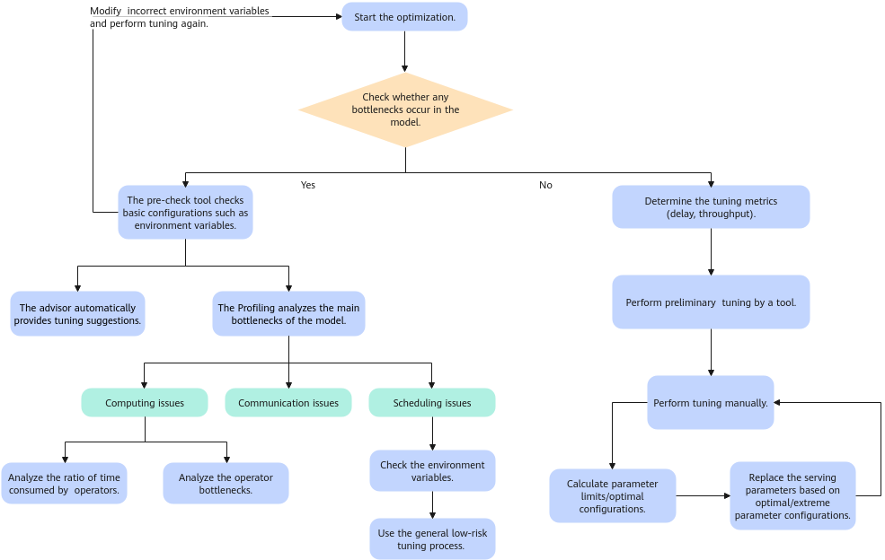

## LLM Inference Performance Tuning

In common models and application scenarios, similar performance can be reproduced theoretically if the same weight, image, and deployment policy are used.

Therefore, if a performance problem occurs, you can check the environment variables and performance-related switches first. There is a high probability that the problem is caused by the environment variables and performance-related switches (for example, no core is bound, the kernel version is low, or the log level is incorrect).

For details about how to test the pure model performance, see [ATB Models Pure Model Usage](https://www.hiascend.com/document/detail/en/mindie/22RC1/mindiellm/llmdev/mindie_llm0009.html).

If the LLM inference test result shows that the performance deteriorates, you can perform detailed Profiling analysis. For details about the analysis method, see [In-depth Model Tuning Analysis (MindStudio Insight)](performance_tool_usage.md#performance_tool_usage02).

### Preliminary LLM Inference Test

The LLM inference test determines the size of the test request based on the `--batch_size option` entered by the user and determines the combination of the request input length and output length based on the `--case_pair` option. During inference, the Prefill of all requests is processed first, and then all requests are grouped into a Decode Batch to complete the Decode inference. For test scenarios that are not covered by the baseline, especially scenarios with TTFT or TPOT latency requirements, perform the following steps to perform a LLM inference test:

1. Set `--case_pair [[input_len, 1]]` to simulate a pure model test with a single prefill batch. In this mode, the specified `--batch_size` is recorded as `prefill_batchsize`, and the `Total Time(s)` in the results is recorded as `prefill_time`.

2. Set the `--case_pair` option according to actual input/output lengths and run tests as normal. Record the specified `--batch_size` as `decode_batchsize`, and record the "Non-first token time (ms)" from the test results as `decode_token_time`.

3. Adjust `decode_batchsize` and `prefill_batchsize` to find the configuration items that meet the requirements, as shown in [Table 1](#ZH-CN_TOPIC_0000002504087066__table1511926121511).

   **Table 1** Configuration description 

   | Scenario                                                          | Configuration Method                                                                                                                                                                                                                                                                      |
   | ----------------------------------------------------------------- | ----------------------------------------------------------------------------------------------------------------------------------------------------------------------------------------------------------------------------------------------------------------------------------------- |
   | Baseline throughput without delay limit                           | Increase `decode_batchsize` to OOM. (Alternatively, select `decode_batchsize` whose growth rate slows down.)                                                                                                                                                                              |
   | TPOT limited, but TTFT not limited                                | Adjust `decode_batchsize` to ensure that `decode_token_time` meets the TPOT limit.                                                                                                                                                                                                        |
   | Limited TPOT and TTFT; ramp-up test (request rate limited)        | Adjust `decode_batchsize` to ensure that `decode_token_time` meets the TPOT limit. Adjust `prefill_batchsize` to ensure that `prefill_time` is close to the TTFT limit.                                                                                                                   |
   | Limited TPOT and TTFT; fixed concurrency (request rate unlimited) | Adjust `decode_batchsize` until the value of `decode_token_time` meets the TPOT limit, set `prefill_batchsize` to `dp`, and decrease the value of `decode_batchsize` until the value of  is close to the average TTFT limit. |

4. If you want to optimize the LLM inference performance (such as the parallel policy and environment variables), repeat Step 1 for different configurations until the optimal configuration is obtained.

5. Convert `Decode Batchsize` and `Prefill Batchsize` of the LLM inference to serving parameters `maxBatchsize` and `maxPrefillBatchSize`.

6. Set other serving and test parameters. Then, adjust the maximum values of concurrent `Requestrate`, `maxBatchSize`, and `maxPrefillBatchsize` based on the actual test result.

## Methodology for Tuning the Serving Performance

### Clarifying the Optimization Objective

Users usually focus on performance metrics such as the first token latency and throughput. During the test, the number of concurrent requests and the length of input and output data greatly affect the performance. You can guide the customer to test the performance based on the actual situation.

- Low-latency scenario: real-time interaction (such as a dialog system), focusing on the speed of generating the first token (optimization in the Prefill phase).

- High-throughput scenario: offline batch processing (such as document generation), focusing on tokens per second (optimization in the Decode phase).

  > [!NOTE]
  >
  > Sometimes, the performance objective is greatly different from the actual performance. You can evaluate the performance upper limit based on the LLM inference performance to determine the upper limit of latency or throughput and determine whether the objective can be achieved.

#### Evaluating the Upper Limit of the Serving Performance

Based on the estimation scenarios, objectives, and LLM inference test results, the following (favorable) methods are used to estimate the upper limit of the serving performance:

- Single concurrency: The performance is close to that of the LLM inference in single-concurrency mode.

- Average first token delay in the case of a large number of concurrent requests.

  - Inference in the Prefill phase is a computing-intensive scenario. After `Prefill Batchsize` is increased, the computing bottleneck is triggered. After the bottleneck is triggered, the Prefill delay increases linearly with `Batchsize`.
  - Determine `Prefill Batchsize` at which the compute bottleneck is reached through pure model testing. Use this `Prefill Batchsize` to partition the number of concurrent serving requests—this establishes the upper bound for TTFT based on pure mode results. Assume that the `Prefill Batchsize` at the bottleneck found in the pure model test is . In this case, the pure model calculation time of a single `Prefill Batch` is , and the estimated actual concurrency of serving is . Then, the estimated total Prefill time for this round of concurrent serving requests is . Under the first-come, first-served (FCFS) scheduling strategy, the average TTFT is about .

- Throughput and TPOT in the case of high concurrency.

  - Decode is a bandwidth bottleneck instead of a computing power bottleneck. Theoretically, a larger value of `Batchsize` for a single Decode indicates a larger total throughput until the graphics memory limit is reached.
  - For the output throughput and TPOT of serving, you can refer to the LLM inference result under the same concurrency (that is, `Decode Batchsize`) as the theoretical upper limit. Considering that serving inference has extra time overheads in the aspects such as framework scheduling, the favorable throughput of the serving inference can be estimated as 0.8 to 0.9 times of the throughput of the LLM inference.

- Theoretical upper limit of the maximum concurrency divided by `maxBatchSize` under the graphics memory bottleneck: In the Decode phase, the value of `maxBatchSize` is mainly limited by the graphics memory and can be calculated based on the number of KV cache blocks and sequence length.

  - The KV Cache pool is allocated by block. The block size is specified by `cacheBlockSize` in the MindIE serving parameters. Generally, the default value is 128. That is, each block can store 128 tokens. The number of KV cache blocks occupied by each request is calculated based on the context length in the application scenario.

    - Maximum number of blocks = Ceil (Number of input tokens/cacheBlockSize) + Ceil (Maximum number of output tokens/cacheBlockSize)
    - Average number of blocks = Ceil (Average number of input tokens/cacheBlockSize) + Ceil (Average number of output tokens/cacheBlockSize)

  - The total number of available KV cache blocks (`Total Block Num`) on the NPU of the MindIE server can be obtained from the test.

    - Clear all old log files in `/root/mindie/log`. By enabling environment variables `MINDIE_LLM_PYTHON_LOG_LEVEL` and `MINDIE_LLM_PYTHON_LOG_TO_FILE`, MindIE LLM can generate INFO logs when running in Python and write the logs into a file.

    - After determining other serving configurations except `maxBatchSize`, use the default values to start the service. After the service is successfully started on the server, run the `grep` command to search for keywords `npuBlockNum` in the MindIE LLM Python program logs. Multiple results will be returned based on the number of used ranks, the minimum value is the total number of available KV cache blocks on the NPU of the MindIE server. [Figure 1](#ZH-CN_TOPIC_0000002535887093__fig19500185613447) shows an example. The total number of available KV cache blocks is 817.

      **Figure 1** Example for obtaining the total number of available KV cache blocks on the NPU of the MindIE server 

      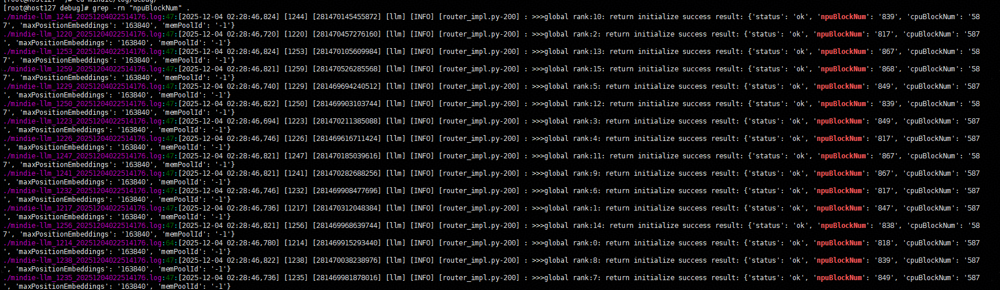

  - The value of `maxBatchSize` cannot exceed that of `Floor [Total block number/Maximum number of blocks]` to ensure optimal performance. If the context length difference between requests is large, the upper limit can be increased to the value of `Floor [Total block number/Average number of blocks]`.

### Tuning Based on the Objective

After clarifying the optimization objective, adjust the serving parameters to improve the serving performance.

**Core Parameters**

For details about the core parameters, see [Table 1](#ZH-CN_TOPIC_0000002535807049__table3617mcpsimp). For more details, see MindIE LLM Development Guide.

**Table 1** Core parameters 

| **Optimization Direction** | **Key Parameter**                      | **Recommended Value/Policy**                                                                                          |
| -------------------------- | -------------------------------------- | --------------------------------------------------------------------------------------------------------------------- |
| **Low latency**            | maxPrefillBatchSize                    | Small batch size (4 to 16), reducing the calculation workload of the first token.                                     |
|                            | supportSelectBatch                     | `false`: The Prefill is forcibly scheduled first.                                                                     |
|                            | maxQueueDelayMicroseconds              | ≤ 50 ms (reducing the waiting delay)                                                                                  |
| **High throughput**        | `maxBatchSize` (in the Decode phase)   | Maximized (limited by the graphics memory)                                                                            |
|                            | maxPrefillBatchSize/maxPrefillTokens   | Increase the value based on the actual average input to ensure that the value of `maxPrefilltokens` is around 10,000. |
|                            | supportSelectBatch                     | Enable throughput-first scheduling.                                                                                   |
|                            | maxQueueDelayMicroseconds              | Increase the waiting time to form a large batch at the beginning of the test.                                         |
|                            | RequestRate (set by using a test tool) | Increase the delivery frequency to the upper limit of the hardware.                                                   |
|                            | Concurrency (set by using a test tool) | Gradually increase the concurrency until the throughput reaches the saturation point.                                 |
|                            | Three-piece suite for sequence length  | Set `maxInputTokenLen`, `maxIterTimes`, and `maxSeqLen` based on the actual scenarios and requirements.               |

**Manual Tuning**

Tune the parameters that do not meet the objectives, for example, the latency or throughput which does not meet the objectives.

Before tuning, you can confirm the theoretical upper limit and optimal configuration of each parameter, for example, calculating the optimal value of `maxBatchSize`. For details about the calculation method, see [Evaluating the Upper Limit of the Serving Performance](#evaluating-the-upper-limit-of-the-serving-performance).

**Tool Tuning**

Manual tuning requires certain serving basic knowledge. For more convenient tuning, you can use the expert suggestion function of the **serving tuning tool** (**msServiceProfiler**). For details, see [Serving Expert Suggestion Tool](https://gitcode.com/Ascend/msserviceprofiler/blob/master/docs/en/service_profiling_advisor_instruct.md). Before using the expert suggestion tool, you need to use MindIE Benchmark to test the serving performance. The expert suggestion tool provides tuning suggestions based on the MindIE Benchmark test result file.

**Difficult Issues**

The preceding serving tuning is performed in black-box mode. You do not know the specific scheduling process of requests, for example, which requests form a batch, the size of a batch, when to execute Prefill, and when to execute Decode.

Some problems cannot be solved by tuning in black-box mode and need to be further analyzed. You must use msServiceProfiler for analysis, which is similar to optimizing the LLM inference performance.

## Cases for Tuning the Serving Performance

### Performance Deterioration Due to Time-consuming Scheduling of the Framework

**Symptom**

In the same environment with the same configurations, the serving performance of MindIE 2.0.RC1 deteriorates seriously compared with that of MindIE 2.0.T3. Check whether the problem is caused by the version.

As shown in [Figure 1](#ZH-CN_TOPIC_0000002504087096__fig31731419193712), the upper part is the test result of the LM inference. The average latency in the Decode phase of the LM inference is 36 ms when 300 concurrent requests are sent. The lower part is the test result of the serving inference. The average latency in the Decode phase is about 66 ms when 300 concurrent requests are sent.

**Figure 1** MindIE 2.0.T3 performance test result 

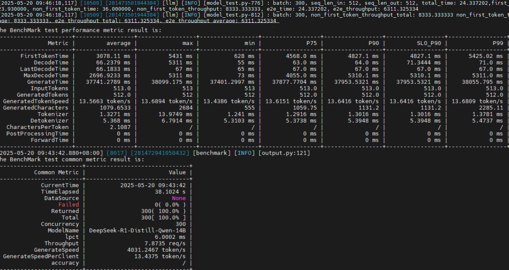

As shown in [Figure 2](#ZH-CN_TOPIC_0000002504087096__fig145925476375), the upper part is the test result of the LM inference. The average latency in the Decode phase of the LM inference is 35.44 ms when 300 concurrent requests are sent. The performance is close to that of MindIE 2.0.T3. The lower part is the test result of the serving inference. The average latency in the Decode phase is about 95 ms when 300 concurrent requests are sent. The performance deteriorates by 50% compared with that of MindIE 2.0.T3.

**Figure 2** MindIE 2.0.RC1 performance test result 

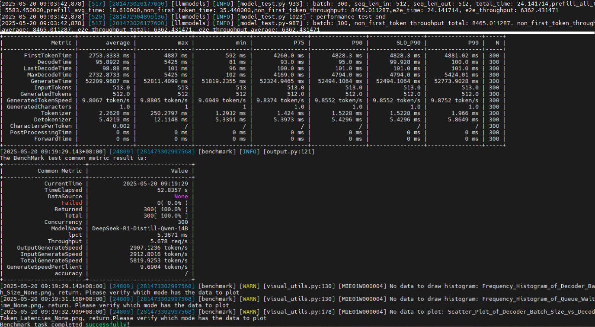

**Solution**

1. Use the pre-check tool to dump and compare the configurations, as shown in [Figure 3](#ZH-CN_TOPIC_0000002504087096__fig2425144244017). `ms_performance_prechecker_dump_20250520_152124.json` is the dump file in the MindIE 2.0.T3 environment, and `ms_performance_prechecker_dump_20250520_152138.json` is the dump file in the MindIE 2.0.RC1 environment. Except for environment variables that do not affect performance, such as log settings, no obvious configuration difference is found.

   **Figure 3** Comparing configurations 

   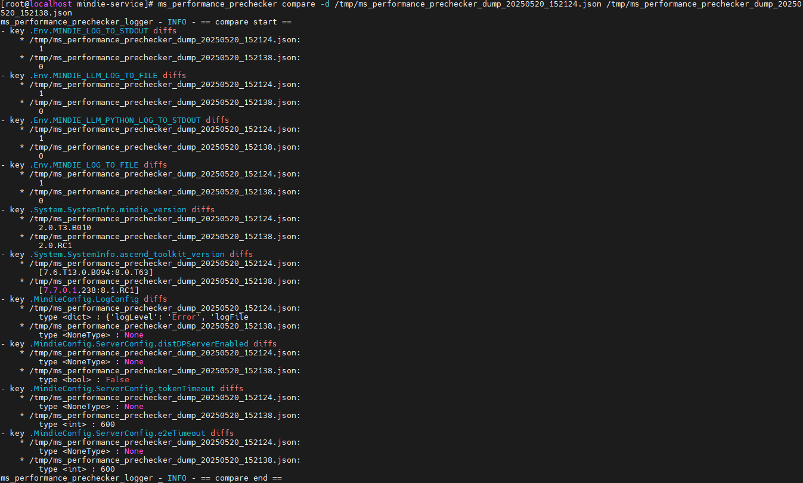

2. Collect and compare the serving profile data of MindIE 2.0.RC1. It is found that the interval between forward operations in the Decode phase of MindIE 2.0.RC1 is serious, indicating that the preprocessing and postprocessing on the CPU side take a long time, as shown in [Figure 4](#ZH-CN_TOPIC_0000002504087096__fig8393010422).

   **Figure 4** Viewing forward

   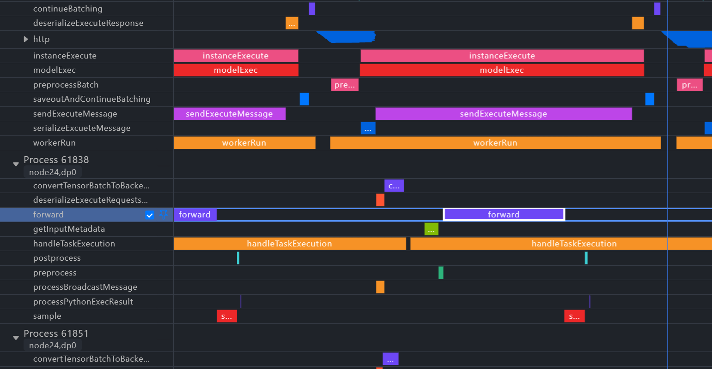

3. Enable asynchronous scheduling and shorten the interval between forward operations. Then, the E2E output throughput of MindIE 2.0.RC1 increases from 2900 to 4500, which is 500tokens/s higher than that of MindIE 2.0.T3. For details about how to enable asynchronous scheduling, see the asynchronous scheduling section in MindIE LLM Development Guide.

   **Figure 5** Enabling asynchronous scheduling

   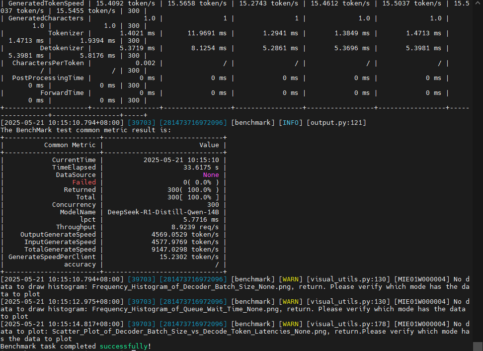

### Tuning the model execution time

**Symptom**

When the DeepSeek Prefill-Decode disaggregated large-scale expert parallel solution is used, the model performance deteriorates seriously.

**Solution**

1. Use msServiceProfiler to collect the serving profile data of the Decode node.

2. Analyze the collected profile data. It is found that two different servers on the same Decode node have fast and slow ranks in the Decode phase. Specifically, the execution time of a single Decode on the two ranks from the two servers is 260 ms and 170 ms, respectively. The difference is serious. If the `MIX_AIC` field is long in the operator lane of a rank, the rank is executing the merged compute and communication operators and the synchronization wait time is long. Therefore, the rank is a fast rank. The `MIX_AIC` field of the other rank is short, indicating that the rank is a slow rank.

   **Figure 1** Profile data of the fast rank 

   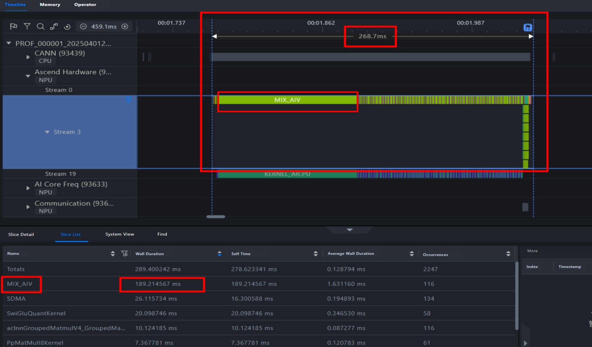

   **Figure 2** Profile data of the slow rank 

   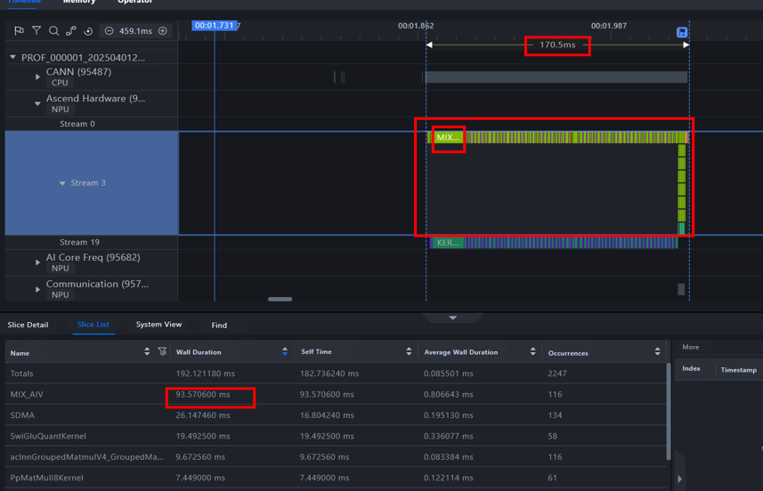

3. As shown in the CANN CPU unit ([Figure 1](#ZH-CN_TOPIC_0000002535807061__fig193870541031) and [Figure 2](#ZH-CN_TOPIC_0000002535807061__fig179374817410) are collapsed in gray), the time for starting a task on each rank is different. As a result, the time for the first MC2 operator (moedispatch) in the forward operation is different, and the synchronization wait time is more than 90 ms. After the first moedispatch is removed, the remaining computing time is about 140 ms, and the operator performance of the two ranks is similar. Based on the above, it can be concluded that the performance difference between fast and slow ranks is caused by model distribution latency, not operator delivery timing.

4. After the distributed scheduling feature is enabled on the Decode node (environment variable `MINDIE_ENABLE_DP_DISTRIBUTED` is enabled, and the large-scale expert parallel solution later than MindIE 25.0.RC1 is enabled by default), the performance becomes normal.

### Analyzing graphics memory bottlenecks

**Symptom**

When the DeepSeek two-node cluster is used for serving inference, the actual **Batchsize** cannot reach 192.

**Analysis**

1. Collects serving profile data.

2. When **Batchsize** is 192, the number of Decodes increases. When the number of Decodes reaches 185, the KV blocks are about to be used up and the number of remaining KV blocks is 36 (the initial number is 1747). Then, the number of remaining KV blocks is reduced to 0, **Batchsize** is reduced to 72. At last, when **Batchsize** is 192, the reference reaches 253.

   **Figure 1** Viewing data

   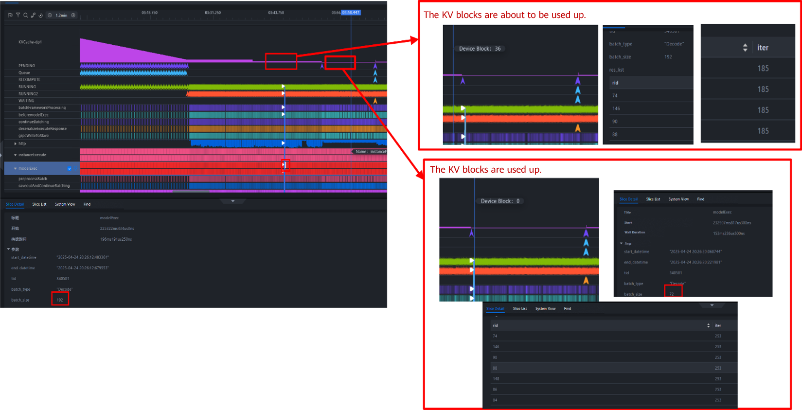

3. According to the actual execution, the number of Decodes can be close to 1000 when **Batchsize** is 150.

   **Figure 2** Actual execution

   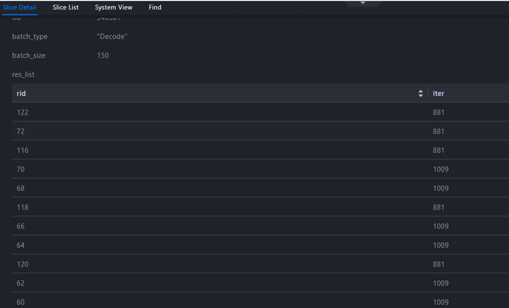

4. Estimate the upper limit of concurrency under the graphics memory bottleneck. The Profiling tool shows that the number of available KV Cache blocks is 1747. By default, the size of each block is 128 tokens. According to the context requirements of 1024 inputs and 2048 outputs, the average context is 1536, and the KV Cache can accommodate 1747/[(1024+2048)/2/128]≈145 on average.

   **Figure 3** Number of blocks

   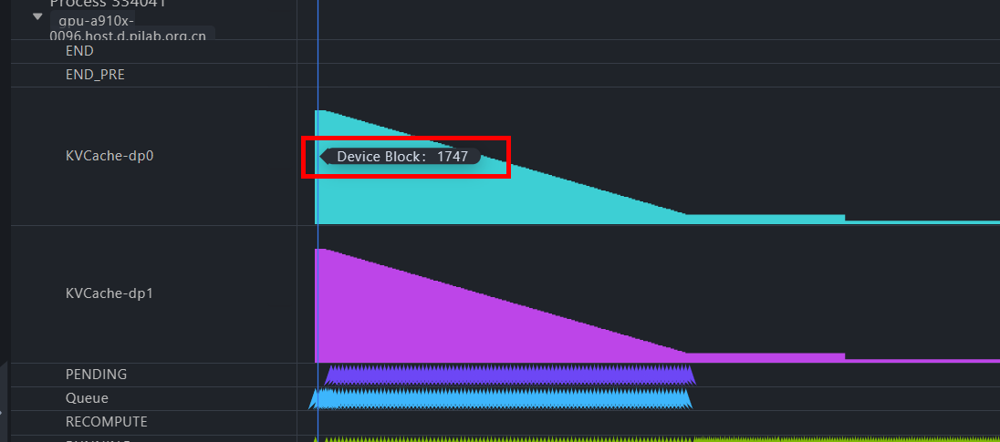

5. Adjust the serving parameters. That is, set `export NPU_MEMORY_FRACTION=0.96` and `maxSeqLen` to 3000 to achieve the optimal effect.

### Optimizing the Serving Parameters

**Symptom**

Qwen3-32B is deployed on a single server with four ranks as a service. In the application scenario, the number of concurrent requests is small and the number of requests reaches the threshold slowly (the maximum number of concurrent requests is 40, and the actual number of concurrent requests is close to the request rate 9.4). In the default serving configuration of PD co-location, the performance is tested when the input length is 128 and the output length is 100. The average TPOT is 48 ms, but TPOT SLO P99 is 157 ms. As a result, the streaming output of some requests is frozen, which cannot meet the requirement of TPOT 50 ms.

**Solution**

1. In the default serving configuration, the preliminary performance test result is shown in [Figure 1](#ZH-CN_TOPIC_0000002504087058__fig57131966516). It can be found that: (1) The maximum TTFT is only 158 ms when the default Prefill priority scheduling is used. This indicates that the Prefill performance is normal and does not reach the computing power bottleneck. (2) The TTFT of P75 is less than 50 ms, and the TPOT is normal, indicating that the actual Decode performance meets the expectation. (3) The P90/P99/maximum delay of non-first tokens is high. It is suspected that the request arrives slowly and the Prefill of the new request interrupts the Decode of the request in the inference. As a result, some non-first tokens need to wait for the Prefill of new requests, and the TPOT increases sharply.

   **Figure 1** Initial performance test result 

   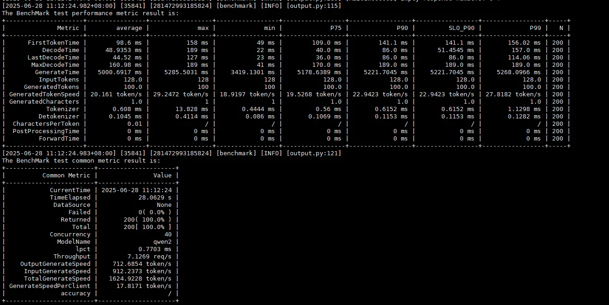

2. In this scenario, you can enable `SupportSelectBatch` and set `prefillTimeMsPerReq` and `decodeTimeMsPerReq` to adjust the priorities of Prefill and Decode so that the scheduler allows Decode to take precedence in certain cases. This policy can reduce the number of new requests that interrupt the Decode of the request during inference, increase the proportion of continuous Decode, and shorten TPOT, as shown in [Figure 2](#ZH-CN_TOPIC_0000002504087058__fig99048387485). Although this policy causes Prefill waiting of some requests, the Prefill performance of the model in this case is enough. Even if the TTFT increases slightly, it can be controlled within an acceptable range by adjusting the priority parameter.

   **Figure 2** Principle of TPOT deterioration 

   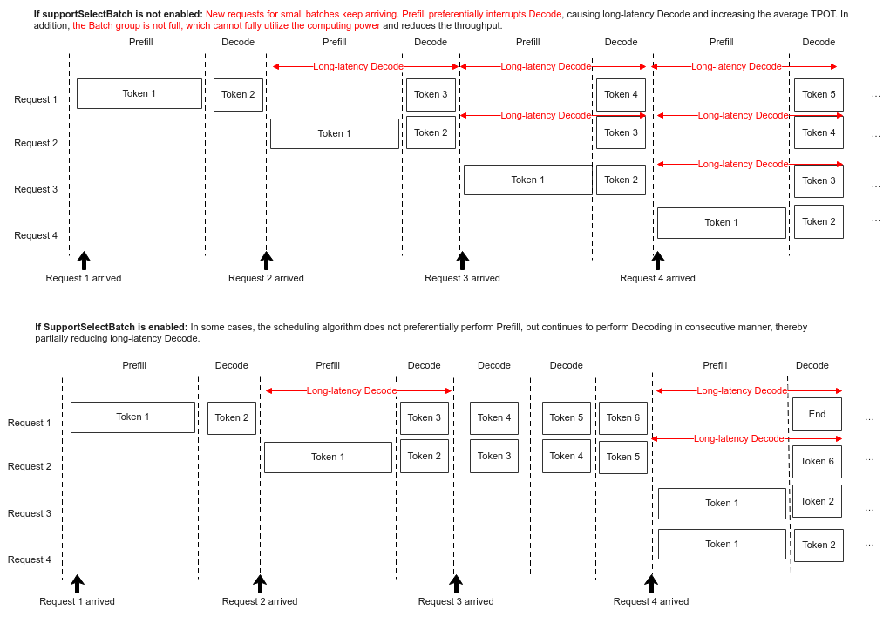

3. Adjust the priority parameters. A larger value of `prefillTimeMsPerReq` and a smaller value of `decodeTimeMsPerReq` indicate a higher Decode priority. Otherwise, the Prefill priority is higher. Set `supportSelectBatch` to `true`, `prefillTimeMsPerReq` to `1000`, and `decodeTimeMsPerReq` to `1`. The performance test result is shown in [Figure 3](#ZH-CN_TOPIC_0000002504087058__fig17560946184820). In this case, the TTFT increases to 1562 ms, the average TPOT decreases to 31.7 ms, and the P99 TPOT decreases to 36 ms. The overall streaming output is smooth, meeting user requirements.

   **Figure 3** Performance test result after tuning 

   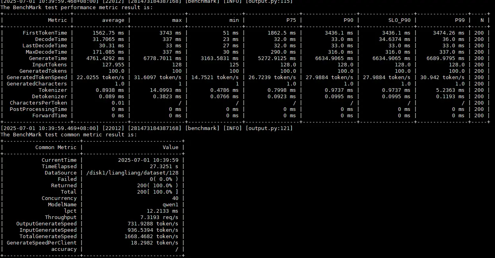

## Advanced Tuning of DeepSeek

Advanced tuning brings benefits to both serving and LLM inferences. Some advanced tuning methods may require support from related components.

### Analyzing the Graphics Memory

After the optimization reaches the bottleneck, an intuitive method is to optimize the graphics memory to use better configurations (such as the number of concurrent tasks and parallel policy). Quantization can be used to reduce the computation workload and graphics memory. Currently, the best solution is W8A8.

### Tuning the Parallel Policy

In the current 16-rank inference scenario, the optimal configuration is as follows: TP=8, DP=2, MOE_TP=4, and MOE_EP=4. However, users have different hosts (Arm/x86) and input and output requirements. As a result, the optimal parallel policy changes. Therefore, the parallel policy needs to be adjusted.

### Optimizing the Communication Policy

Different communication policies generate different traffic. Therefore, you need to evaluate the traffic based on the parallel policy.

Tuning suggestions:

- Minimize the TP of Attention and increase the DP to avoid KV cache replication and repeated access and storage.
- Pure DP communication can save KV cache, but the model weight needs to occupy more space.
- Expert communication (EP) is configured based on the `ep_level` keyword in the `config.json` configuration file in the ATB-Models installation directory. The theoretical AlltoAll communication traffic is less.
- Communication can be implemented through LCCL or HCCL. Generally, LCCL delivers better performance, but adaptation may be abnormal in some parallel policies.

### Other Optimization Methods

- Weight format conversion: Convert the weight to the NZ format to reduce the time required for format conversion.
- Total request setting: The performance in the Decode phase increases (the request rate is limited, the batch size is small in the early stage, and the bottleneck is not reached. The batch size in the Decode phase gradually increases). Therefore, you are advised to set the total number of requests to the number of concurrent requests multiplied by 10.
