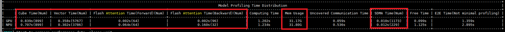
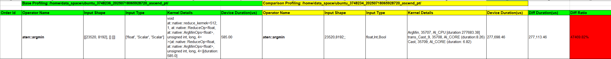
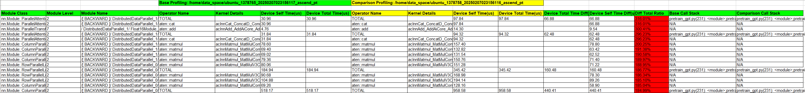
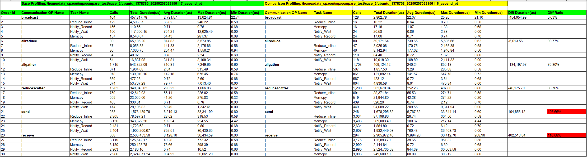
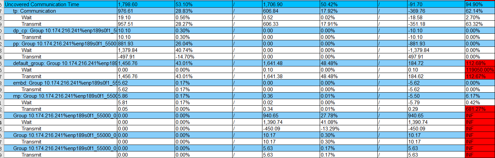
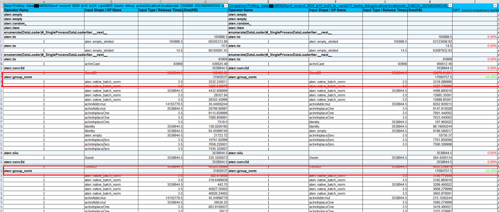
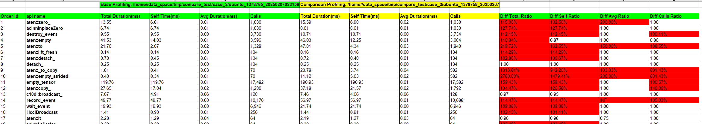

# Methodology for Locating Performance Deterioration During Version Upgrade

## Identifying the Main Performance Bottlenecks

Use the msprof-analyze compare tool to view the track information, as shown in [Figure 1](#ZH-CN_TOPIC_0000002535887045__fig1351083175417). Alternatively, view the **OverallMetrics** sheet in the **performance_comparison_result_{timestamp}.xlsx** file.

**Figure 1** Printed information 

Pay attention to the differences in the four core aspects and find the aspect with the most obvious difference for further analysis.

- Computing Time
- Uncovered Communication Time (communication time that is not covered in the computing)
- Mem Usage (memory usage)
- Free Time

## Comparing and Analyzing the Operator Performance Deterioration

### Comparing the Operator-level Performance

The msprof-analyze compare tool provides comparison about the operator-level performance. The result is displayed on the **OperatorCompare** and **OperatorCompareStatistic** sheets in the **performance_comparison_result_{timestamp}.xlsx**. The result displays the comprehensive shape information, time consumed by the delivered kernel and device, and memory usage.

1. Check the **OperatorCompareStatistic** sheet, which displays the number of operator calls and the total time consumed by the device. Sort the operators in reverse order by **Diff Duration(ms)** or **Diff Ratio**, and find the top operators with the largest time difference.

2. On the **OperatorCompare** sheet, search for the top operators with the largest time difference and view the time consumed by the executed kernel, as shown in [Figure 1](#ZH-CN_TOPIC_0000002503927216__fig142391113203011), to find the optimization points.

   **Figure 1** Viewing the time consumed by the executed kernel 

   

### Comparing the Module-level Performance

The msprof-analyze compare tool also supports module-level comparison, helping quickly identify deteriorated modules and operators and locate code blocks.

1. On the **ModuleCompareStatistic** sheet, set **Operator Name** to **[TOTAL]**, sort the modules by **Device Self Time (ms)** in reverse order, and find the modules with the largest time difference.

2. On the **ModuleCompare** sheet, search for the deteriorated operators in the top modules with the largest time difference.

3. Search for the target code line by calling the stack, as shown in [Figure 2](#ZH-CN_TOPIC_0000002503927216__fig49361714183410).

   **Figure 2** Searching for the code line 

   

## Comparing and Analyzing the Deterioration During Communication Time (Uncovered)

1. Check whether the performance of communication operators deteriorates seriously.

   Open the **CommunicationCompare** sheet in the **performance_comparison_result_{timestamp}.xlsx** and compare the following performance metrics for communication operators, as shown in [Figure 1](#ZH-CN_TOPIC_0000002504087130__fig154214341371).

   - Operator type (such as Broadcast and AllReduce)
   - Time consumption metrics (average time consumption, maximum/minimum time consumption) and call frequency statistics
   - Information about associated subtasks (such as Reduce_Inline, Notify_Record, Notify_Wait, and Memcpy)

   **Figure 1** Comparing the performance metrics of large communication operators 

   

2. On the **OverallMetrics** sheet, perform in-depth comparison and analysis by communication domain.

   Pay attention to the differences between **transit_time** and **wait time** in the same communication domain, as shown in [Figure 2](#ZH-CN_TOPIC_0000002504087130__fig165861453143815).

   **Figure 2** Key metric differences 

   

3. If no communication operator with degraded communication performance is found, it indicates poor parallelism between communication and computation. Proceed with NPU cluster performance analysis.

## Comparing and Analyzing the Memory Degradation

The operator memory comparison result is displayed on the **MemoryCompare** and **MemoryCompareStatistic** sheets in the **performance_comparison_result_{timestamp}.xlsx** file.

1. View the **MemoryCompareStatistic** sheet and find the top operators with the largest memory usage difference.

2. View the **MemoryCompare** sheet, search for the top operators with the largest memory usage difference, and view the specific memory usage.

   For example, after the CANN and TorchNPU software packages are upgraded onsite, OOM occurs. In this case, collect the Profiling results before and after the upgrade. According to the operator-level comparison, it is found that more than 10 GB memory is allocated **aten::group_norm**, as shown in [Figure 1](#ZH-CN_TOPIC_0000002535807069__fig15924104214429).

   **Figure 1** Operator comparison 

   

## Comparing and Analyzing the Degradation During Idle Time

If the computation time and communication time do not change seriously but the **Free** time increases significantly, you can use the comparison result on the **ApiCompare** sheet in the **performance_comparison_result_{timestamp}.xlsx** to find the top APIs with the largest time consumption difference and check whether the host is bound based on the delivered connection on the MindStudio Insight GUI.

**Figure 1** Viewing the ApiCompare sheet

