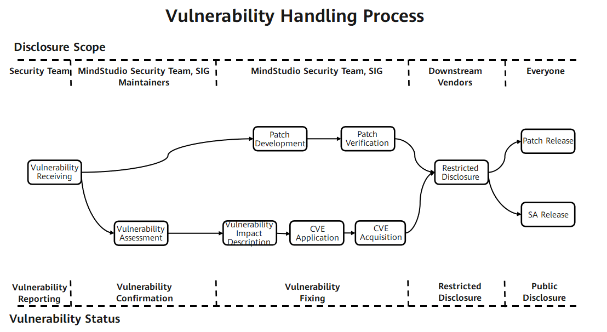

# MindStudio Vulnerability Mechanism Description

<!-- md-trans-meta sourceCommit=unknown translatedAt=2026-06-03T09:27:09.851Z pushedAt=2026-06-03T09:32:33.581Z -->

The MindStudio community places great importance on the security of its community versions. It has designated a vulnerability management specialist to handle vulnerability-related affairs. To build a more secure full-process AI toolchain, we also welcome your participation.

## Vulnerability Handling Process

For each security vulnerability, the MindStudio community will assign personnel to track and handle it. The end-to-end process of Vulnerability Handling is shown in the following figure.

The following will focus on explaining the processes of vulnerability reporting, Vulnerability Assessment, and vulnerability disclosure.

## Vulnerability Reporting

You can contact the MindStudio community team by submitting an issue, and we will immediately arrange for dedicated security vulnerability personnel to contact you.

To ensure security, please do not describe specific information involving security and privacy in the issue.

### Report Response

1. The MindStudio community will confirm, analyze, and report security vulnerability issues within 3 working days, and simultaneously initiate the Vulnerability Handling process.
2. After confirming the security vulnerability issue, the MindStudio security team will distribute and follow up on the issue.
3. During the process of classifying, determining, fixing, and releasing the security vulnerability issue, we will update the report in a timely manner.

## Vulnerability Assessment

The industry commonly uses the CVSS standard to assess the severity of vulnerabilities. When MindStudio uses CVSS v3.1 for Vulnerability Assessment, it is necessary to set the vulnerability attack scenario and evaluate based on the actual impact in that attack scenario. Severity Level assessment refers to evaluating the ease of exploiting a vulnerability and the impact on Confidentiality, Integrity, and Availability after exploitation, and generating a score.

### Vulnerability Assessment Criteria

MindStudio assesses the Severity Level of a vulnerability through the following vectors:

- Attack Vector (AV): Indicates the "remoteness" of the attack and how this vulnerability can be exploited.
- Attack Complexity (AC): Describes the difficulty of executing the attack and what factors are required for a successful attack.
- User Interaction (UI): Determines whether user participation is required for the attack.
- Privileges Required (PR): Records the level of user authentication required for a successful attack.
- Scope (S): Determines whether an attacker can affect components with different privilege levels.
- Confidentiality (C): Measures the degree of impact caused by information disclosure to unauthorized parties.
- Integrity (I): Measures the degree of impact caused by information tampering.
- Availability (A): Measures the degree to which users are affected when they need to access data or services.

### Assessment Principles

- Assess the Severity Level of the vulnerability, not the risk.
- The assessment must be based on an attack scenario, and it must be ensured that in this scenario, a successful attack by the attacker can impact the Confidentiality, Integrity, and Availability of the system.
- When a security vulnerability has multiple attack scenarios, the assessment should be based on the scenario that causes the greatest impact, i.e., the one with the highest CVSS score.
- For vulnerabilities in embedded or invoked libraries, the assessment must be conducted after determining the attack scenario based on how the library is used within the product.
- If a security defect cannot be triggered or does not affect CIA (Confidentiality, Integrity, Availability), the CVSS score is 0.

### Assessment Steps

When assessing the Severity Level of a vulnerability, follow the steps below:

1. Define possible attack scenarios and score based on the attack scenarios.
2. Identify the Vulnerable Component and the Impact Component.

3. Select the values for the base metrics.

   - Exploitability Metrics (Attack Vector, Attack Complexity, Privileges Required, User Interaction, Scope) are selected based on the Vulnerable Component.

   - Impact Metrics (Confidentiality, Integrity, Availability) reflect either the impact on the Vulnerable Component or the impact on the Impact Component, whichever results in the most severe outcome.

### Severity Level Classification

| **Severity Rating** | **CVSS Score** | **Vulnerability Fix Time** |
| ------------------------------- | --------------------- | ---------------- |
| Critical                | 9.0~10.0              | 7 days              |
| High                      | 7.0~8.9               | 14 days             |
| Medium                    | 4.0~6.9               | 30 days             |
| Low                       | 0.1~3.9               | 30 days             |

## Vulnerability Disclosure

After a security vulnerability is fixed, the MindStudio community will release a Security Announcement (SA) and a Security Note (SN). The Security Announcement includes information such as the technical details of the vulnerability, its type, the reporter, the CVE ID, and the affected and fixed versions.
To protect the security of MindStudio users, the MindStudio community will not publicly disclose, discuss, or confirm security issues in MindStudio products before the investigation, fix, and release of a Security Announcement.

## Appendix

### MindStudio Security Announcement (SA)

Currently in a maintained version, with no security vulnerabilities.

### MindStudio Security Note (SN)

Vulnerability notes for third-party open-source components:

| CVE ID | Third-Party Component Name | Affected MindStudio Tool/Plugin Name | Status | Description |
| ------- | ------------ | --------------------------- | ---- | ---- |
| None    | -            | -                           | -    | -    |