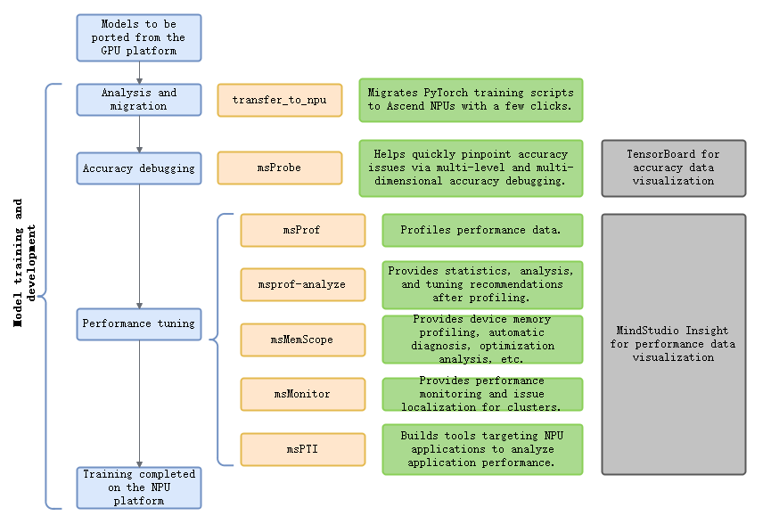

# Overview

MindStudio Training Tools (msTT) provides a full-process toolchain to address your pain points during model migration and model development. By offering three major tool kits, the Analysis and Migration Tool (msfmktransplt), MindStudio Probe (msProbe, the accuracy debugging tool), and MindStudio Profiler (msProf, the performance tuning tool), it helps you resolve migration issues, loss divergence, and substandard or degraded performance during development, enabling you to easily solve accuracy and performance issues and embark on an enjoyable, minimalist development journey.

**Full Process of Model Training and Development**

## Tool Descriptions

### Analysis Migration Tool

MindStudio Analysis and Migration Tool (msfmktransplt)

   Provides one-click migration of PyTorch training scripts to the Ascend NPU, allowing developers to complete migration with minimal or zero code changes. For details, see [MindStudio Analysis and Migration Tool](https://gitcode.com/Ascend/mstt/blob/master/msfmktransplt/docs/en/msfmktransplt_instruct.md).

### Accuracy Debugging Tool

MindStudio Probe (msProbe)

This toolkit used in the model development and accuracy debugging phase is a full-scenario precision toolchain provided for Ascend, helping users improve the efficiency of locating model accuracy issues. For details, see [MindStudio Probe](https://gitcode.com/Ascend/msprobe/blob/master/docs/en/dump/mindspore_dump_quick_start.md).

### Performance Tuning Tools

- MindStudio Profiler (msProf)

  This tool builds the foundational full-scenario performance tuning capabilities for Ascend, supporting the collection of CANN and NPU performance data to improve the efficiency of performance tuning on Ascend devices. For details, see [MindStudio Profiler](https://gitcode.com/Ascend/msprof/blob/master/docs/en/getting_started/quick_start.md).

- Ascend PyTorch Profiler

  This tool collects performance data in PyTorch training/online inference scenarios, outputs visualized performance data files, and improves performance analysis efficiency. For details, see [Ascend PyTorch Profiler](https://gitcode.com/Ascend/pytorch/blob/v2.7.1/docs/en/ascend_pytorch_profiler/ascend_pytorch_profiler_user_guide.md).

- MindStudio Profiler Analyze (msprof-analyze, MindStudio performance analysis tool)

  An Ascend performance analysis tool that analyzes collected performance data and provides rapid identification of performance bottlenecks on Ascend devices. For details, see [MindStudio Profiler Analyze](https://gitcode.com/Ascend/msprof-analyze/blob/master/docs/en/getting_started/quick_start.md).

- msMemScope (MindStudio memory analysis tool)

  A specialized tool for Ascend device memory debugging and tuning, providing network-wide multi-dimensional memory data collection, automatic diagnosis, and optimization analysis capabilities. For details, see [msMemScope](https://gitcode.com/Ascend/msmemscope/blob/master/docs/en/quick_start.md).

- MindStudio Monitor (msMonitor, MindStudio online monitoring tool)

  A one-stop online monitoring tool that supports drive-based and online performance data collection, providing cluster-level performance monitoring and localization capabilities. For details, see [MindStudio Monitor](https://gitcode.com/Ascend/msmonitor/blob/master/docs/en/getting_started/quick_start.md).

- MindStudio Profiling Tools Interface (msPTI)

  A set of profiling APIs provided by MindStudio for Ascend devices. Users can build tools for NPU applications through msPTI to analyze application performance. For details, see [msPTI](https://gitcode.com/Ascend/mspti/blob/master/docs/en/getting_started/quick_start.md).

- MindStudio Insight (msInsight, MindStudio visualization tuning tool)

 MindStudio Insight supports multi-dimensional performance analysis across various scenarios and levels, such as system-level, operator-level, and service-oriented analysis. It deeply analyzes performance data to help developers complete performance diagnostics. For details, see [MindStudio Insight](https://gitcode.com/Ascend/msinsight/blob/master/docs/en/user_guide/overview.md).

- Ascend Affinity CPU Binding Tool

  A CPU binding script that supports non-intrusive modification of project code to achieve one-click CPU binding. For details, see [Ascend Affinity CPU Binding](https://gitcode.com/Ascend/mstt/blob/master/profiler/affinity_cpu_bind/README.md).

- Tinker

  The Tinker LLM parallel strategy automatic optimization system performs single-node NPU performance measurement based on the provided training script and recommends a high-performance parallel strategy training script. For details, see [Tinker](https://gitcode.com/Ascend/mstt/blob/master/profiler/tinker/README.md).
