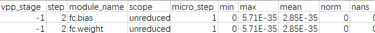
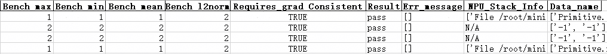

# msTT Quick Start in MindSpore Scenarios

## Overview

This document provides a quick start guide for using development tools in the training scenario, focusing on model development and migration, model accuracy debugging, and model performance tuning.

Tool introduction:

- msProbe:

For foundation models developed on Ascend or migrated from GPU to the Ascend NPU environment, anomalies such as precision loss, loss curve divergence, or non-convergence may occur during training. Since metrics like training loss cannot precisely pinpoint the problematic module, this document describes how to use MindStudio Probe (msProbe, an accuracy debugging tool) for rapid delimitation.

msProbe is the accuracy tool in the msTT toolchain. It collects and compares training accuracy data from a benchmark environment (such as a debugged CPU, GPU, or Ascend NPU environment) and the Ascend NPU environment to identify discrepancies.

The msProbe tool provides numerous features. For details, see [MindStudio Probe](https://gitcode.com/Ascend/msprobe).

- MindSpore Profiler API tool: Collects performance data in MindSpore training scenarios.

- msprof-analyze tool: Performs statistics, analysis, and outputs related tuning suggestions.

- MindStudio Insight tool: Visualizes performance data.

**Procedure**

The following describes the operational process of using msTT and related tools in the process of training development.

1. Model development and migration

   No migration tool is currently provided for MindSpore training scenarios. This document uses a training script developed directly in the Ascend NPU environment as an example.

2. Model accuracy debugging

   In model accuracy debugging, the msProbe tool is used to perform the following operations:

   1. Pre-training configuration check

      Identify configuration differences between two environments that affect accuracy.

   2. Training status monitoring

      Monitor anomalies in computation, communication, optimizer, and other components during training.

   3. Accuracy data collection

      Collect forward and backward input/output data at the API or Module level during training.

   4. Accuracy pre-check

      Scan API data to identify APIs with accuracy issues.

   5. Accuracy comparison

      Compare the API data on the NPU side and the benchmark environment to quickly pinpoint accuracy issues.

3. Model performance tuning

   In the MindSpore training scenario, the following operations are performed during model performance tuning:

   1. Performance data collection: MindSpore Profiler
   2. Performance data analysis: msprof-analyze
   3. Performance data visualization: MindStudio Insight

**Environment Setup**<a name="environment-setup"></a>

1. Prepare a training server (such as an Atlas A2 training product) based on the Ascend NPU, and install the NPU driver and firmware.

2. Install the compatible version of the CANN Toolkit (development suite) and ops operator package, and configure the CANN environment variables. For details, see the [CANN Software Installation Guide](https://www.hiascend.com/document/detail/en/canncommercial/850/softwareinst/instg/instg_0000.html?Mode=PmIns&InstallType=local&OS=Ubuntu).

3. Install the framework.

   For training on MindSpore (versions 2.7.2 and 2.8.0 for example), see the [MindSpore Installation Guide](https://www.mindspore.cn/install/en).

## Model Development and Migration

No migration tool is currently provided for the MindSpore training scenario. This document uses a training script developed directly in the Ascend environment as an example.

**Prerequisites**

1. Complete [environment setup](#environment-setup).
2. Using "mindspore_main.py" as the filename, create a training script file and copy the content from [MindSpore Ascend NPU Environment Training Script Sample](#mindspore-ascend-npu-environment-training-script-sample).
3. Upload the "mindspore_main.py" file to any directory on the training server (ensure files in that directory can be read and written).

**Training Execution**

Execute training directly.

```bash
python mindspore_main.py
```

If the training proceeds normally, the following log is printed upon completion.

```ColdFusion
train finish
```

## Model Accuracy Debugging

### Pre-training Configuration Check

According to the sample in this document, you need to add the tool API to the training script for configuration check.

> [!NOTE] Note
>
> In this example, the scenario involves accuracy comparison between different MindSpore versions in the same environment. Therefore, the only difference in the results checked for the two scenarios will be the version number, so you can skip this step.

**Prerequisites**

- Complete [environment setup](#environment-setup).
- Complete [model development and migration](#model-development-and-migration), and ensure that training tasks can be completed normally in all sample environments.

**Tool Installation**

Install msProbe in the Ascend NPU environment by running the following command:

```bash
pip install mindstudio-probe --pre
```

**Executing the Check**

The steps are as follows:

1. Obtain the zip packages for the two environments. The packages contain environment configurations that affect training accuracy: environment variables, third-party library versions, weights, datasets, random functions, and more.

   Perform the following operations in the MindSpore 2.7.2 and MindSpore 2.8.0 environments respectively. Note that the two zip packages must be given different names.

   > [!NOTE] Note
   >
   > You can directly copy the complete code from the [MindSpore Pre-training Configuration Check Code Sample](#mindspore-pre-training-configuration-check-code-sample) to execute it. The following only describes where the tool API is added in the script.

   1. Insert the following code at the beginning of the first Python script executed in the training process.

      ```python
        1 from msprobe.core.config_check import ConfigChecker
        2 ConfigChecker.apply_patches(fmk)
      ```

      fmk: Training framework, string. Options are `pytorch` and `mindspore`. Configure this as `mindspore`.

   2. Insert the following code after the model is initialized.

      ```python
       49 from msprobe.core.config_check import ConfigChecker
       50 ConfigChecker(model=model, output_zip_path="", fmk="")
      ```

      - model: The initialized model. Weights and datasets are not collected by default.
      - output_zip_path: Path of the output .zip package, string. The .zip package name must be specified. The default value is "./config_check_pack.zip".
      - fmk: Training framework. Options include `pytorch` and `mindspore`. Configure this as `mindspore` here.

   3. Run the training script command.

      ```bash
      python mindspore_main.py
      ```

      After collection is complete, a .zip package is generated, containing various configurations that affect accuracy. Data is stored by rank and step, where step refers to `micro_step`.

2. Transfer the two .zip packages to the same environment and use the following command for comparison.

   ```bash
   msprobe config_check -c bench_zip_path cmp_zip_path -o output_path 
   ```

   Here, bench_zip_path is the name of the .zip package collected from the benchmark side, and cmp_zip_path is the name of the .zip package collected from the side to be compared.

   output_path defaults to "./config_check_result".

   After executing the above command, the following data is generated in output_path:

   - bench: Data packaged in bench_zip_path.
   - cmp: Data packaged in cmp_zip_path.
   - result.xlsx: Comparison result. It contains multiple sheets, where the summary sheet provides an overview of the check results, and other sheets contain details of specific check items, where step is micro_step.

3. View the check results.

   The check is passed only if all of the following items pass. If any inconsistency is found, adjust the environment accordingly:

   - Environment variables
   - Third-party library versions
   - Datasets
   - Weights
   - Random operations

   As shown below:

   ```ColdFusion
   filename        ass_check
   env             pass
   pip             error
   dataset         pass
   weights         pass
   random          pass
   ```

   Here, MindSpore 2.7.2 and MindSpore 2.8.0 versions are used as examples, so the pip check for third-party library versions shows an error.

### Training Status Monitoring

**Prerequisites**

- Complete [environment setup](#environment-setup).
- Complete [pre-training configuration check](#pre-training-configuration-check) checks.

**Procedure**

1. Create a configuration file, taking the weight gradient monitoring function as an example.

   The following is an example of creating the **monitor_v2_config.json** configuration file in the directory where the training script is located. Copy the following sample configuration into the file.

   ```json
   {
     "framework": "mindspore",
     "output_dir": "",
     "rank": [0],
     "start_step": 0,
     "step_interval": 1,
     "step_count_per_record": 1,
     "collect_times": 100,
     "format": "csv",
     "patch_optimizer_step": false,
     "monitors": {
       "weight_grad": {
         "enabled": true,
         "ops": ["min", "max", "mean", "norm", "nans"],
         "eps": 1e-8,
         "monitor_mbs_grad": false
       }
     }
   }
   ```

2. Add the tool to the training script, as shown below.

   > [!NOTE] Note
   >
   > You can directly copy the complete code from [MindSpore Training Status Monitoring Code Sample](#mindspore-training-status-monitoring-code-sample) for execution. The following only describes the API tools that need to be added to the script.

   ```python
   ...
     8 from msprobe.core.monitor_v2.trainer import TrainerMonitorV2    # Import training monitoring
     9 
   ...
   
    46 if __name__ == "__main__":
    47     mon = TrainerMonitorV2("./monitor_v2_config.json", fr="mindspore")    # Import the monitoring configuration file and specify the framework
    48     mon.start(model=model, optimizer=optimizer)    # Start training monitoring
    49     step = 0
    50     # Train the model
    51     for data, label in ds.GeneratorDataset(generator_net(), ["data", "label"]):
    52         train_step(data, label)
    53         print(f"train step {step}")
    54         step += 1
    55         mon.step()    # After each training step ends, save the monitoring data of the current step and increment step by 1
    56     mon.stop()    # End training monitoring
    57     print("train finish")
   ```

3. Execute the training script command.

   ```bash
   python mindspore_main.py
   ```

4. View the results.

   After training is completed, a **rank_{rank_id}** directory is generated in the current path. Multiple result sets are generated in this directory based on timestamps. View the files in the latest directory, as shown below.

   **Figure 1** Content in a result file

   

   For details about the output results, see "[Output Results](https://gitcode.com/Ascend/msprobe/blob/master/docs/en/monitor_v2_instruct.md#output-results)".

### Accuracy Data Collection

**Prerequisites**

- Complete [environment setup](#environment-setup).
- Complete [pre-training configuration check](#pre-training-configuration-check).

**Collection Execution**

1. Create a configuration file.

   For example, create a **config.json** configuration file in the directory where the training script is located, and copy the following sample configuration into the file.

   ```json
   {
       "task": "tensor",
       "dump_path": "./dump_data",
       "rank": [],
       "step": [],
       "level": "L1",
   
       "tensor": {
           "scope": [], 
           "list": [],
           "data_mode": ["all"]
       }
   }
   ```

2. Add the tool to the training script **mindspore_main.py** in the MindSpore 2.7.2 and MindSpore 2.8.0 environments, respectively, as shown below.

   > [!NOTE] Note
   >
   > You can directly copy the complete code from [MindSpore Accuracy Data Collection Code Sample](#mindspore-accuracy-data-collection-code-sample) for execution. The following only illustrates where the tool API is added in the script.

   ```python
   ...
     8 from msprobe.mindspore import PrecisionDebugger    # Import the tool data collection API
     9 debugger = PrecisionDebugger(config_path="./config.json")    # Instantiate PrecisionDebugger and load the dump configuration file
   ...
    47 if __name__ == "__main__":
    48     step = 0
    49     # Train the model
    50     for data, label in ds.GeneratorDataset(generator_net(), ["data", "label"]):
    51         debugger.start(model)    # Enable data dump
    52         train_step(data, label)
    53         print(f"train step {step}")
    54         step += 1
    55         debugger.stop()    # Disable data dump. You can enable data dump again, and the collected data will be recorded in the same step.
    56         debugger.step()    # End data dump. If you enable data dump again, the collected data will be recorded in the next step.
    57     print("train finish")
   ```

   > [!NOTE] Note
   >
   > Accuracy data occupies a certain amount of drive space, which may cause the risk of the server becoming unavailable due to a full drive. The space required for accuracy data is closely related to the model parameters, collection switch configuration, and the number of iterations collected. You must ensure sufficient available drive space in the dump directory.

3. Execute the training script command. The tool will collect accuracy data during model training.

   ```python
   python mindspore_main.py
   ```

   If the following sample information appears in the log, the data collection is successful. You can view the data after the collection is complete.

   ```ColdFusion
   The aip tensor hook function is successfully mounted to the model.
   msprobe: debugger.start() is set successfully
   Dump switch is turned on at step 0.
   Dump data will be saved in /home/user1/dump/dump_data/step0.
   ```

**Viewing Results**

The following directory structure will appear in the path specified by the `dump_path` parameter. You can select appropriate data for analysis as needed.

```ColdFusion
dump_data/
├── step0
    └── rank
        ├── construct.json           # Saves the hierarchical relationship information of the module, which is empty in the current scenario
        ├── dump.json                # Saves the statistical information and overflow information of the inputs and outputs of forward and backward APIs
        ├── dump_tensor_data         # Saves the actual tensor data information of the inputs and outputs of forward and backward APIs
        │   ├── Jit.Momentum.0.forward.input.1.0.npy
        │   ├── Primitive.matmul.MatMul.1.forward.input.1.npy
        │   ├── Mint.add.1.backward.input.0.npy
        │   ├── Primitive.matmul.MatMul.1.forward.output.0.npy
        ...
        └── stack.json               # Saves the API call stack information
├── step1
...
```

The collected data needs to be further analyzed through [Accuracy Pre-check](#accuracy-pre-check) and [Accuracy Comparison](#accuracy-comparison).

### Accuracy Pre-check

**Prerequisites**

- Complete [environment setup](#environment-setup).
- Complete [accuracy data collection](#accuracy-data-collection) to obtain the accuracy data of the Ascend NPU environment in the MindSpore training scenario.

**Pre-check**

Run the pre-check directly in the Ascend NPU environment.

```bash
msprobe acc_check -api_info ./dump_data/step0/rank/dump.json -o ./checker_result
```

At this point, two CSV files are generated in the path specified by the `-o` parameter: **accuracy_checking_details\_{timestamp}.csv** and **accuracy_checking_result_{timestamp}.csv**.

**accuracy_checking_result\_{timestamp}.csv** indicates whether each API passes the test. For APIs that fail the test or are of particular interest, query the compliance status and comparison metrics of each output in **accuracy_checking_details\_{timestamp}.csv** based on the API Name field.

**Figure 1** accuracy_checking_result


**Figure 2** accuracy_checking_details


For details about the pre-check result, see "[Pre-check Result](https://gitcode.com/Ascend/msprobe/blob/master/docs/en/accuracy_checker/mindspore_accuracy_checker_instruct.md#pre-check-result)".

### Accuracy Comparison

#### Comparing Accuracy

**Prerequisites**

- Complete the [environment setup](#environment-setup).
- Taking the cell module comparison scenario across different versions within the MindSpore framework as an example, see [Accuracy Data Collection](#accuracy-data-collection) to complete the dump of cell modules for different framework versions, for example, MindSpore 2.7.2 and MindSpore 2.8.0.

**Comparison Execution**

1. Data preparation.

   Based on the **prerequisites**, two accuracy data directories are obtained. The two data storage directories are named **dump_data_2.7.2** and **dump_data_2.8.0**, respectively, as an example.

   The path of dump.json in the **dump_data_2.7.2** directory is `/home/dump/dump_data_2.7.2/step0/rank/dump.json`.

   The path of dump.json in the **dump_data_2.8.0** directory is `/home/dump/dump_data_2.8.0/step0/rank/dump.json`.

2. Perform comparison.

   The command is as follows:

   ```bash
   msprobe compare -tp /home/dump/dump_data_2.8.0/step0/rank/dump.json -gp /home/dump/dump_data_2.7.2/step0/rank/dump.json -o ./compare_result/accuracy_compare
   ```

   The following printout indicates a successful comparison:

   ```ColdFusion
   ...
   Compare result is /xxx/compare_result/accuracy_compare/compare_result_{timestamp}.xlsx
   ...
   ************************************************************************************
   *                        msprobe compare ends successfully.                        *
   ************************************************************************************
   ```

3. Analyze the comparison result file.

   The compare command generates the following files in **./compare_result/accuracy_compare**.

   **compare_result_{timestamp}.xlsx**: This file lists detailed information and comparison results for all APIs on which accuracy comparison was performed. You can locate suspicious operators based on the comparison result (`Result`) and error message (`Err_Message`). However, since each metric has its own judgment criteria, you need to make assessments based on the actual situation.

   The following is an example:

   **Figure 1** compare_result_1

   

   **Figure 2** compare_result_2

   

   **Figure 2** compare_result_3

   

  For more comparison result analysis, see "[Output Result File Description](https://gitcode.com/Ascend/msprobe/blob/master/docs/en/accuracy_compare/pytorch_accuracy_compare_instruct.md#output-result-file-description)".

#### Hierarchical Visualization Graph Comparison

**Prerequisites**

- Complete [environment setup](#environment-setup).

- Taking the cell module comparison scenario across different versions within the MindSpore framework as an example, see [Accuracy Data Collection](#accuracy-data-collection) to complete cell module dumps for different framework versions, for example, MindSpore 2.7.2 and MindSpore 2.8.0.

**Comparison Execution**

1. Data preparation.

   Based on the **prerequisites**, obtain two accuracy data directories. The two data storage directories are named **dump_data_2.7.2** and **dump_data_2.8.0**, respectively.

   The **dump_data_2.7.2** directory path is `/home/dump/dump_data_2.7.2`.

   The **dump_data_2.8.0** directory path is `/home/dump/dump_data_2.8.0`.

2. Perform graph comparison.

   ```bash
   msprobe graph_visualize -tp /home/dump/dump_data_2.8.0 -gp /home/dump/dump_data_2.7.2 -o /home/dump/output
   ```

   After the comparison is complete, a file with the vis suffix is generated in `./output`.

3. Start TensorBoard.

   ```bash
   tensorboard --logdir ./output --bind_all
   ```

   The path specified by --logdir is the `./output` path in [2](https://www.hiascend.com/document/detail/en/mindstudio/82RC1/msquickstart/atlasquick_train_0012.html?framework=mindspore#ZH-CN_TOPIC_0000002446706768__li7405184191914).

After executing the above command, the following log is printed.

   ```bash
   TensorBoard 2.19.0 at http://ubuntu:6008/ (Press CTRL+C to quit)
   ```

Open a browser in a Windows environment and visit `http://ubuntu:6008/`, replacing **ubuntu** with the server's IP address, for example, `http://192.168.1.10:6008/`.

After successfully accessing the address, the page displays the TensorBoard interface, as shown below.

**Figure 1** Hierarchical visualization graph comparison


   Since the "level" is configured as "L1" when dumping data in this sample, the collected model structure data is empty, and there is no data during hierarchical visualization composition. The above figure shows an example with other data.

## Model Performance Tuning

### Performance Data Collection

**Prerequisites**

- Complete [environment setup](#environment-setup).
- Complete the training task in the MindSpore scenario according to the MindSpore section in [Model Development and Migration](#model-development-and-migration).

> [!NOTICE] Notice
>
> Before performing performance data collection, delete the [Accuracy Data Collection](#accuracy-data-collection) related APIs from the training script mindspore_main.py file, because accuracy data collection and performance data collection cannot be performed simultaneously.

**Collection Execution**

The collection process is based on MindSpore 2.8.0 as an example. If performance comparison is required, you can also collect performance data for MindSpore 2.7.2 as well.

1. Add the MindSpore Profiler API tool to the training script **mindspore_main.py** in the Ascend NPU environment, as shown below.

   > [!NOTE] Note
   >
   > You can directly copy the complete code from [MindSpore Profiler API Collection Performance Data Code Sample](#mindspore-profiler-api-collection-performance-data-code-sample) for execution. The following only illustrates where the tool API is added in the script.

   ```python
    ...
     8 from mindspore.profiler import ProfilerLevel, ProfilerActivity, AicoreMetrics    # Import mindspore.profiler
   ...
    46 if __name__ == "__main__":
    47     mindspore.set_context(mode=mindspore.PYNATIVE_MODE)
    48     mindspore.set_device("Ascend")
    49 
    50     # Add extended profiling collection configuration parameters
    51     experimental_config = mindspore.profiler._ExperimentalConfig(
    52         profiler_level=ProfilerLevel.Level0,
    53         aic_metrics=AicoreMetrics.AiCoreNone,
    54         data_simplification=False
    55     )
    56 
    57     step = 0
    58     # Add basic profiling collection configuration parameters before training the model
    59     with mindspore.profiler.profile(
    60             activities=[ProfilerActivity.CPU, ProfilerActivity.NPU],
    61             schedule=mindspore.profiler.schedule(
    62                 wait=0, warmup=0, active=1, repeat=1, skip_first=0
    63             ),
    64             on_trace_ready=mindspore.profiler.tensorboard_trace_handler("./profiling_data"),
    65             profile_memory=False,
    66             experimental_config=experimental_config,
    67     ) as prof:
    68         # Train the model
    69         for data, label in ds.GeneratorDataset(generator_net(), ["data", "label"]):
    70             train_step(data, label)
    71             print(f"train step {step}")
    72             step += 1
    73             prof.step()
    74         print("train finish")
   ```

   > [!NOTE] Note
   >
   > - The above provides only a simple example. For more complete collection parameter configuration and detailed API descriptions, see [mindspore.profiler.profile](https://www.mindspore.cn/docs/en/r2.8.0/api_python/mindspore/mindspore.profiler.profile.html).
   > - Performance data occupies a certain amount of drive space, which may cause the server to become unavailable if the drive is full. The space required for performance data is closely related to the model parameters, collection switch configuration, and the number of collected iterations. You must ensure sufficient available drive space in the target directory.

2. Execute the training script command. The tool collects performance data during model training.

   ```bash
   python mindspore_main.py
   ```

3. View the collected MindSpore training performance data result file.

   After training is complete, a performance data result directory for the MindSpore Profiler API is generated in the directory specified by the `mindspore.profiler.tensorboard_trace_handler` API, as shown in the following example.

   ```ColdFusion
   └── ubuntu_1198203_20260617064811905_ascend_ms
   ├── ASCEND_PROFILER_OUTPUT
   │   ├── api_statistic.csv
   │   ├── dataset.csv
   │   ├── kernel_details.csv
   │   ├── step_trace_time.csv
   │   └── trace_view.json
   ├── FRAMEWORK
   ├── logs
   ├── PROF_000001_20260617064812088_QGGJHHNAODRDOJFB
   │   ├── device_0
   │   │   ├── data
   ...
   │   ├── host
   │   │   ├── data
   ...
   │   ├── mindstudio_profiler_log
   ...
   │   └── mindstudio_profiler_output
   │       ├── api_statistic_20260202065550.csv
   │       ├── README.txt
   │       ├── op_summary_20260202065550.csv
   │       ├── task_time_20260202065550.csv
   │       ├── step_trace_20260202065550.csv
   │       ├── msprof_20260202065549.json
   │       └── step_trace_20260202065549.json
   └── profiler_info_0.json
   ```

   The performance data collected by the MindSpore Profiler API can be analyzed using the msprof-analyze tool of msTT, or directly visualized using MindStudio Insight. For detailed operations, see [Analyzing Performance Data Using the msprof-analyze Tool](#analyzing-performance-data-using-the-msprof-analyze-tool) and [Using the MindStudio Insight Tool to Visualize Performance Data](#using-the-mindstudio-insight-tool-to-visualize-performance-data).

### Performance Data Analysis

#### Analyzing Performance Data Using the msprof-analyze Tool

**Prerequisites**

1. Complete the [environment setup](#environment-setup).

2. Complete [performance data collection](#performance-data-collection) to obtain performance data from the Ascend NPU environment.

3. Install msprof-analyze. The command is as follows:

   ```bash
   pip install msprof-analyze
   ```

   A prompt with the following information indicates successful installation.

   ```ColdFusion
   Successfully installed msprof-analyze-{version}
   ```

   For details about the msprof-analyze tool, see [msprof-analyze](https://gitcode.com/Ascend/mstt/tree/master/profiler/msprof_analyze).

**Performing msprof-analyze Analysis**<a name="performing-msprof-analyze-analysis"></a>

> [!NOTE] Note
>
> The following only provides operation guidance, without specific data analysis.

msprof-analyze primarily focuses on intra-iteration time analysis, communication time analysis, and communication matrix analysis based on communication domains, thereby pinpointing slow ranks, slow nodes, and slow link issues.

The operation is as follows:

1. Data preparation.

   Copy the performance data from all devices to the same directory.

2. Execute the performance analysis operation.

   ```bash
   msprof-analyze -m all -d $HOME/profiling_data/
   ```

   The analysis result generates a **cluster_analysis_output** folder in the directory specified by the `-d` parameter and outputs the **cluster_step_trace_time.csv**, **cluster_communication_matrix.json**, and **cluster_communication.json** files.

   For more information, see [msprof-analyze](https://gitcode.com/Ascend/msprof-analyze).

   The deliverables of the cluster analysis tool are displayed through the MindStudio Insight tool. For detailed operations, see [Using the MindStudio Insight Tool to Visualize Performance Data](#using-the-mindstudio-insight-tool-to-visualize-performance-data).

**Executing Advisor Analysis**

The advisor function of msprof-analyze analyzes the performance data collected and parsed by MindSpore Profiler and outputs performance tuning suggestions.

The command is as follows:

```bash
msprof-analyze advisor all -d $HOME/profiling_data/
```

The analysis result outputs brief suggestions to the execution terminal, and generates **mstt_advisor_{timestamp}.html** and **/log/mstt_advisor_{timestamp}.xlsx** files in the command execution directory for users to view.

The analysis result of the advisor tool mainly provides expert suggestions on potential performance issues.

For a detailed introduction to the results, see "[Output Result File Description](https://gitcode.com/Ascend/msprof-analyze/blob/master/docs/en/user_guide/advisor_instruct.md#output-result-file-description)" in [advisor](https://gitcode.com/Ascend/msprof-analyze/blob/master/docs/en/user_guide/advisor_instruct.md).

**Executing compare_tools Performance Comparison**

The compare_tools function is used to compare performance data collected from the same training project in the Ascend NPU environment under different frameworks or software versions.

The command is as follows:

```bash
msprof-analyze compare -d $HOME/2.8.0/profiling_data/*_ascend_ms -bp $HOME/2.7.2/profiling_data/*_ascend_ms --output_path ./compare_result/profiler_compare
```

The analysis result is output to the execution terminal, and a **performance_comparison_result_{timestamp}.xlsx** file is generated in the path specified by the `--output_path` parameter for user review.

The performance comparison tool breaks down overall performance into training time and memory usage. Training time can be further broken down into three dimensions: operators (including nn.Module), communication, and scheduling. It prints overall metrics to help users pinpoint the direction of degradation. Meanwhile, the tool also displays the performance of each operator in terms of execution time, communication time, and memory usage in the **performance_comparison_result_{timestamp}.xlsx** file. Degraded operators can be filtered out by checking where the DIFF column is greater than 0. No example is provided here. For details about the results, see [Output Result File Description](https://gitcode.com/Ascend/msprof-analyze/blob/master/docs/en/user_guide/compare_tool_instruct.md#output-result-file-description) in [Performance Comparison Tool](https://gitcode.com/Ascend/msprof-analyze/blob/master/docs/en/user_guide/compare_tool_instruct.md).

#### Using the MindStudio Insight Tool to Visualize Performance Data

- The performance data generated from [Performance Data Collection](#performance-data-collection) can all be visualized using the MindStudio Insight tool.
- When [performing msprof-analyze analysis](#performing-msprof-analyze-analysis), the output deliverables need to be visualized using the MindStudio Insight tool.

**Prerequisites**

Complete [performance data collection](#performance-data-collection) or [msprof-analyze analysis](#performing-msprof-analyze-analysis) to obtain the corresponding deliverables.

**Procedure**

1. Install MindStudio Insight.

   For details, see the [MindStudio Insight Tool User Guide](https://gitcode.com/Ascend/msinsight/blob/master/docs/en/user_guide/mindstudio_insight_install_guide.md) to download and install MindStudio Insight.

   The MindStudio Insight visualization tool is recommended for use in a Windows environment.

2. Double-click the MindStudio Insight shortcut icon on the desktop to launch MindStudio Insight.

3. Import performance data.

   1. Copy the performance data from [performance data collection](#performance-data-collection) or [msprof-analyze analysis](#performing-msprof-analyze-analysis) to the Windows environment.

   2. Click **Import Data** in the upper left corner of the MindStudio Insight interface, select the performance data file or directory in the dialog box, and then click **OK** to import. The import result is shown in the following figure.

      **Figure 1** View of performance data

      

4. Analyze the performance data.

  The MindStudio Insight tool visualizes performance data, enabling more intuitive analysis of performance bottlenecks. For detailed analysis methods, see the [MindStudio Insight Tool User Guide](https://gitcode.com/Ascend/msinsight/blob/master/README.md).

## Code Samples

### MindSpore Ascend NPU Environment Training Script Sample

```python
import mindspore as ms
import numpy as np
import mindspore
mindspore.set_device("Ascend")
import mindspore.mint as mint   
import mindspore.dataset as ds
from mindspore import nn


class Net(nn.Cell):
    def __init__(self):
        super(Net, self).__init__()
        self.fc = nn.Dense(2, 2)

    def construct(self, x):
        # First, pass through the fully connected layer
        y = self.fc(x)
        # Call mint.add to compute the sum of y and itself
        # You can also change it to mint.add(x, x) or mint.add(y, x) as needed.
        z = mint.add(y, y)
        return z


def generator_net():
    for _ in range(10):
        yield np.ones([2, 2]).astype(np.float32), np.ones([2]).astype(np.int32)

def forward_fn(data, label):
    logits = model(data)
    loss = loss_fn(logits, label)
    return loss, logits

model = Net()
optimizer = nn.Momentum(model.trainable_params(), 1, 0.9)
loss_fn = nn.SoftmaxCrossEntropyWithLogits(sparse=True)
grad_fn = mindspore.value_and_grad(forward_fn, None, optimizer.parameters, has_aux=True)

# Define the functionality of a single training step
def train_step(data, label):
    (loss, _), grads = grad_fn(data, label)
    optimizer(grads)
    return loss


if __name__ == "__main__":
    step = 0
    # Train the model
    for data, label in ds.GeneratorDataset(generator_net(), ["data", "label"]):
        train_step(data, label)
        print(f"train step {step}")
        step += 1
    print("train finish")
```

### MindSpore Pre-training Configuration Check Code Sample

```python
from msprobe.core.config_check import ConfigChecker
ConfigChecker.apply_patches(fmk="mindspore")
import mindspore as ms
import numpy as np
import mindspore
mindspore.set_device("Ascend")
import mindspore.mint as mint   
import mindspore.dataset as ds
from mindspore import nn


class Net(nn.Cell):
    def __init__(self):
        super(Net, self).__init__()
        self.fc = nn.Dense(2, 2)

    def construct(self, x):
        # First, pass through the fully connected layer
        y = self.fc(x)
        # Call mint.add to compute the sum of y and itself
        # You can also change it to mint.add(x, x) or mint.add(y, x) as needed
        z = mint.add(y, y)
        return z


def generator_net():
    for _ in range(10):
        yield np.ones([2, 2]).astype(np.float32), np.ones([2]).astype(np.int32)

def forward_fn(data, label):
    logits = model(data)
    loss = loss_fn(logits, label)
    return loss, logits

model = Net()
optimizer = nn.Momentum(model.trainable_params(), 1, 0.9)
loss_fn = nn.SoftmaxCrossEntropyWithLogits(sparse=True)
grad_fn = mindspore.value_and_grad(forward_fn, None, optimizer.parameters, has_aux=True)

# Define the functionality for a single training step
def train_step(data, label):
    (loss, _), grads = grad_fn(data, label)
    optimizer(grads)
    return loss


if __name__ == "__main__":
    step = 0
    from msprobe.core.config_check import ConfigChecker
    ConfigChecker(model=model, output_zip_path="./config_check_pack.zip", fmk="mindspore")
    # Train the model
    for data, label in ds.GeneratorDataset(generator_net(), ["data", "label"]):
        train_step(data, label)
        print(f"train step {step}")
        step += 1
    print("train finish")
```

### MindSpore Training Status Monitoring Code Sample

```python
import mindspore as ms
import numpy as np
import mindspore
mindspore.set_device("Ascend")
import mindspore.mint as mint   
import mindspore.dataset as ds
from mindspore import nn
from msprobe.core.monitor_v2.trainer import TrainerMonitorV2    # Import training monitoring


class Net(nn.Cell):
    def __init__(self):
        super(Net, self).__init__()
        self.fc = nn.Dense(2, 2)

    def construct(self, x):
        # First, pass through the fully connected layer
        y = self.fc(x)
        # Call mint.add to compute the sum of y and itself
        # You can also change it to mint.add(x, x) or mint.add(y, x) as needed
        z = mint.add(y, y)
        return z


def generator_net():
    for _ in range(10):
        yield np.ones([2, 2]).astype(np.float32), np.ones([2]).astype(np.int32)

def forward_fn(data, label):
    logits = model(data)
    loss = loss_fn(logits, label)
    return loss, logits

model = Net()
optimizer = nn.Momentum(model.trainable_params(), 1, 0.9)
loss_fn = nn.SoftmaxCrossEntropyWithLogits(sparse=True)
grad_fn = mindspore.value_and_grad(forward_fn, None, optimizer.parameters, has_aux=True)

# Define the functionality of a single training step
def train_step(data, label):
    (loss, _), grads = grad_fn(data, label)
    optimizer(grads)
    return loss


if __name__ == "__main__":
    mon = TrainerMonitorV2("./monitor_v2_config.json", fr="mindspore")    # Import the monitoring configuration file and specify the framework
    mon.start(model=model, optimizer=optimizer)    # Start training monitoring
    step = 0
    # Train the model
    for data, label in ds.GeneratorDataset(generator_net(), ["data", "label"]):
        train_step(data, label)
        print(f"train step {step}")
        step += 1
        mon.step()    # After each training step ends, save the monitoring data of the current step and increment step by 1
    mon.stop()    # End training monitoring
    print("train finish")
```

### MindSpore Accuracy Data Collection Code Sample

```python
import mindspore as ms
import numpy as np
import mindspore
mindspore.set_device("Ascend")
import mindspore.mint as mint   
import mindspore.dataset as ds
from mindspore import nn
from msprobe.mindspore import PrecisionDebugger
debugger = PrecisionDebugger(config_path="./config.json")


class Net(nn.Cell):
    def __init__(self):
        super(Net, self).__init__()
        self.fc = nn.Dense(2, 2)

    def construct(self, x):
        # First, pass through the fully connected layer
        y = self.fc(x)
        # Call mint.add to compute the sum of y and itself
        # You can also change it to mint.add(x, x) or mint.add(y, x) as needed
        z = mint.add(y, y)
        return z


def generator_net():
    for _ in range(10):
        yield np.ones([2, 2]).astype(np.float32), np.ones([2]).astype(np.int32)

def forward_fn(data, label):
    logits = model(data)
    loss = loss_fn(logits, label)
    return loss, logits

model = Net()
optimizer = nn.Momentum(model.trainable_params(), 1, 0.9)
loss_fn = nn.SoftmaxCrossEntropyWithLogits(sparse=True)
grad_fn = mindspore.value_and_grad(forward_fn, None, optimizer.parameters, has_aux=True)

# Define the functionality for a single training step
def train_step(data, label):
    (loss, _), grads = grad_fn(data, label)
    optimizer(grads)
    return loss


if __name__ == "__main__":
    step = 0
    # Training the Model
    for data, label in ds.GeneratorDataset(generator_net(), ["data", "label"]):
        debugger.start(model)
        train_step(data, label)
        print(f"train step {step}")
        step += 1
        debugger.stop()
        debugger.step()
    print("train finish")
```

### MindSpore Profiler API Collection Performance Data Code Sample

```python
import mindspore as ms
import numpy as np
import mindspore
mindspore.set_device("Ascend")
import mindspore.mint as mint   
import mindspore.dataset as ds
from mindspore import nn
from mindspore.profiler import ProfilerLevel, ProfilerActivity, AicoreMetrics    # Import mindspore.profiler


class Net(nn.Cell):
    def __init__(self):
        super(Net, self).__init__()
        self.fc = nn.Dense(2, 2)

    def construct(self, x):
        # First go through the fully connected layer
        y = self.fc(x)
        # Call mint.add to compute the sum of y and itself
        # You can also change it to mint.add(x, x) or mint.add(y, x) as needed.
        z = mint.add(y, y)
        return z


def generator_net():
    for _ in range(10):
        yield np.ones([2, 2]).astype(np.float32), np.ones([2]).astype(np.int32)

def forward_fn(data, label):
    logits = model(data)
    loss = loss_fn(logits, label)
    return loss, logits

model = Net()
optimizer = nn.Momentum(model.trainable_params(), 1, 0.9)
loss_fn = nn.SoftmaxCrossEntropyWithLogits(sparse=True)
grad_fn = mindspore.value_and_grad(forward_fn, None, optimizer.parameters, has_aux=True)

# Define the functionality of a single training step
def train_step(data, label):
    (loss, _), grads = grad_fn(data, label)
    optimizer(grads)
    return loss


if __name__ == "__main__":
    mindspore.set_context(mode=mindspore.PYNATIVE_MODE)
    mindspore.set_device("Ascend")

    # Add extended configuration parameters for Profiling collection
    experimental_config = mindspore.profiler._ExperimentalConfig(
        profiler_level=ProfilerLevel.Level0,
        aic_metrics=AicoreMetrics.AiCoreNone,
        data_simplification=False
    )

    step = 0
    # Add basic configuration parameters for Profiling collection before training the model
    with mindspore.profiler.profile(
            activities=[ProfilerActivity.CPU, ProfilerActivity.NPU],
            schedule=mindspore.profiler.schedule(
                wait=0, warmup=0, active=1, repeat=1, skip_first=0
            ),
            on_trace_ready=mindspore.profiler.tensorboard_trace_handler("./profiling_data"),
            profile_memory=False,
            experimental_config=experimental_config,
    ) as prof:
        # Train the model
        for data, label in ds.GeneratorDataset(generator_net(), ["data", "label"]):
            train_step(data, label)
            print(f"train step {step}")
            step += 1
            prof.step()
        print("train finish")
```
